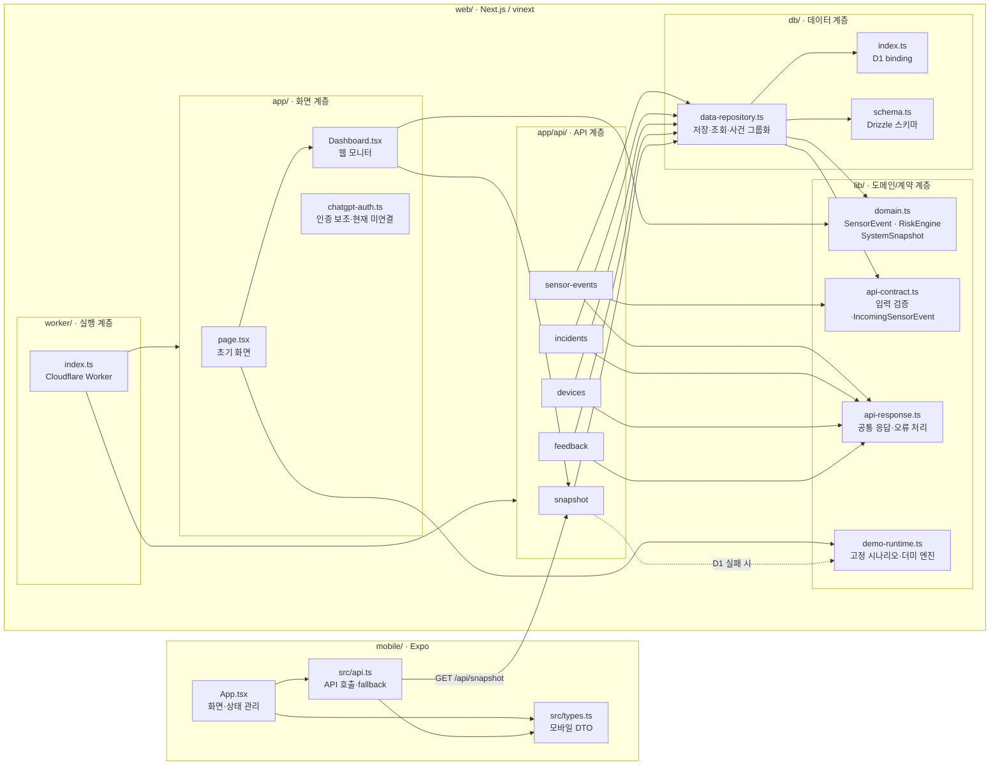

# Package Diagram

웹과 모바일의 소스 패키지 및 현재 의존 관계를 보여줍니다.

## Mermaid 원본

```mermaid
flowchart LR
    subgraph Mobile["mobile/ · Expo"]
        direction TB
        MobileApp["App.tsx<br/>화면·상태 관리"]
        MobileAPI["src/api.ts<br/>API 호출·fallback"]
        MobileTypes["src/types.ts<br/>모바일 DTO"]

        MobileApp --> MobileAPI
        MobileApp --> MobileTypes
        MobileAPI --> MobileTypes
    end

    subgraph Web["web/ · Next.js / vinext"]
        direction TB

        subgraph Presentation["app/ · 화면 계층"]
            Page["page.tsx<br/>초기 화면"]
            Dashboard["Dashboard.tsx<br/>웹 모니터"]
            AuthHelper["chatgpt-auth.ts<br/>인증 보조·현재 미연결"]
        end

        subgraph Controllers["app/api/ · API 계층"]
            SnapshotAPI["snapshot"]
            SensorAPI["sensor-events"]
            IncidentAPI["incidents"]
            DeviceAPI["devices"]
            FeedbackAPI["feedback"]
        end

        subgraph Domain["lib/ · 도메인/계약 계층"]
            DomainTypes["domain.ts<br/>SensorEvent · RiskEngine<br/>SystemSnapshot"]
            APIContract["api-contract.ts<br/>입력 검증·IncomingSensorEvent"]
            APIResponse["api-response.ts<br/>공통 응답·오류 처리"]
            DemoRuntime["demo-runtime.ts<br/>고정 시나리오·더미 엔진"]
        end

        subgraph Persistence["db/ · 데이터 계층"]
            DBIndex["index.ts<br/>D1 binding"]
            Repository["data-repository.ts<br/>저장·조회·사건 그룹화"]
            Schema["schema.ts<br/>Drizzle 스키마"]
        end

        subgraph Runtime["worker/ · 실행 계층"]
            Worker["index.ts<br/>Cloudflare Worker"]
        end

        Page --> DemoRuntime
        Page --> Dashboard
        Dashboard --> DomainTypes
        Dashboard --> SnapshotAPI

        SensorAPI --> APIContract
        SensorAPI --> APIResponse
        IncidentAPI --> APIResponse
        DeviceAPI --> APIResponse
        FeedbackAPI --> APIResponse

        SensorAPI --> Repository
        IncidentAPI --> Repository
        DeviceAPI --> Repository
        FeedbackAPI --> Repository
        SnapshotAPI --> Repository
        SnapshotAPI -. "D1 실패 시" .-> DemoRuntime

        Repository --> APIContract
        Repository --> DomainTypes
        Repository --> DBIndex
        Repository --> Schema
        Worker --> Controllers
        Worker --> Presentation
    end

    MobileAPI -->|"GET /api/snapshot"| SnapshotAPI
```

> [!NOTE]
> `chatgpt-auth.ts`는 구현되어 있지만 현재 페이지나 API에서 import하지 않습니다. 웹과 모바일의 `SystemSnapshot` 타입도 아직 별도 파일로 중복 관리하고 있습니다.
