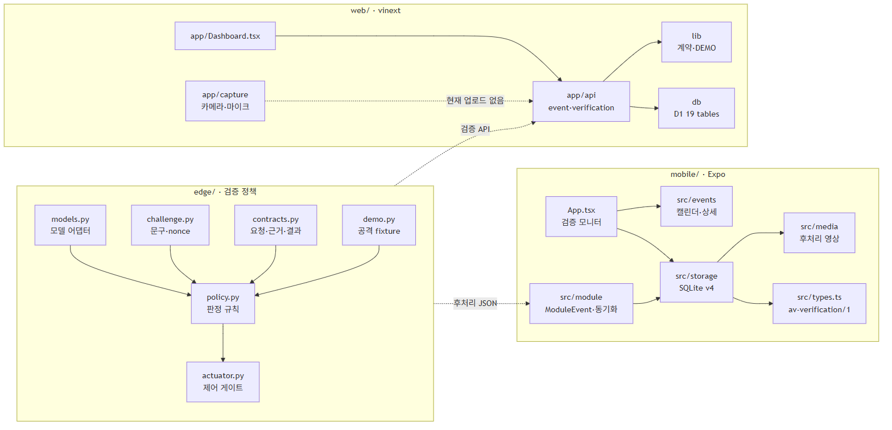
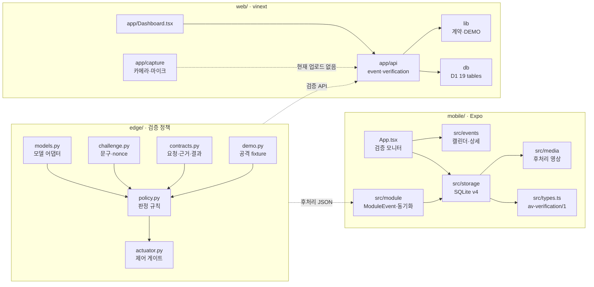

# Package Diagram

```mermaid
flowchart LR
    subgraph Edge["edge/ · 검증 정책"]
        Contracts["contracts.py<br/>요청·근거·결과"]
        Challenge["challenge.py<br/>문구·nonce"]
        Models["models.py<br/>모델 어댑터"]
        Policy["policy.py<br/>판정 규칙"]
        Actuator["actuator.py<br/>제어 게이트"]
        Demo["demo.py<br/>공격 fixture"]
        Models --> Policy
        Challenge --> Policy
        Contracts --> Policy
        Policy --> Actuator
        Demo --> Policy
    end

    subgraph Mobile["mobile/ · Expo"]
        App["App.tsx<br/>검증 모니터"]
        Events["src/events<br/>캘린더·상세"]
        Module["src/module<br/>ModuleEvent·동기화"]
        Storage["src/storage<br/>SQLite v4"]
        Media["src/media<br/>후처리 영상"]
        Types["src/types.ts<br/>av-verification/1"]
        App --> Events
        App --> Storage
        Module --> Storage
        Storage --> Media
        Storage --> Types
    end

    subgraph Web["web/ · vinext"]
        Dashboard["app/Dashboard.tsx"]
        Capture["app/capture<br/>카메라·마이크"]
        Routes["app/api<br/>event·verification"]
        Domain["lib<br/>계약·DEMO"]
        Repo["db<br/>D1 19 tables"]
        Dashboard --> Routes
        Capture -. "현재 업로드 없음" .-> Routes
        Routes --> Domain
        Routes --> Repo
    end

    Edge -. "후처리 JSON" .-> Module
    Edge -. "검증 API" .-> Routes
```

공통 계약은 현재 Python, 모바일 TypeScript, 웹 TypeScript에 각각 정의되어 있다. 모델 연결 후에는 JSON Schema를 기준으로 계약 테스트를 추가한다.
