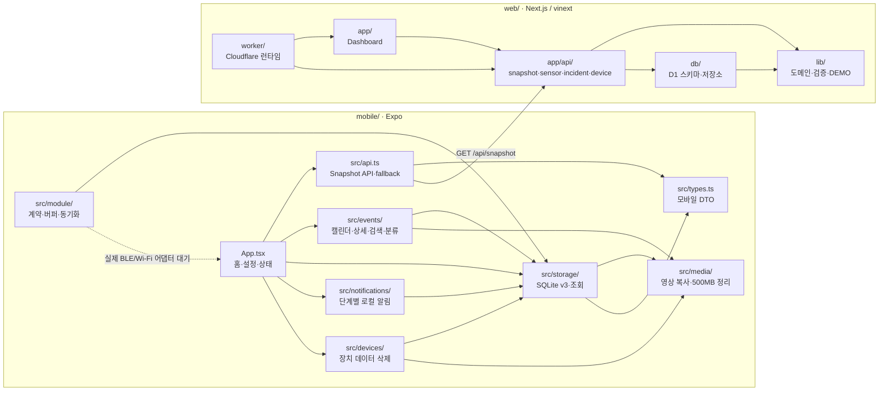

# Package Diagram

웹과 모바일의 소스 패키지 및 현재 의존 관계를 보여줍니다.

## Mermaid 원본

```mermaid
flowchart LR
    subgraph Mobile["mobile/ · Expo"]
        App["App.tsx<br/>홈·설정·상태"]
        Events["src/events/<br/>캘린더·상세·검색·분류"]
        API["src/api.ts<br/>Snapshot API·fallback"]
        Module["src/module/<br/>계약·버퍼·동기화"]
        Storage["src/storage/<br/>SQLite v3·조회"]
        Media["src/media/<br/>영상 복사·500MB 정리"]
        Notify["src/notifications/<br/>단계별 로컬 알림"]
        Devices["src/devices/<br/>장치 데이터 삭제"]
        Types["src/types.ts<br/>모바일 DTO"]

        App --> API
        App --> Events
        App --> Storage
        App --> Notify
        App --> Devices
        Events --> Storage
        Events --> Media
        Module --> Storage
        Storage --> Media
        Notify --> Storage
        Devices --> Storage
        Devices --> Media
        API --> Types
        Storage --> Types
    end

    subgraph Web["web/ · Next.js / vinext"]
        UI["app/<br/>Dashboard"]
        Routes["app/api/<br/>snapshot·sensor·incident·device"]
        Domain["lib/<br/>도메인·검증·DEMO"]
        Repo["db/<br/>D1 스키마·저장소"]
        Worker["worker/<br/>Cloudflare 런타임"]

        Worker --> UI
        Worker --> Routes
        UI --> Routes
        Routes --> Domain
        Routes --> Repo
        Repo --> Domain
    end

    API -->|"GET /api/snapshot"| Routes
    Module -. "실제 BLE/Wi-Fi 어댑터 대기" .-> App
```

모바일의 네이티브 저장·알림 구현은 웹 번들에서 대체 파일을 사용합니다. 웹과 모바일의 공통 Snapshot 타입은 아직 별도 파일에 중복되어 있어 추후 공용 패키지로 분리할 수 있습니다.
