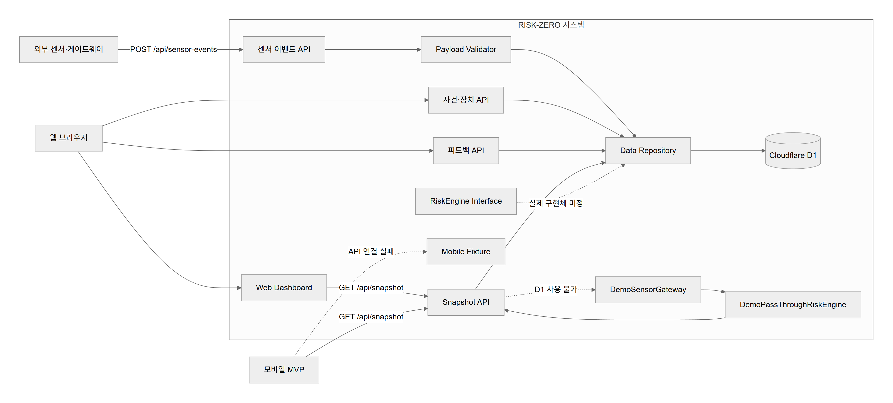
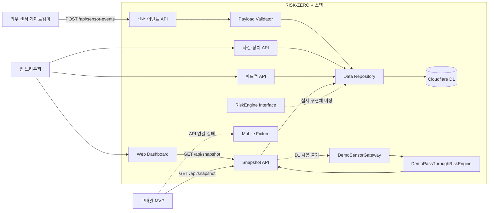

# Component Diagram

센서 입력부터 DB 저장, 웹·모바일 모니터링과 데모 fallback까지의 실행 컴포넌트를 보여줍니다.

## Mermaid 원본

> [!IMPORTANT]
> 실제 센서 사건은 DB에 저장되지만 활성 위험도 엔진이 없어 `pending`으로 남습니다. 현재 점수는 `DemoPassThroughRiskEngine`의 고정 시연 값입니다.
