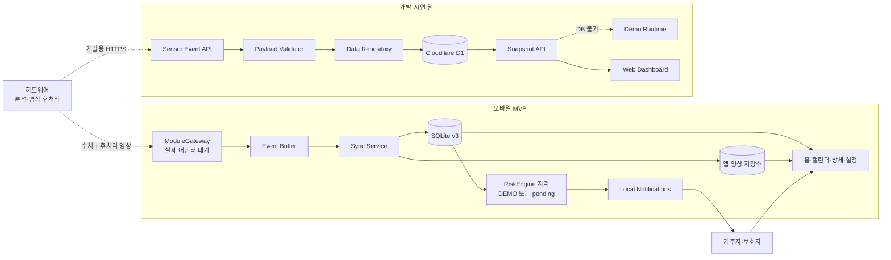

# Component Diagram

하드웨어의 후처리 결과부터 모바일 로컬 저장·알림, 웹 개발 API까지의 컴포넌트를 보여줍니다.

## Mermaid 원본

```mermaid
flowchart LR
    HW["하드웨어<br/>분석·영상 후처리"]
    User["거주자·보호자"]

    subgraph Mobile["모바일 MVP"]
        Gateway["ModuleGateway<br/>실제 어댑터 대기"]
        Buffer["Event Buffer"]
        Sync["Sync Service"]
        Files[("앱 영상 저장소")]
        SQLite[("SQLite v3")]
        Risk["RiskEngine 자리<br/>DEMO 또는 pending"]
        Alerts["Local Notifications"]
        Views["홈·캘린더·상세·설정"]
    end

    subgraph Web["개발·시연 웹"]
        SensorAPI["Sensor Event API"]
        Validator["Payload Validator"]
        Repo["Data Repository"]
        D1[("Cloudflare D1")]
        Snapshot["Snapshot API"]
        Demo["Demo Runtime"]
        Dashboard["Web Dashboard"]
    end

    HW -. "수치 + 후처리 영상" .-> Gateway
    Gateway --> Buffer
    Buffer --> Sync
    Sync --> Files
    Sync --> SQLite
    SQLite --> Risk
    Risk --> Alerts
    SQLite --> Views
    Files --> Views
    Alerts --> User
    User --> Views

    HW -. "개발용 HTTPS" .-> SensorAPI
    SensorAPI --> Validator
    Validator --> Repo
    Repo --> D1
    D1 --> Snapshot
    Snapshot -. "DB 불가" .-> Demo
    Snapshot --> Dashboard
```

실제 위험도 엔진은 아직 없습니다. 모바일 기기 알림은 앱이 사건을 받은 뒤 동작하며, 원격 보호자 푸시나 앱 종료 상태의 하드웨어 수신을 대신하지 않습니다.
