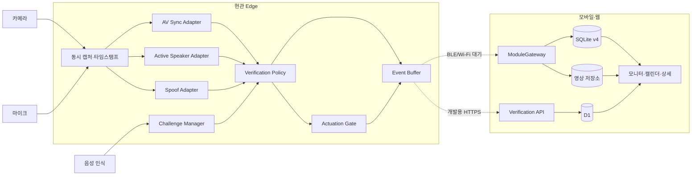

# Component Diagram

```mermaid
flowchart LR
    Camera["카메라"]
    Mic["마이크"]
    ASR["음성 인식"]

    subgraph Edge["현관 Edge"]
        Capture["동시 캡처·타임스탬프"]
        AVSync["AV Sync Adapter"]
        Speaker["Active Speaker Adapter"]
        Spoof["Spoof Adapter"]
        Challenge["Challenge Manager"]
        Policy["Verification Policy"]
        Gate["Actuation Gate"]
        Buffer["Event Buffer"]
    end

    subgraph Client["모바일·웹"]
        ModuleGateway["ModuleGateway"]
        LocalDB[("SQLite v4")]
        Files[("영상 저장소")]
        API["Verification API"]
        D1[("D1")]
        UI["모니터·캘린더·상세"]
    end

    Camera --> Capture
    Mic --> Capture
    Capture --> AVSync
    Capture --> Speaker
    Capture --> Spoof
    ASR --> Challenge
    AVSync --> Policy
    Speaker --> Policy
    Spoof --> Policy
    Challenge --> Policy
    Policy --> Gate
    Policy --> Buffer
    Gate --> Buffer
    Buffer -. "BLE/Wi-Fi 대기" .-> ModuleGateway
    ModuleGateway --> LocalDB
    ModuleGateway --> Files
    LocalDB --> UI
    Files --> UI
    Buffer -. "개발용 HTTPS" .-> API
    API --> D1
    D1 --> UI
```

점선은 실제 장치·모델 연결이 남은 경계다. 현재 모델 컴포넌트에는 결정론적 DEMO 입력만 사용한다.
