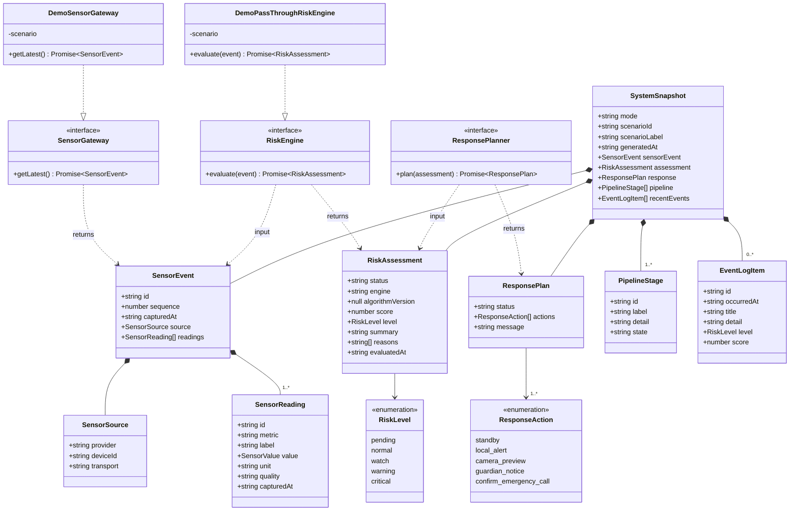

# Domain/Class Diagram

`web/lib/domain.ts`의 도메인 객체와 현재 데모 구현체의 관계를 보여줍니다.

## Mermaid 원본

```mermaid
classDiagram
    class SensorGateway {
        <<interface>>
        +getLatest() Promise~SensorEvent~
    }

    class RiskEngine {
        <<interface>>
        +evaluate(event) Promise~RiskAssessment~
    }

    class ResponsePlanner {
        <<interface>>
        +plan(assessment) Promise~ResponsePlan~
    }

    class DemoSensorGateway {
        -scenario
        +getLatest() Promise~SensorEvent~
    }

    class DemoPassThroughRiskEngine {
        -scenario
        +evaluate(event) Promise~RiskAssessment~
    }

    class SensorEvent {
        +string id
        +number sequence
        +string capturedAt
        +SensorSource source
        +SensorReading[] readings
    }

    class SensorSource {
        +string provider
        +string deviceId
        +string transport
    }

    class SensorReading {
        +string id
        +string metric
        +string label
        +SensorValue value
        +string unit
        +string quality
        +string capturedAt
    }

    class RiskAssessment {
        +string status
        +string engine
        +null algorithmVersion
        +number score
        +RiskLevel level
        +string summary
        +string[] reasons
        +string evaluatedAt
    }

    class RiskLevel {
        <<enumeration>>
        pending
        normal
        watch
        warning
        critical
    }

    class ResponsePlan {
        +string status
        +ResponseAction[] actions
        +string message
    }

    class ResponseAction {
        <<enumeration>>
        standby
        local_alert
        camera_preview
        guardian_notice
        confirm_emergency_call
    }

    class SystemSnapshot {
        +string mode
        +string scenarioId
        +string scenarioLabel
        +string generatedAt
        +SensorEvent sensorEvent
        +RiskAssessment assessment
        +ResponsePlan response
        +PipelineStage[] pipeline
        +EventLogItem[] recentEvents
    }

    class PipelineStage {
        +string id
        +string label
        +string detail
        +string state
    }

    class EventLogItem {
        +string id
        +string occurredAt
        +string title
        +string detail
        +RiskLevel level
        +number score
    }

    DemoSensorGateway ..|> SensorGateway
    DemoPassThroughRiskEngine ..|> RiskEngine

    SensorGateway ..> SensorEvent : returns
    RiskEngine ..> SensorEvent : input
    RiskEngine ..> RiskAssessment : returns
    ResponsePlanner ..> RiskAssessment : input
    ResponsePlanner ..> ResponsePlan : returns

    SensorEvent *-- SensorSource
    SensorEvent *-- "1..*" SensorReading
    RiskAssessment --> RiskLevel
    ResponsePlan --> "1..*" ResponseAction

    SystemSnapshot *-- SensorEvent
    SystemSnapshot *-- RiskAssessment
    SystemSnapshot *-- ResponsePlan
    SystemSnapshot *-- "1..*" PipelineStage
    SystemSnapshot *-- "0..*" EventLogItem
```

> [!NOTE]
> `ResponsePlanner`는 인터페이스만 있고 구현체가 없습니다. `SensorGateway`와 `RiskEngine`은 현재 데모 구현체만 존재합니다.
