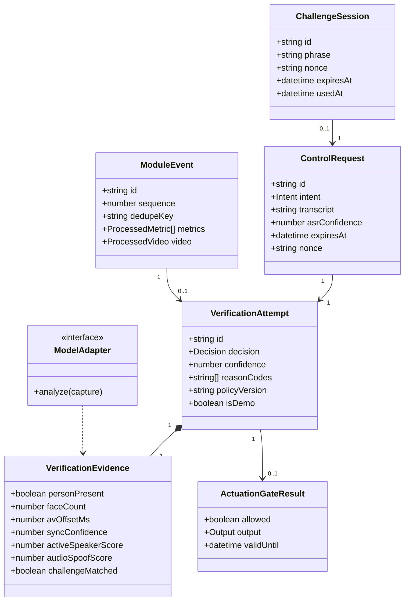

# Domain/Class Diagram

```mermaid
classDiagram
    class ChallengeSession {
        +string id
        +string phrase
        +string nonce
        +datetime expiresAt
        +datetime usedAt
    }
    class ControlRequest {
        +string id
        +Intent intent
        +string transcript
        +number asrConfidence
        +datetime expiresAt
        +string nonce
    }
    class ModuleEvent {
        +string id
        +number sequence
        +string dedupeKey
        +ProcessedMetric[] metrics
        +ProcessedVideo video
    }
    class VerificationAttempt {
        +string id
        +Decision decision
        +number confidence
        +string[] reasonCodes
        +string policyVersion
        +boolean isDemo
    }
    class VerificationEvidence {
        +boolean personPresent
        +number faceCount
        +number avOffsetMs
        +number syncConfidence
        +number activeSpeakerScore
        +number audioSpoofScore
        +boolean challengeMatched
    }
    class ActuationGateResult {
        +boolean allowed
        +Output output
        +datetime validUntil
    }
    class ModelAdapter {
        <<interface>>
        +analyze(capture)
    }

    ChallengeSession "0..1" --> "1" ControlRequest
    ControlRequest "1" --> "1" VerificationAttempt
    ModuleEvent "1" --> "0..1" VerificationAttempt
    VerificationAttempt "1" *-- "1" VerificationEvidence
    VerificationAttempt "1" --> "0..1" ActuationGateResult
    ModelAdapter ..> VerificationEvidence
```

`VerificationAttempt`는 신원이나 위험도를 뜻하지 않는다. 한 제어 요청의 시청각 근거가 정책 조건을 충족했는지 기록한다.
