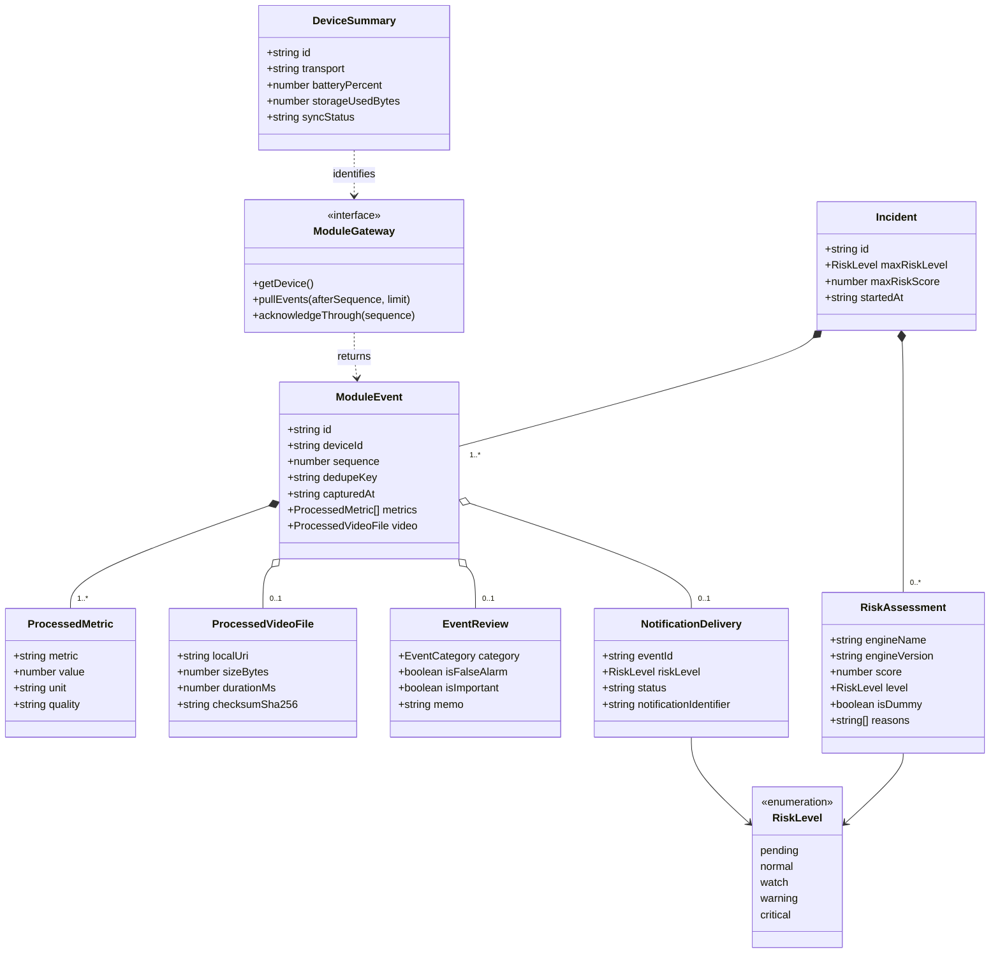

# Domain/Class Diagram

모바일 v0.2.0의 모듈·사건·영상·평가·분류·알림 객체 관계를 중심으로 보여줍니다.

## Mermaid 원본

```mermaid
classDiagram
    class ModuleGateway {
        <<interface>>
        +getDevice()
        +pullEvents(afterSequence, limit)
        +acknowledgeThrough(sequence)
    }

    class ModuleEvent {
        +string id
        +string deviceId
        +number sequence
        +string dedupeKey
        +string capturedAt
        +ProcessedMetric[] metrics
        +ProcessedVideoFile video
    }

    class ProcessedMetric {
        +string metric
        +number value
        +string unit
        +string quality
    }

    class ProcessedVideoFile {
        +string localUri
        +number sizeBytes
        +number durationMs
        +string checksumSha256
    }

    class Incident {
        +string id
        +RiskLevel maxRiskLevel
        +number maxRiskScore
        +string startedAt
    }

    class RiskAssessment {
        +string engineName
        +string engineVersion
        +number score
        +RiskLevel level
        +boolean isDummy
        +string[] reasons
    }

    class EventReview {
        +EventCategory category
        +boolean isFalseAlarm
        +boolean isImportant
        +string memo
    }

    class NotificationDelivery {
        +string eventId
        +RiskLevel riskLevel
        +string status
        +string notificationIdentifier
    }

    class DeviceSummary {
        +string id
        +string transport
        +number batteryPercent
        +number storageUsedBytes
        +string syncStatus
    }

    class RiskLevel {
        <<enumeration>>
        pending
        normal
        watch
        warning
        critical
    }

    ModuleGateway ..> ModuleEvent : returns
    ModuleEvent *-- "1..*" ProcessedMetric
    ModuleEvent o-- "0..1" ProcessedVideoFile
    Incident *-- "1..*" ModuleEvent
    Incident *-- "0..*" RiskAssessment
    ModuleEvent o-- "0..1" EventReview
    ModuleEvent o-- "0..1" NotificationDelivery
    RiskAssessment --> RiskLevel
    NotificationDelivery --> RiskLevel
    DeviceSummary ..> ModuleGateway : identifies
```

`EventReview`는 사용자의 로컬 분류이고 검증용 정답 라벨과 동일하지 않습니다. `RiskAssessment.engineVersion`은 실제 계산식이 확정되기 전까지 비어 있습니다.
