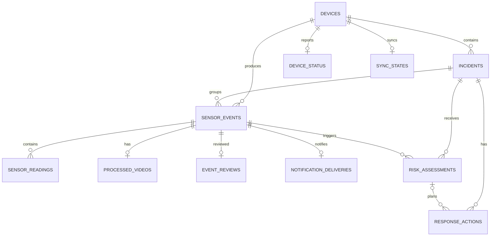

# Data Model ERD

모바일 SQLite schema v3의 12개 앱 데이터 테이블 관계를 보여줍니다. 별도의 `schema_migrations` 테이블까지 포함하면 총 13개입니다.

## Mermaid 원본

새 센서는 `sensor_readings.metric` 행으로 확장합니다. 영상 파일은 DB 밖에 두고 `processed_videos.local_uri`만 저장합니다. 장치 삭제 시 외래키 cascade와 파일 정리를 함께 실행합니다.
