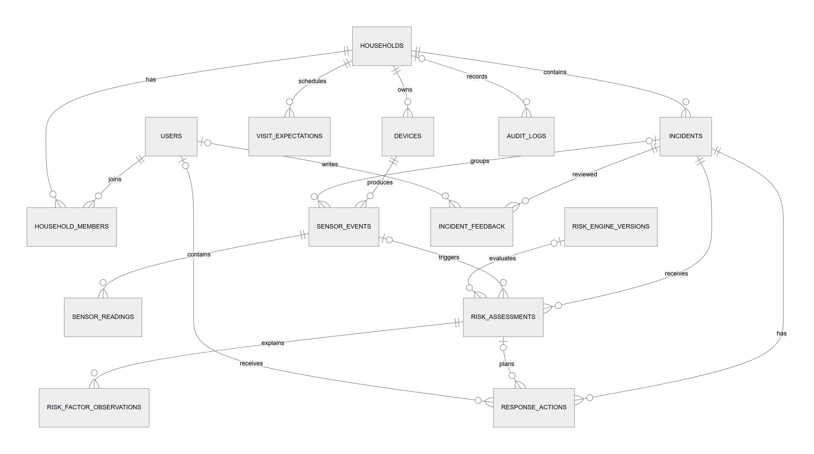
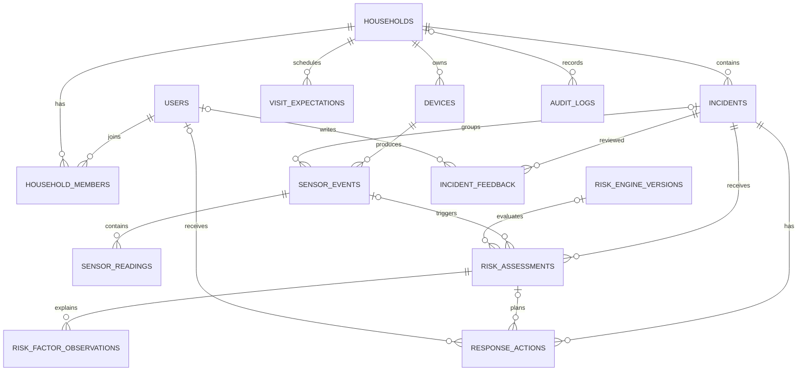

# Data Model ERD

Cloudflare D1에 구현된 핵심 테이블과 사건·평가·피드백 관계를 보여줍니다.

## Mermaid 원본

> [!NOTE]
> 새로운 센서는 DB 열을 추가하는 대신 `sensor_readings.metric` 행을 추가합니다. 위험도 엔진 결과는 버전별로 새 평가를 저장하며 기존 평가를 덮어쓰지 않는 구조입니다.
