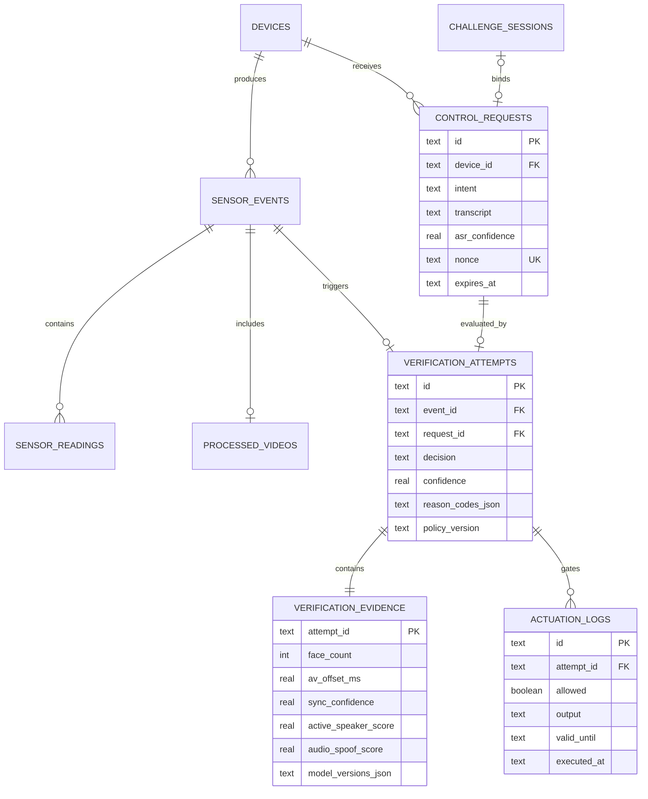

# Data Model ERD

```mermaid
erDiagram
    DEVICES ||--o{ SENSOR_EVENTS : produces
    DEVICES ||--o{ CONTROL_REQUESTS : receives
    CHALLENGE_SESSIONS o|--o| CONTROL_REQUESTS : binds
    SENSOR_EVENTS ||--o{ SENSOR_READINGS : contains
    SENSOR_EVENTS ||--o| PROCESSED_VIDEOS : includes
    SENSOR_EVENTS ||--o| VERIFICATION_ATTEMPTS : triggers
    CONTROL_REQUESTS ||--o| VERIFICATION_ATTEMPTS : evaluated_by
    VERIFICATION_ATTEMPTS ||--|| VERIFICATION_EVIDENCE : contains
    VERIFICATION_ATTEMPTS ||--o{ ACTUATION_LOGS : gates

    CONTROL_REQUESTS {
        text id PK
        text device_id FK
        text intent
        text transcript
        real asr_confidence
        text nonce UK
        text expires_at
    }
    VERIFICATION_ATTEMPTS {
        text id PK
        text event_id FK
        text request_id FK
        text decision
        real confidence
        text reason_codes_json
        text policy_version
    }
    VERIFICATION_EVIDENCE {
        text attempt_id PK
        int face_count
        real av_offset_ms
        real sync_confidence
        real active_speaker_score
        real audio_spoof_score
        text model_versions_json
    }
    ACTUATION_LOGS {
        text id PK
        text attempt_id FK
        boolean allowed
        text output
        text valid_until
        text executed_at
    }
```

모바일 SQLite는 18개, 웹 D1은 계정·가구·감사 테이블을 포함해 19개다. 그림은 새 검증 흐름의 핵심 관계만 표시한다.
