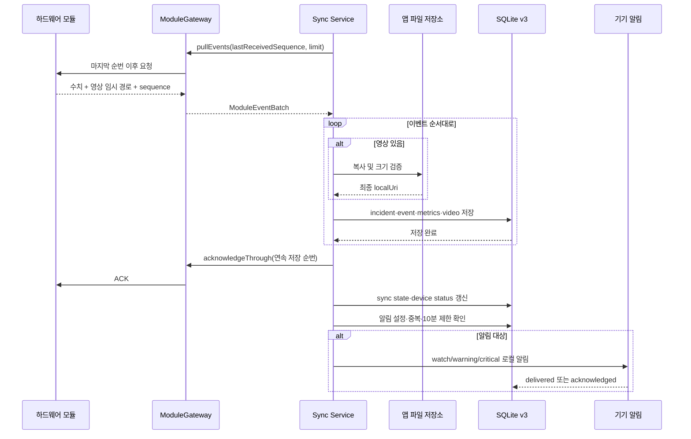

# Module Sync Sequence Diagram

하드웨어가 만든 수치·후처리 영상을 모바일이 저장하고 ACK·알림하는 순서를 보여줍니다.

## Mermaid 원본

```mermaid
sequenceDiagram
    participant HW as 하드웨어 모듈
    participant GW as ModuleGateway
    participant SY as Sync Service
    participant FS as 앱 파일 저장소
    participant DB as SQLite v3
    participant NT as 기기 알림

    SY->>GW: pullEvents(lastReceivedSequence, limit)
    GW->>HW: 마지막 순번 이후 요청
    HW-->>GW: 수치 + 영상 임시 경로 + sequence
    GW-->>SY: ModuleEventBatch

    loop 이벤트 순서대로
        alt 영상 있음
            SY->>FS: 복사 및 크기 검증
            FS-->>SY: 최종 localUri
        end
        SY->>DB: incident·event·metrics·video 저장
        DB-->>SY: 저장 완료
    end

    SY->>GW: acknowledgeThrough(연속 저장 순번)
    GW->>HW: ACK
    SY->>DB: sync state·device status 갱신
    SY->>DB: 알림 설정·중복·10분 제한 확인

    alt 알림 대상
        SY->>NT: watch/warning/critical 로컬 알림
        NT-->>DB: delivered 또는 acknowledged
    end
```

영상 복사나 DB 기록이 실패하면 ACK하지 않습니다. 현재 실제 `ModuleGateway` 구현은 없고 메모리 모듈로 동기화 규칙을 시험합니다.
