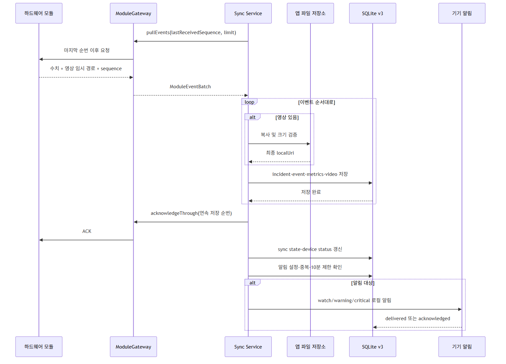
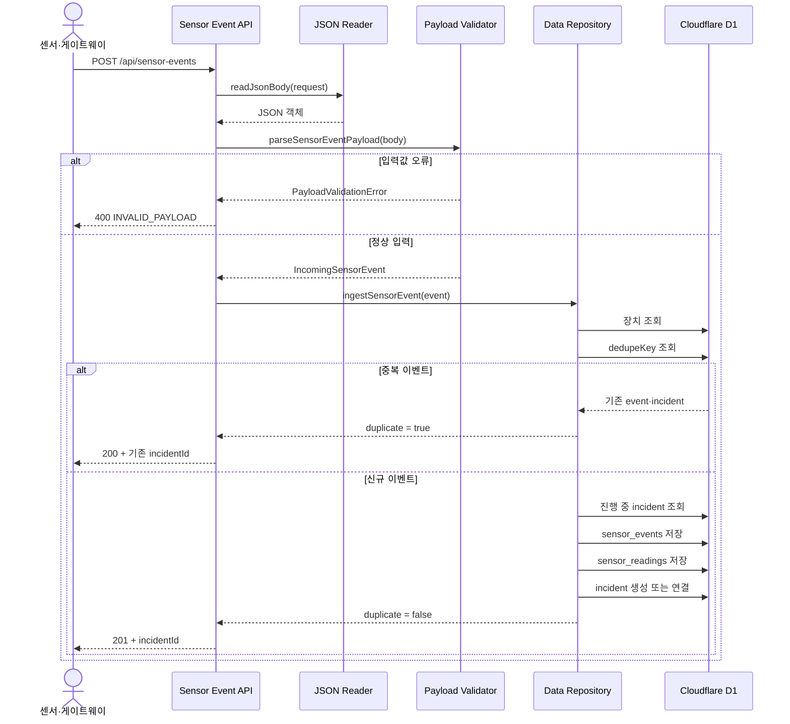

# Sensor Ingest Sequence Diagram

센서 이벤트 수신, 검증, 중복 방지, 사건 그룹화와 D1 저장 순서를 보여줍니다.

## Mermaid 원본

```mermaid
sequenceDiagram
    actor Sensor as 센서·게이트웨이
    participant Route as Sensor Event API
    participant Body as JSON Reader
    participant Validator as Payload Validator
    participant Repo as Data Repository
    participant DB as Cloudflare D1

    Sensor->>Route: POST /api/sensor-events
    Route->>Body: readJsonBody(request)
    Body-->>Route: JSON 객체
    Route->>Validator: parseSensorEventPayload(body)

    alt 입력값 오류
        Validator-->>Route: PayloadValidationError
        Route-->>Sensor: 400 INVALID_PAYLOAD
    else 정상 입력
        Validator-->>Route: IncomingSensorEvent
        Route->>Repo: ingestSensorEvent(event)
        Repo->>DB: 장치 조회
        Repo->>DB: dedupeKey 조회

        alt 중복 이벤트
            DB-->>Repo: 기존 event·incident
            Repo-->>Route: duplicate = true
            Route-->>Sensor: 200 + 기존 incidentId
        else 신규 이벤트
            Repo->>DB: 진행 중 incident 조회
            Repo->>DB: sensor_events 저장
            Repo->>DB: sensor_readings 저장
            Repo->>DB: incident 생성 또는 연결
            Repo-->>Route: duplicate = false
            Route-->>Sensor: 201 + incidentId
        end
    end
```

> [!NOTE]
> 사건 ID가 지정되지 않으면 같은 주거의 최근 진행 중 사건을 조회합니다. 현재 기본 그룹화 시간은 2분입니다.
