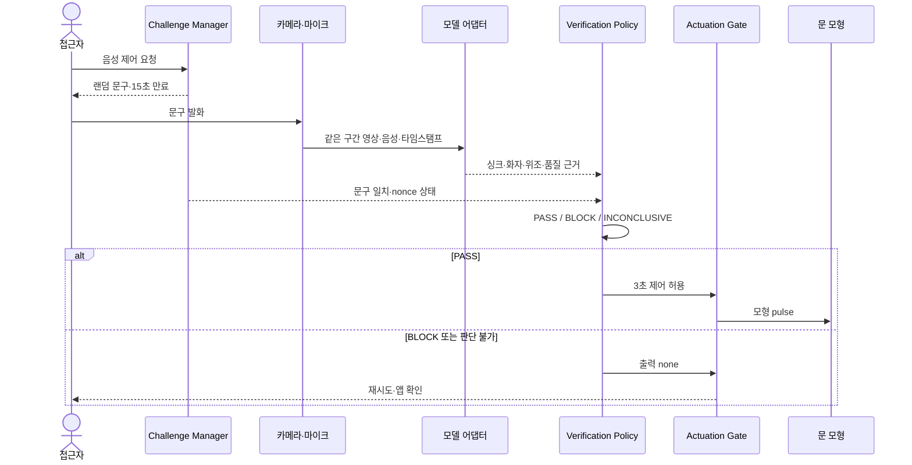

# Capture and Verification Sequence

```mermaid
sequenceDiagram
    actor Person as 접근자
    participant Challenge as Challenge Manager
    participant Capture as 카메라·마이크
    participant Models as 모델 어댑터
    participant Policy as Verification Policy
    participant Gate as Actuation Gate
    participant Lock as 문 모형

    Person->>Challenge: 음성 제어 요청
    Challenge-->>Person: 랜덤 문구·15초 만료
    Person->>Capture: 문구 발화
    Capture->>Models: 같은 구간 영상·음성·타임스탬프
    Models-->>Policy: 싱크·화자·위조·품질 근거
    Challenge-->>Policy: 문구 일치·nonce 상태
    Policy->>Policy: PASS / BLOCK / INCONCLUSIVE
    alt PASS
        Policy->>Gate: 3초 제어 허용
        Gate->>Lock: 모형 pulse
    else BLOCK 또는 판단 불가
        Policy->>Gate: 출력 none
        Gate-->>Person: 재시도·앱 확인
    end
```

현재 `Lock`은 `MockActuator`이며 실제 도어락 출력을 만들지 않는다.
