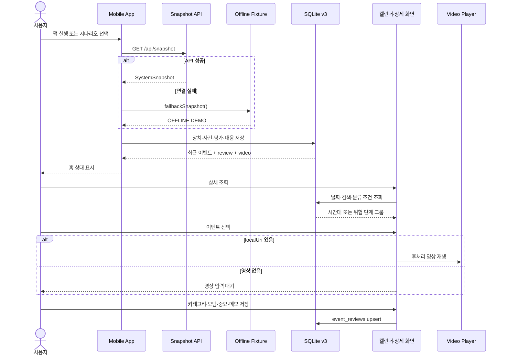

# Event View Sequence Diagram

모바일이 API 또는 내장 fixture를 SQLite에 반영하고 캘린더·상세 화면에서 읽는 순서를 보여줍니다.

## Mermaid 원본

```mermaid
sequenceDiagram
    actor User as 사용자
    participant App as Mobile App
    participant API as Snapshot API
    participant FX as Offline Fixture
    participant DB as SQLite v3
    participant View as 캘린더·상세 화면
    participant Video as Video Player

    User->>App: 앱 실행 또는 시나리오 선택
    App->>API: GET /api/snapshot

    alt API 성공
        API-->>App: SystemSnapshot
    else 연결 실패
        App->>FX: fallbackSnapshot()
        FX-->>App: OFFLINE DEMO
    end

    App->>DB: 장치·사건·평가·대응 저장
    DB-->>App: 최근 이벤트 + review + video
    App-->>User: 홈 상태 표시

    User->>View: 상세 조회
    View->>DB: 날짜·검색·분류 조건 조회
    DB-->>View: 시간대 또는 위험 단계 그룹
    User->>View: 이벤트 선택

    alt localUri 있음
        View->>Video: 후처리 영상 재생
    else 영상 없음
        View-->>User: 영상 입력 대기
    end

    User->>View: 카테고리·오탐·중요·메모 저장
    View->>DB: event_reviews upsert
```

API와 fixture의 점수는 DEMO 값입니다. 실제 모듈 사건은 위험도 엔진이 연결되기 전까지 `pending`으로 표시합니다.
