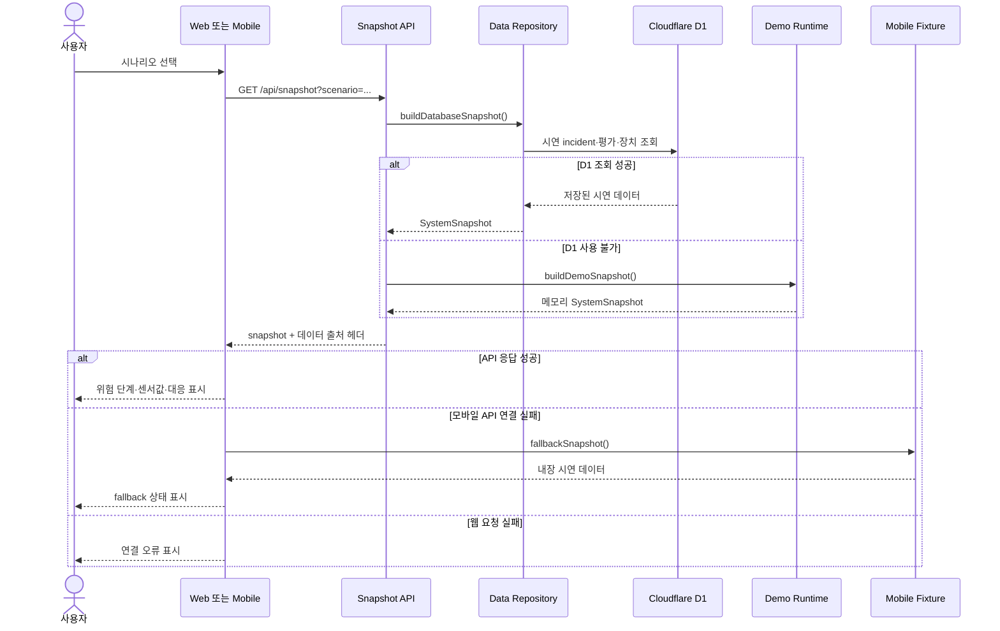

# Snapshot Sequence Diagram

웹·모바일의 스냅샷 조회와 D1·메모리·모바일 fixture fallback 순서를 보여줍니다.

## Mermaid 원본

> [!IMPORTANT]
> fallback 데이터는 실제 현관 상태가 아니라 화면 확인용 시연 데이터입니다. 실제 운영 전에는 마지막 성공 시각과 연결 실패 상태를 명확하게 표시해야 합니다.
