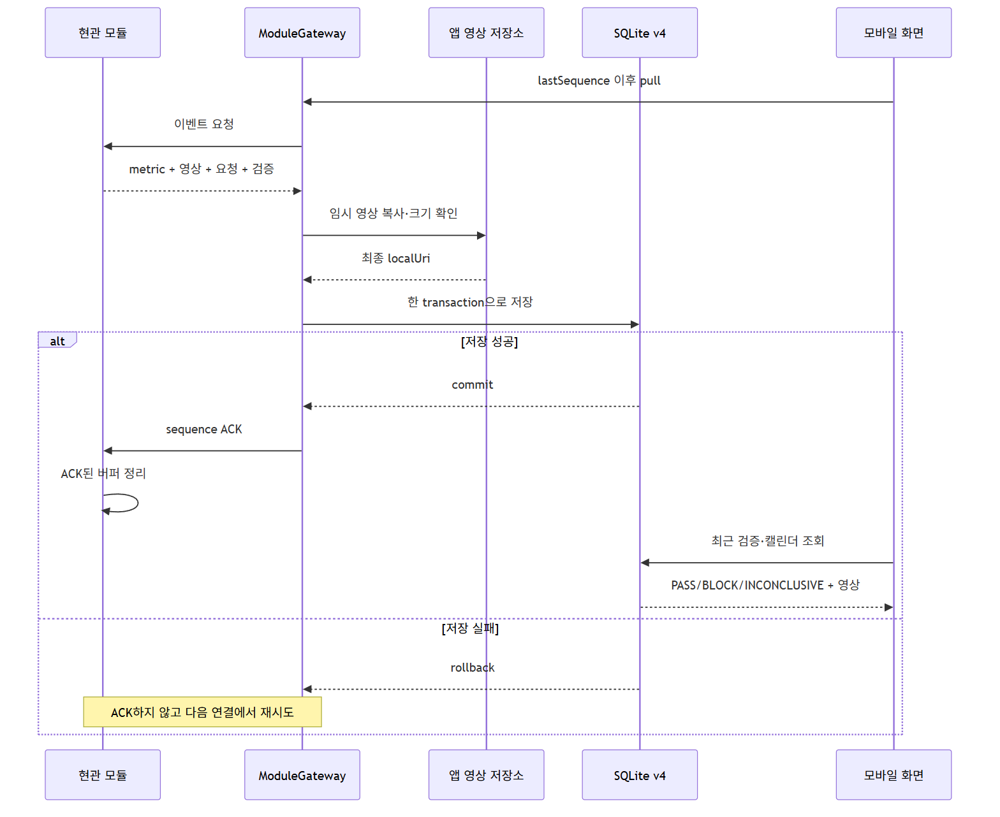
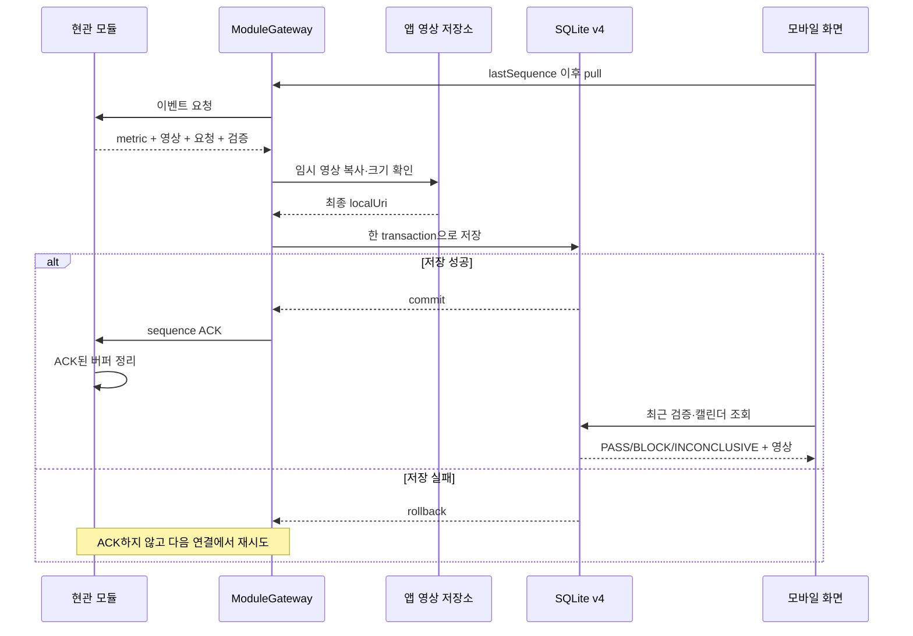

# Module Sync and Monitoring Sequence

```mermaid
sequenceDiagram
    participant Edge as 현관 모듈
    participant Gateway as ModuleGateway
    participant File as 앱 영상 저장소
    participant DB as SQLite v4
    participant UI as 모바일 화면

    UI->>Gateway: lastSequence 이후 pull
    Gateway->>Edge: 이벤트 요청
    Edge-->>Gateway: metric + 영상 + 요청 + 검증
    Gateway->>File: 임시 영상 복사·크기 확인
    File-->>Gateway: 최종 localUri
    Gateway->>DB: 한 transaction으로 저장
    alt 저장 성공
        DB-->>Gateway: commit
        Gateway->>Edge: sequence ACK
        Edge->>Edge: ACK된 버퍼 정리
        UI->>DB: 최근 검증·캘린더 조회
        DB-->>UI: PASS/BLOCK/INCONCLUSIVE + 영상
    else 저장 실패
        DB-->>Gateway: rollback
        Note over Gateway,Edge: ACK하지 않고 다음 연결에서 재시도
    end
```

event ID, dedupe key, sequence, nonce의 고유 제약으로 재전송과 재사용을 구분한다.
