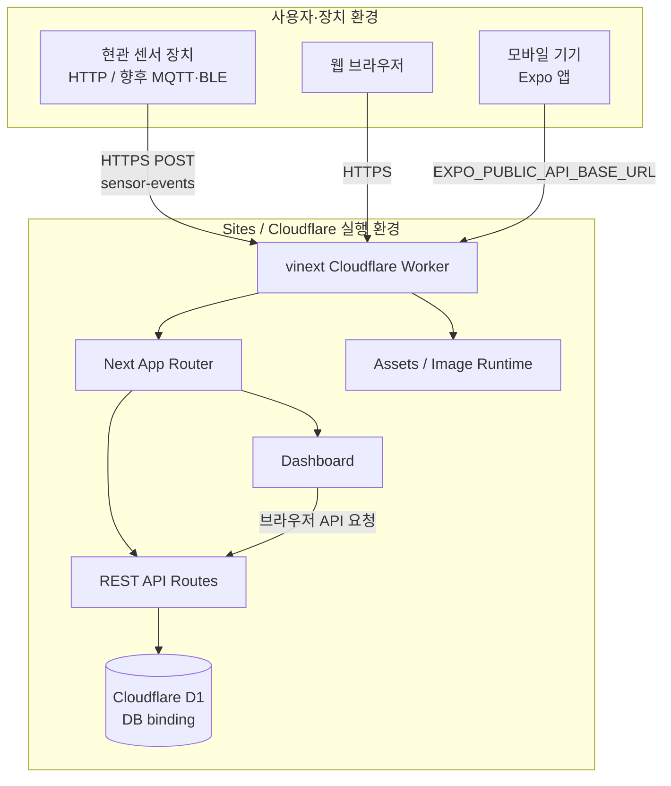

# Deployment Diagram

현관 센서, 웹 브라우저, Expo 모바일 앱과 Sites·Cloudflare Worker·D1의 배치 관계를 보여줍니다.

## Mermaid 원본

> [!NOTE]
> `.openai/hosting.json`은 D1 binding 이름을 `DB`로 지정합니다. 실제 센서와 모바일 앱은 배포된 Worker의 HTTPS API 주소를 사용해야 합니다.
