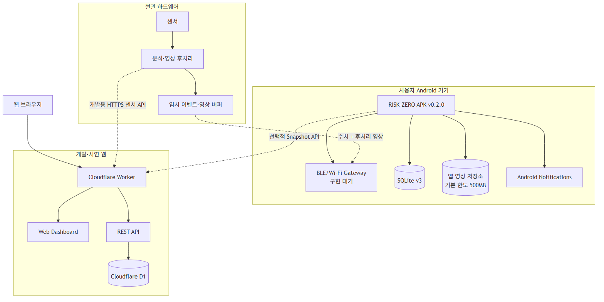
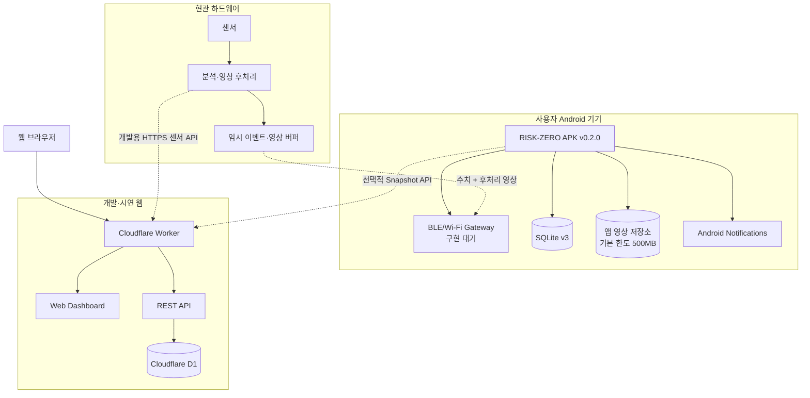

# Deployment Diagram

현관 모듈, Android 앱의 로컬 저장소, 개발용 웹 Worker·D1의 배치 관계를 보여줍니다.

## Mermaid 원본

```mermaid
flowchart TB
    subgraph Entrance["현관 하드웨어"]
        Sensors["센서"]
        Processor["분석·영상 후처리"]
        Buffer["임시 이벤트·영상 버퍼"]
        Sensors --> Processor
        Processor --> Buffer
    end

    subgraph Phone["사용자 Android 기기"]
        APK["RISK-ZERO APK v0.2.0"]
        Gateway["BLE/Wi-Fi Gateway<br/>구현 대기"]
        SQLite[("SQLite v3")]
        Files[("앱 영상 저장소<br/>기본 한도 500MB")]
        OS["Android Notifications"]

        APK --> Gateway
        APK --> SQLite
        APK --> Files
        APK --> OS
    end

    subgraph Cloud["개발·시연 웹"]
        Worker["Cloudflare Worker"]
        WebUI["Web Dashboard"]
        APIs["REST API"]
        D1[("Cloudflare D1")]
        Worker --> WebUI
        Worker --> APIs
        APIs --> D1
    end

    Buffer -. "수치 + 후처리 영상" .-> Gateway
    APK -. "선택적 Snapshot API" .-> Worker
    Browser["웹 브라우저"] --> Worker
    Processor -. "개발용 HTTPS 센서 API" .-> Worker
```

모바일 MVP는 서버가 없어도 OFFLINE DEMO로 실행됩니다. 실제 하드웨어 통신, 사용자·장치 인증, 원격 푸시, 112 신고와 도어락 제어는 배치에 포함하지 않았습니다.
