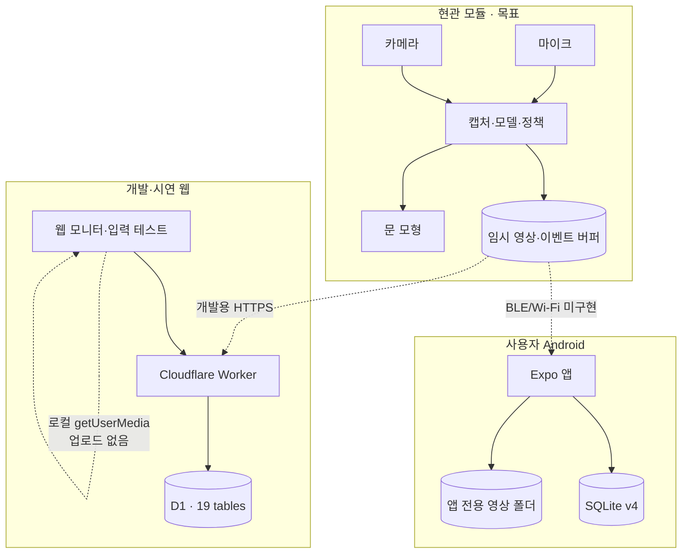

# Deployment Diagram

```mermaid
flowchart TB
    subgraph Entrance["현관 모듈 · 목표"]
        Camera["카메라"]
        Mic["마이크"]
        EdgeApp["캡처·모델·정책"]
        Buffer[("임시 영상·이벤트 버퍼")]
        MockLock["문 모형"]
        Camera --> EdgeApp
        Mic --> EdgeApp
        EdgeApp --> Buffer
        EdgeApp --> MockLock
    end

    subgraph Phone["사용자 Android"]
        Mobile["Expo 앱"]
        SQLite[("SQLite v4")]
        Video[("앱 전용 영상 폴더")]
        Mobile --> SQLite
        Mobile --> Video
    end

    subgraph DevWeb["개발·시연 웹"]
        Browser["웹 모니터·입력 테스트"]
        Worker["Cloudflare Worker"]
        D1[("D1 · 19 tables")]
        Browser --> Worker
        Worker --> D1
    end

    Buffer -. "BLE/Wi-Fi 미구현" .-> Mobile
    Buffer -. "개발용 HTTPS" .-> Worker
    Browser -. "로컬 getUserMedia<br/>업로드 없음" .-> Browser
```

모바일 경로는 서버 없이 동작하도록 설계했다. 웹은 통합 시험용이며 실제 운영 배치는 인증·암호화·보존 정책을 추가한 뒤 결정한다.
