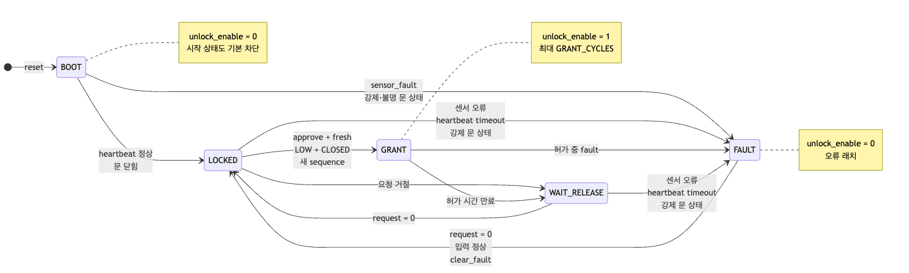
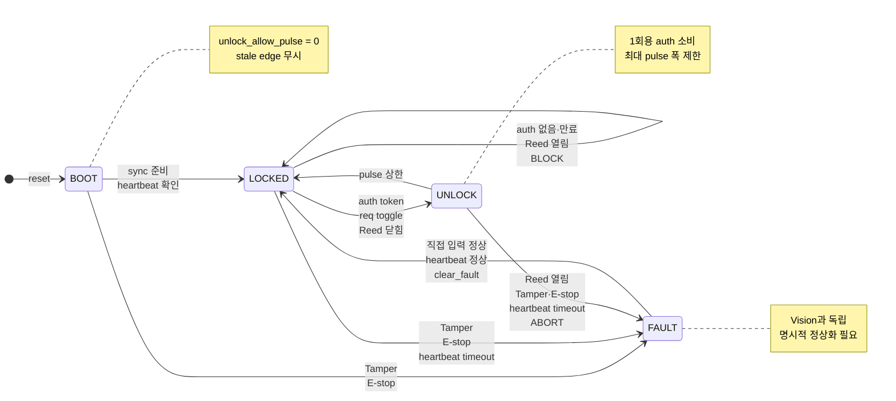

# FPGA Default-Deny Safety Gate FSM

```mermaid
stateDiagram-v2
    direction LR

    [*] --> BOOT: reset

    BOOT --> LOCKED: sync 준비<br/>heartbeat 확인
    BOOT --> FAULT: Tamper<br/>E-stop

    LOCKED --> UNLOCK: auth token<br/>req toggle<br/>Reed 닫힘
    LOCKED --> LOCKED: auth 없음·만료<br/>Reed 열림<br/>BLOCK
    LOCKED --> FAULT: Tamper<br/>E-stop<br/>heartbeat timeout

    UNLOCK --> LOCKED: pulse 상한
    UNLOCK --> FAULT: Reed 열림<br/>Tamper·E-stop<br/>heartbeat timeout<br/>ABORT

    FAULT --> LOCKED: 직접 입력 정상<br/>heartbeat 정상<br/>clear_fault

    note right of BOOT
      unlock_allow_pulse = 0
      stale edge 무시
    end note

    note right of UNLOCK
      1회용 auth 소비
      최대 pulse 폭 제한
    end note

    note right of FAULT
      Vision과 독립
      명시적 정상화 필요
    end note
```

Door Hub의 `ALLOW`는 FPGA 직접 Reed #2·Tamper·E-stop과 heartbeat를 우회할 수 없다. Camera/Vision 결과에서 `unlock_allow_pulse`로 직접 연결하는 경로는 만들지 않는다.
