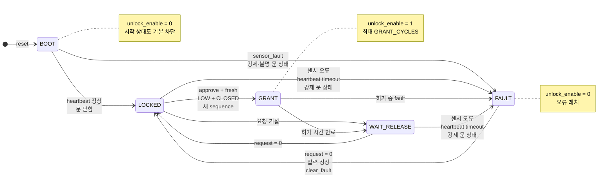

# FPGA Default-Deny Safety Gate FSM

```mermaid
stateDiagram-v2
    direction LR

    [*] --> BOOT: reset

    BOOT --> LOCKED: heartbeat 정상<br/>문 닫힘
    BOOT --> FAULT: sensor_fault<br/>강제·불명 문 상태

    LOCKED --> GRANT: approve + fresh<br/>LOW + CLOSED<br/>새 sequence
    LOCKED --> WAIT_RELEASE: 요청 거절
    LOCKED --> FAULT: 센서 오류<br/>heartbeat timeout<br/>강제 문 상태

    GRANT --> WAIT_RELEASE: 허가 시간 만료
    GRANT --> FAULT: 허가 중 fault

    WAIT_RELEASE --> LOCKED: request = 0
    WAIT_RELEASE --> FAULT: 센서 오류<br/>heartbeat timeout<br/>강제 문 상태

    FAULT --> LOCKED: request = 0<br/>입력 정상<br/>clear_fault

    note right of BOOT
      unlock_enable = 0
      시작 상태도 기본 차단
    end note

    note right of GRANT
      unlock_enable = 1
      최대 GRANT_CYCLES
    end note

    note right of FAULT
      unlock_enable = 0
      오류 래치
    end note
```

허가되지 않은 요청은 `WAIT_RELEASE`에서 입력이 내려갈 때까지 기다려 레벨 고정에 의한 반복 개방을 방지한다. `FAULT`는 요청이 해제되고 heartbeat·센서·문 상태가 모두 정상인 경우에만 명시적으로 해제한다.
