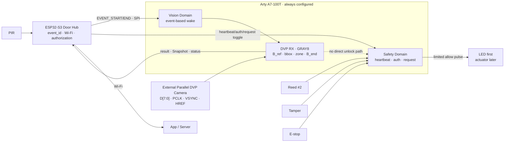

# Current Hardware Architecture

```mermaid
flowchart LR
    PIR["PIR"] --> Hub["ESP32-S3 Door Hub<br/>event_id · Wi-Fi · authorization"]

    subgraph FPGA["Arty A7-100T · always configured"]
        Safety["Safety Domain<br/>heartbeat · auth · request"]
        Vision["Vision Domain<br/>event-based wake"]
        DVP["DVP RX · GRAY8<br/>B_ref · bbox · zone · B_end"]
        Vision --> DVP
    end

    Camera["External Parallel DVP Camera<br/>D[7:0] · PCLK · VSYNC · HREF"] --> DVP
    Hub -->|"EVENT_START/END · SPI"| Vision
    DVP -->|"result · Snapshot · status"| Hub

    Hub -->|"heartbeat/auth/request toggle"| Safety
    Reed["Reed #2"] --> Safety
    Tamper["Tamper"] --> Safety
    Estop["E-stop"] --> Safety
    Safety -->|"limited allow pulse"| LED["LED first<br/>actuator later"]

    Hub -->|"Wi-Fi"| App["App / Server"]

    DVP -. "no direct unlock path" .-> Safety
```

FPGA 전체는 방문 이벤트마다 재부팅하지 않는다. Safety Domain은 계속 동작하고 Camera와 Vision Domain만 대기·활성 상태를 전환한다. 점선은 금지된 직접 개방 경로를 뜻한다.
