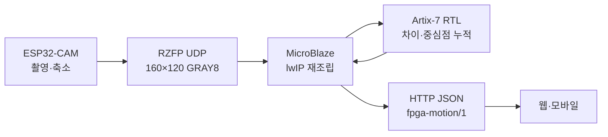

# RISK-ZERO Arty A7-100T 동선 처리 설계 v0.1

- 기준일: 2026-08-18
- 입력 장치: AI Thinker ESP32-CAM
- 처리 장치: Digilent Arty A7-100T, XC7A100T
- 목표: 노트북의 영상 분석 역할을 FPGA 보드로 이동

## 결정

Arty A7-100T에는 ARM이 없으므로 사람 탐지 신경망 대신 고정 카메라의 움직임 후보를 FPGA에서 계산한다. MicroBlaze는 Ethernet과 HTTP를 담당하고, RTL은 매 픽셀의 프레임 차이를 병렬 처리한다.

## FPGA RTL 처리

첫 프레임은 배경 BRAM으로 저장한다. 다음 프레임부터 같은 위치의 배경 픽셀과 현재 픽셀 차이가 임계값 이상이면 전경 후보로 센다. 차이가 작은 픽셀만 배경으로 갱신하므로 접근자가 멈춰도 전경 후보가 바로 사라지지 않는다.

FPGA가 계산하는 값:

- 움직임 픽셀 수
- 모든 움직임 픽셀의 x 좌표 합과 y 좌표 합
- 움직임 경계 상자의 최소·최대 x/y
- 배경 준비와 결과 준비 상태

MicroBlaze는 `sumX / count`, `sumY / count`로 중심점을 계산한다. 중심점은 0~1000 좌표로 정규화해 현관, 택배, 사각지대 구역과 비교한다.

## 네트워크

ESP32-CAM은 Wi-Fi, Arty A7은 Ethernet으로 같은 공유기에 연결한다. JPEG 웹 화면은 유지하고, FPGA에는 160×120 흑백 프레임을 5FPS 이하로 UDP 전송한다.

- 입력: UDP 5005
- 상태 출력: HTTP 80
- 패킷: RZFP/1, 32-byte header, 최대 1,200-byte payload
- 손실 프레임: 폐기 후 다음 프레임 처리

## 구현 파일

| 경로 | 내용 |
| --- | --- |
| `firmware/esp32-cam` | JPEG→GRAY8 축소와 UDP 분할 전송 |
| `fpga/arty-a7-100t/rtl` | motion core와 AXI4-Lite wrapper |
| `fpga/arty-a7-100t/software` | UDP 재조립, FPGA 제어, 동선 상태, HTTP JSON |
| `fpga/arty-a7-100t/vivado` | RTL simulation, IP packaging, BRAM Block Design, 합성·timing·XSA Tcl |
| `web/lib/fpga-motion.ts` | `fpga-motion/1` 검증과 웹 데이터 변환 |
| `web/app/TrajectoryMonitor.tsx` | Arty IP 연결과 1초 polling |

## 검증 경계

Python reference model로 UDP 순서 변경과 RTL 시험 벡터를 검사했다. A7-100T용 256KB BRAM MicroBlaze Block Design과 합성·timing·XSA 생성 Tcl도 작성했다. 웹 production build와 타입·린트 검사는 완료했다. 현재 PC에 Vivado, Vitis, Icarus Verilog가 없으므로 다음 항목은 보드가 있는 개발 PC에서 확인해야 한다.

- SystemVerilog simulation 성공
- XC7A100T 합성과 timing closure
- BRAM·LUT·DSP 사용량
- MicroBlaze BSP와 C 컴파일
- 30분 UDP 수신과 손실률
- 실제 현관에서 조명 변화·카메라 흔들림 오탐

## 캡스톤에서 주장할 수 있는 범위

`FPGA가 저해상도 영상의 움직임 영역과 중심점을 계산하고, MicroBlaze가 동선과 체류 상태를 출력한다.`

다음 표현은 현재 구현으로 주장하지 않는다.

- FPGA가 사람임을 AI로 정확히 분류한다.
- 여러 사람을 각각 재식별한다.
- 범죄 의도나 택배기사 신원을 판정한다.
- 정지 전경을 유지하므로 새로 놓인 택배도 사람 후보와 함께 남을 수 있다.
- 상용 보안 성능을 보장한다.

## 다음 실장 순서

1. Vivado에서 motion core simulation
2. Arty block design과 IP 합성
3. MicroBlaze가 version register를 읽는 UART 시험
4. lwIP UDP 수신 시험
5. ESP32-CAM FPGA 출력 활성화
6. Arty HTTP JSON 확인
7. 웹 실장치 모드 연결
8. 실제 영상으로 threshold와 최소 픽셀 수 조정
