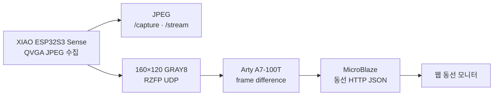

# RISK-ZERO ESP32-CAM 현관 동선 추적 설계 v0.1

- 기준일: 2026-08-18
- 범위: 대학 캡스톤 MVP
- 기본 장치: Seeed Studio XIAO ESP32S3 Sense(OV3660), AI Thinker ESP32-CAM 환경 유지

## 1. 목표

현관 앞에 들어온 사람이 어느 경로로 접근하고 얼마나 머문 뒤 어디로 사라졌는지 기록한다. 택배 구역을 지난 뒤 정상 출구가 아닌 사각지대로 이동하거나, 짧은 시간 안에 다시 접근하는 상황은 사용자 확인 대상으로 올린다.

시스템이 범죄자, 택배기사, 거주자 같은 신원이나 범죄 의도를 판정하지는 않는다. 화면의 `정상`, `경계`, `확인 필요`, `판단 불가`는 관찰된 동선에 대한 처리 우선순위다.

## 2. 고정한 구조

ESP32 카메라 보드는 기존 JPEG 촬영·웹 스트림을 유지하면서 FPGA용 160×120 흑백 프레임을 추가 전송한다. 현재 기본 PlatformIO 환경은 XIAO ESP32S3 Sense이고 기존 AI Thinker 환경도 유지한다. 움직임 중심점과 동선 계산은 Arty A7-100T의 RTL과 MicroBlaze가 담당한다. 자세한 FPGA 구조는 [Arty A7 동선 처리 설계](RISK-ZERO_Arty-A7_FPGA_동선_처리_설계_v0.1.md)를 기준으로 한다.



Arty A7은 ARM이 없는 순수 FPGA이므로 YOLO 사람 분류 대신 고정 카메라의 움직임 후보를 처리한다. 웹은 DEMO와 FPGA 실장치 응답을 같은 동선 화면 계약으로 표시한다.

## 3. 구현 상태

| 구간 | 상태 | 내용 |
| --- | --- | --- |
| ESP32 카메라 펌웨어 | XIAO build/upload·USB·PSRAM 통과, OV3660 probe 실패 | `/health`, `/capture`, `:81/stream`은 센서 교체 후 시험 |
| 장치 연결 확인 | 완료 | Python으로 상태 조회와 JPEG 한 장 저장 |
| FPGA용 영상 | 코드 완료, 보드 시험 전 | 160×120 GRAY8, UDP 5005, 16 chunks |
| FPGA 움직임 처리 | RTL·MicroBlaze 코드 완료 | 선택 갱신 배경 차분·중심점·bbox, 합성 전 |
| 사람 분류 | 범위 제외 | 움직임 후보를 사람으로 단정하지 않음 |
| 사람별 ID·좌표열 | MVP 완료 | 중심점 거리 기반 추적, 가림·교차 re-ID는 미지원 |
| 동선 정책 | MVP 완료 | 정상 배송, 사각지대, 재접근, 인원 불일치, 장기 체류, 추적 불가 |
| 웹 모니터 | DEMO 완료 | 6개 상황 전환, 동선 지도, 점수·사유·대응 표시 |
| 실제 영상·DB 연동 | 미구현 | 탐지 모델 선정 뒤 구현 |

## 4. ESP32-CAM 인터페이스

| 메서드 | 주소 | 응답 |
| --- | --- | --- |
| `GET` | `http://장치IP/health` | 장치 ID, RSSI, 여유 heap |
| `GET` | `http://장치IP/capture` | 현재 JPEG 한 장 |
| `GET` | `http://장치IP:81/stream` | MJPEG 스트림 |

펌웨어 기본값은 QVGA 320×240, JPEG 품질 12, PSRAM 사용 시 프레임 버퍼 2개다. 네트워크가 끊기면 재연결을 시도한다. Wi-Fi 비밀번호가 들어가는 `risk_zero_config.h`는 Git에서 제외된다.

## 5. 탐지기 연결 계약

실제 탐지 모델은 프레임마다 사람 상자를 0부터 1 사이 좌표로 바꿔 전달한다.

```json
{
  "x1": 0.10,
  "y1": 0.28,
  "x2": 0.24,
  "y2": 0.91,
  "confidence": 0.87
}
```

`CentroidTracker`는 상자의 중심점 거리가 가까운 순서로 기존 ID를 유지하고 다음 정보를 만든다.

- `person-01` 형태의 임시 ID
- 밀리초 기준 좌표열
- 복도 출입, 접근, 현관, 택배, 사각지대 구역
- 평균 추적 신뢰도
- 연속 프레임에서 사라진 뒤 종료된 트랙

현재 방식은 두 사람이 교차하거나 긴 시간 가려지는 경우 ID가 바뀔 수 있다. 실제 시험에서 이 문제가 반복되면 외형 특징을 쓰는 re-ID 추적기로 교체한다.

## 6. 판정 규칙

| 조건 | 결과 | 이유 코드 |
| --- | --- | --- |
| 배송 구역 방문 후 복도 방향 이탈, 진입·이탈 수 일치 | 정상 | `normal_delivery_exit` |
| 배송 행동 후 사각지대 방향 이동 | 확인 필요 | `blind_zone_after_delivery` |
| 이탈 후 60초 안에 같은 트랙이 재접근 | 확인 필요 | `quick_return` |
| 진입 인원이 2명 이상이거나 진입·이탈 차이가 큼 | 확인 필요 | `person_count_mismatch` |
| 45초 이상 체류 | 경계 | `long_dwell` |
| 신뢰도 0.45 미만, 좌표 부족·오류 | 판단 불가 | `tracking_confidence_low` 등 |

임계값은 아직 실험용이다. Arty 보드가 연결된 뒤 조명 변화와 정상 이동 표본을 모아 움직임 threshold와 최소 픽셀 수를 조정한다.

## 7. 실행

펌웨어는 `firmware/esp32-cam`을 PlatformIO로 연다. `include/config.example.h`를 `include/risk_zero_config.h`로 복사하고 Wi-Fi 정보를 넣은 뒤 업로드한다. 포트는 Windows의 `COM*` 또는 macOS의 `/dev/cu.*` 값을 자동 감지하며 저장소에 고정하지 않는다.

```powershell
python -m edge.risk_zero_trajectory --probe-camera http://192.168.0.30
python -m edge.risk_zero_trajectory --probe-camera http://192.168.0.30 --capture work/camera-test.jpg
python -m edge.risk_zero_trajectory --scenario hidden-after-delivery
```

웹은 `web`에서 `pnpm dev`로 실행한다. `/`는 동선 모니터이고 기존 시청각 검증 화면은 `/av`, 수집 시험은 `/capture`에 유지한다.

## 8. 다음 구현 순서

1. 정상 OV3660 모듈 또는 Sense 확장보드로 교체하고 카메라 초기화와 30분 연속 스트리밍을 확인한다.
2. 카메라 설치 높이·각도를 고정하고 웹 지도 구역 좌표를 실제 현관 화면에 맞춘다.
3. 검증된 DDR bitstream/ELF로 Arty를 program하고 MIG·UART를 확인한다.
4. ESP32-CAM의 RZFP UDP를 활성화해 Arty에서 완전한 프레임 수신을 확인한다.
5. 정상 이동, 조명 변화, 카메라 흔들림, 두 사람 동시 이동을 각 10회 촬영한다.
6. 손실률, 움직임 오탐과 중심점 오차를 기록하고 threshold를 조정한다.
7. 후처리된 영상과 동선 이벤트만 DB에 저장하고 보존기간·삭제 기능을 연결한다.

## 9. 참고

- [Espressif esp32-camera 드라이버](https://github.com/espressif/esp32-camera): JPEG와 PSRAM 사용 조건, 프레임 버퍼 설정
- [Espressif ESP-WHO](https://github.com/espressif/esp-who): 현재 공식 AI 예제의 지원 보드 범위 확인
