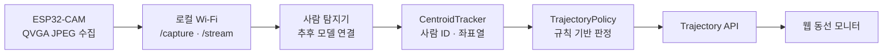

# RISK-ZERO ESP32-CAM 현관 동선 추적 설계 v0.1

- 기준일: 2026-08-18
- 범위: 대학 캡스톤 MVP
- 장치: AI Thinker ESP32-CAM

## 1. 목표

현관 앞에 들어온 사람이 어느 경로로 접근하고 얼마나 머문 뒤 어디로 사라졌는지 기록한다. 택배 구역을 지난 뒤 정상 출구가 아닌 사각지대로 이동하거나, 짧은 시간 안에 다시 접근하는 상황은 사용자 확인 대상으로 올린다.

시스템이 범죄자, 택배기사, 거주자 같은 신원이나 범죄 의도를 판정하지는 않는다. 화면의 `정상`, `경계`, `확인 필요`, `판단 불가`는 관찰된 동선에 대한 처리 우선순위다.

## 2. 고정한 구조

ESP32-CAM은 바꾸지 않는다. 장치의 제한된 메모리와 연산량을 고려해 JPEG 수집과 로컬 Wi-Fi 전송만 담당한다. 사람 탐지, ID 유지, 동선 계산과 정책 판정은 실험용 노트북에서 수행한다.



FPGA는 MVP 필수 부품으로 넣지 않는다. 나중에 처리 속도가 실제 문제로 확인되면 사람 탐지나 영상 전처리만 FPGA로 옮기고, FPGA 출력은 현재 `Detection` 좌표 계약에 맞춘다. 따라서 웹·정책 코드는 바꾸지 않아도 된다.

## 3. 구현 상태

| 구간 | 상태 | 내용 |
| --- | --- | --- |
| ESP32-CAM 펌웨어 | 코드 완료, 보드 시험 전 | `/health`, `/capture`, `:81/stream` |
| 장치 연결 확인 | 완료 | Python으로 상태 조회와 JPEG 한 장 저장 |
| 사람 탐지 | 미연결 | 실제 모델 또는 FPGA 출력 어댑터 필요 |
| 사람별 ID·좌표열 | MVP 완료 | 중심점 거리 기반 추적, 가림·교차 re-ID는 미지원 |
| 동선 정책 | MVP 완료 | 정상 배송, 사각지대, 재접근, 인원 불일치, 장기 체류, 추적 불가 |
| 웹 모니터 | DEMO 완료 | 6개 상황 전환, 동선 지도, 점수·사유·대응 표시 |
| 실제 영상·DB 연동 | 미구현 | 탐지 모델 선정 뒤 구현 |

## 4. ESP32-CAM 인터페이스

| 메서드 | 주소 | 응답 |
| --- | --- | --- |
| `GET` | `http://장치IP/health` | 장치 ID, RSSI, 여유 heap |
| `GET` | `http://장치IP/capture` | 현재 JPEG 한 장 |
| `GET` | `http://장치IP:81/stream` | MJPEG 스트림 |

펌웨어 기본값은 QVGA 320×240, JPEG 품질 12, PSRAM 사용 시 프레임 버퍼 2개다. 네트워크가 끊기면 재연결을 시도한다. Wi-Fi 비밀번호가 들어가는 `config.h`는 Git에서 제외된다.

## 5. 탐지기 연결 계약

실제 탐지 모델은 프레임마다 사람 상자를 0부터 1 사이 좌표로 바꿔 전달한다.

```json
{
  "x1": 0.10,
  "y1": 0.28,
  "x2": 0.24,
  "y2": 0.91,
  "confidence": 0.87
}
```

`CentroidTracker`는 상자의 중심점 거리가 가까운 순서로 기존 ID를 유지하고 다음 정보를 만든다.

- `person-01` 형태의 임시 ID
- 밀리초 기준 좌표열
- 복도 출입, 접근, 현관, 택배, 사각지대 구역
- 평균 추적 신뢰도
- 연속 프레임에서 사라진 뒤 종료된 트랙

현재 방식은 두 사람이 교차하거나 긴 시간 가려지는 경우 ID가 바뀔 수 있다. 실제 시험에서 이 문제가 반복되면 외형 특징을 쓰는 re-ID 추적기로 교체한다.

## 6. 판정 규칙

| 조건 | 결과 | 이유 코드 |
| --- | --- | --- |
| 배송 구역 방문 후 복도 방향 이탈, 진입·이탈 수 일치 | 정상 | `normal_delivery_exit` |
| 배송 행동 후 사각지대 방향 이동 | 확인 필요 | `blind_zone_after_delivery` |
| 이탈 후 60초 안에 같은 트랙이 재접근 | 확인 필요 | `quick_return` |
| 진입 인원이 2명 이상이거나 진입·이탈 차이가 큼 | 확인 필요 | `person_count_mismatch` |
| 45초 이상 체류 | 경계 | `long_dwell` |
| 신뢰도 0.45 미만, 좌표 부족·오류 | 판단 불가 | `tracking_confidence_low` 등 |

임계값은 아직 실험용이다. 사람 탐지기가 연결된 뒤 정상 배송과 비정상 동선 표본을 모아 조정한다.

## 7. 실행

펌웨어는 `firmware/esp32-cam`을 PlatformIO로 연다. `include/config.example.h`를 `include/config.h`로 복사하고 Wi-Fi 정보를 넣은 뒤 업로드한다.

```powershell
python -m edge.risk_zero_trajectory --probe-camera http://192.168.0.30
python -m edge.risk_zero_trajectory --probe-camera http://192.168.0.30 --capture work/camera-test.jpg
python -m edge.risk_zero_trajectory --scenario hidden-after-delivery
```

웹은 `web`에서 `pnpm dev`로 실행한다. `/`는 동선 모니터이고 기존 시청각 검증 화면은 `/av`, 수집 시험은 `/capture`에 유지한다.

## 8. 다음 구현 순서

1. ESP32-CAM 한 대에 펌웨어를 올려 30분 연속 스트리밍과 프레임 손실을 확인한다.
2. 카메라 설치 높이·각도를 고정하고 웹 지도 구역 좌표를 실제 현관 화면에 맞춘다.
3. 노트북에서 동작할 사람 탐지 모델 한 개를 선정해 `Detection` 계약에 연결한다.
4. 정상 배송, 배송 후 우측 이동, 빠른 재접근, 두 사람 교차 영상을 각 10회 촬영한다.
5. ID 전환 수, 누락률, 이벤트 정탐·오탐을 표로 기록하고 임계값을 조정한다.
6. 후처리된 영상과 동선 이벤트만 DB에 저장하고 보존기간·삭제 기능을 연결한다.

## 9. 참고

- [Espressif esp32-camera 드라이버](https://github.com/espressif/esp32-camera): JPEG와 PSRAM 사용 조건, 프레임 버퍼 설정
- [Espressif ESP-WHO](https://github.com/espressif/esp-who): 현재 공식 AI 예제의 지원 보드 범위 확인

