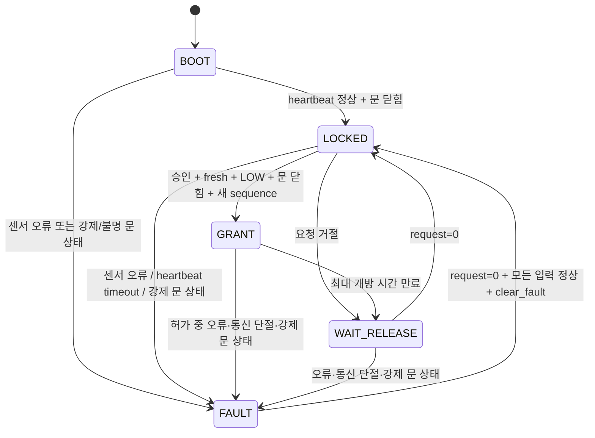

# RISK-ZERO FPGA Safety Gate FSM 설계 v0.1

## 목적

이 FSM은 문 개방 액추에이터의 마지막 하드웨어 허가 게이트다. 인증 알고리즘을 대신하지 않으며, ESP32가 전달한 요청에서 누락·위험·만료·재사용·센서 오류·heartbeat 단절을 확인해 기본 차단한다.

## 상태

| 값 | 상태 | 동작 |
| ---: | --- | --- |
| 0 | `BOOT` | heartbeat가 확인되고 문이 닫힐 때까지 차단 |
| 1 | `LOCKED` | 요청 평가, 기본 출력 0 |
| 2 | `GRANT` | 파라미터로 제한된 시간만 `unlock_enable=1` |
| 3 | `WAIT_RELEASE` | 요청이 내려갈 때까지 같은 요청 재실행 방지 |
| 4 | `FAULT` | 오류를 래치하고 명시적 정상화 전까지 차단 |

## 입력 계약

| 신호 | 폭 | 의미 |
| --- | ---: | --- |
| `request` | 1 | 개방 요청 레벨. 처리 후 반드시 0으로 복귀 |
| `approve` | 1 | 상위 인증·승인 결과 |
| `request_fresh` | 1 | 요청 유효시간 검사를 통과했는지 |
| `request_sequence` | 16 | 단조 증가 요청 번호, wraparound 허용 |
| `risk_level` | 2 | `00=LOW`, 그 외는 개방 차단 |
| `door_state` | 2 | `00=CLOSED`, `01=OPEN`, `10=FORCED`, `11=UNKNOWN` |
| `sensor_fault` | 1 | 센서 오류 통합 신호 |
| `heartbeat_toggle` | 1 | 송신측이 주기적으로 반전하는 생존 신호 |
| `clear_fault` | 1 | 모든 입력이 정상일 때만 적용되는 오류 해제 |

## 차단 사유 코드

| 코드 | 의미 |
| ---: | --- |
| 0 | 없음 |
| 1 | 승인 없음 |
| 2 | 위험 수준이 LOW가 아님 |
| 3 | 문이 닫혀 있지 않음 |
| 4 | 센서 오류 |
| 5 | heartbeat timeout |
| 6 | 만료된 요청 |
| 7 | 동일하거나 과거 sequence 재사용 |
| 8 | 강제 개방 또는 알 수 없는 문 상태 |

## 안전 불변식

1. reset 직후와 `BOOT`, `LOCKED`, `WAIT_RELEASE`, `FAULT`에서는 `unlock_enable=0`이다.
2. `GRANT`의 최대 길이는 `GRANT_CYCLES`를 넘지 않는다.
3. `GRANT` 중 fault가 발생하면 다음 clock에서 즉시 개방 출력을 내린다.
4. request를 계속 1로 유지해도 재개방되지 않는다.
5. 동일하거나 과거의 sequence는 개방되지 않는다.
6. heartbeat가 없거나 끊기면 개방되지 않는다.

100MHz clock에서 기본 `GRANT_CYCLES=100_000_000`은 1초, `HEARTBEAT_TIMEOUT_CYCLES=300_000_000`은 3초다.

## 검증 범위

`sim/tb_risk_zero_safety_gate_fsm.sv`는 reset 기본 차단, 정상 허가 펄스 폭, 요청 고정 시 재실행 방지, 승인 없음, 만료, 고위험, sequence replay, 허가 중 sensor fault, fault 해제 조건, heartbeat timeout을 검사한다.

## 보안 경계

현재 FSM은 `approve`, `risk_level`, `request_fresh`의 출처가 진짜인지 암호학적으로 검증하지 않는다. ESP32 침해까지 방어 범위에 넣으려면 신뢰 장치가 생성한 MAC/서명, nonce, 만료시간을 FPGA 또는 별도 secure element에서 검증해야 한다.
