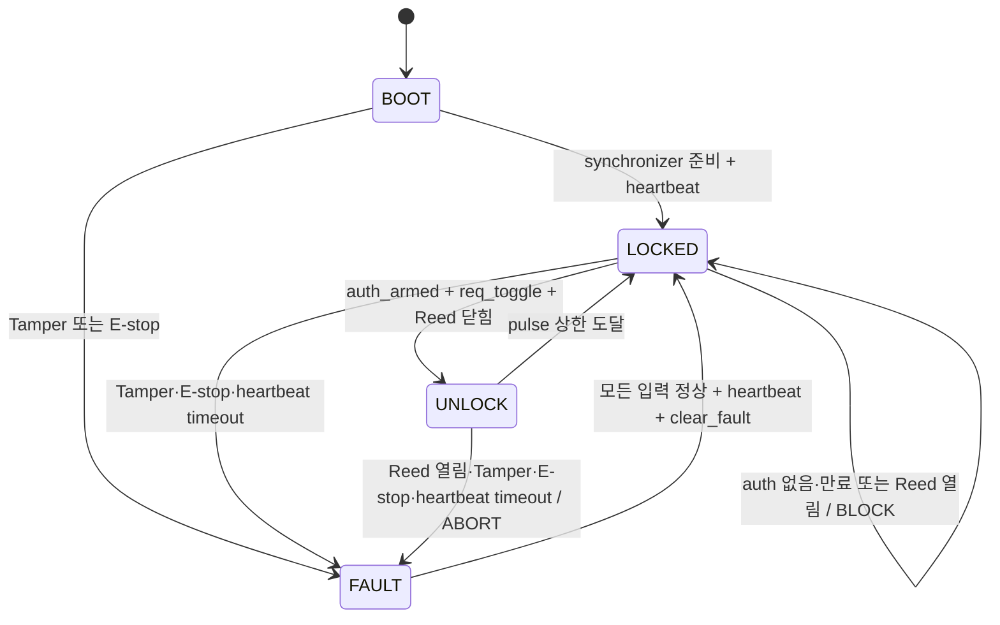

# RISK-ZERO FPGA Safety Gate FSM 설계 v0.2

## 목적

Safety Gate는 문 개방 출력 앞의 항상 동작하는 FPGA 하드웨어 게이트다. Door Hub의 authorization/request와 FPGA에 직접 연결된 Reed #2·Tamper·E-stop을 다시 확인하고, 모든 조건이 정상일 때만 제한된 `unlock_allow_pulse`를 출력한다.

Vision Domain은 이 FSM에 개방 신호를 직접 전달할 수 없다. Camera PCLK 정지, Vision reset 또는 영상처리 fault가 Safety clock을 멈추거나 출력을 활성화해서는 안 된다.

## 상태

| 값 | 상태 | 동작 |
| ---: | --- | --- |
| 0 | `BOOT` | 입력 synchronizer와 첫 heartbeat를 기다리며 기본 차단 |
| 1 | `LOCKED` | auth token과 새 request를 평가하며 출력 0 |
| 2 | `UNLOCK` | 파라미터로 제한된 시간만 개방 pulse 1 |
| 3 | `FAULT` | Tamper·E-stop·heartbeat 또는 pulse 중 unsafe 입력을 래치 |

## 입력 계약

Door Hub 신호와 직접 안전 입력은 2-FF synchronizer를 통과한다.

| 신호 | 의미 |
| --- | --- |
| `auth_toggle` | Door Hub가 새 authorization을 발급할 때 반전 |
| `req_toggle` | authorization 소비와 실행을 요청할 때 반전 |
| `heartbeat_toggle` | Door Hub 생존 신호, 주기적으로 반전 |
| `door_closed_direct` | FPGA에 직접 연결된 Reed #2가 닫힘일 때 1 |
| `tamper_detected` | 강제 조작 감지 시 1 |
| `estop_n` | 정상 1, 비상 차단 0 |
| `clear_fault` | 모든 입력 정상 상태에서 명시적으로 fault 해제 |

toggle은 처리 후 0으로 내리는 pulse가 아니다. 이전 값과 달라지는 edge가 새 이벤트다. reset 뒤 synchronizer가 안정되는 동안 입력 레벨을 기준값으로 잡아 reset 이전의 오래된 edge가 새 요청으로 처리되지 않도록 한다.

## 출력 계약

| 신호 | 의미 |
| --- | --- |
| `ack_toggle` | req event 처리 때 반전 |
| `decision_code` | `0=NONE`, `1=ALLOW`, `2=BLOCK`, `3=ABORT` |
| `block_reason` | 차단·중단 원인 |
| `auth_armed` | 만료되지 않은 1회용 authorization 존재 |
| `fault_latched` | 명시적 정상화 전까지 유지되는 fault |
| `unlock_allow_pulse` | 외부 driver 앞의 시간 제한 enable |

## 차단 사유

| 코드 | 의미 |
| ---: | --- |
| 0 | 없음 |
| 1 | authorization 없음 또는 이미 소비 |
| 2 | authorization 만료 |
| 3 | Reed #2가 문 닫힘을 확인하지 못함 |
| 4 | Tamper |
| 5 | E-stop |
| 6 | heartbeat 없음 또는 timeout |

## 안전 불변식

1. reset, BOOT, LOCKED와 FAULT에서 `unlock_allow_pulse=0`이다.
2. authorization은 시간 제한이 있고 request 한 번에 소비된다.
3. request toggle만으로 authorization을 만들 수 없다.
4. Door Hub ALLOW가 Reed·Tamper·E-stop·heartbeat를 override할 수 없다.
5. UNLOCK 중 직접 입력이 unsafe가 되면 동기화 직후 출력 0과 ABORT로 전환한다.
6. pulse 폭은 `UNLOCK_PULSE_CYCLES`를 넘지 않는다.
7. clear fault는 E-stop 해제, Tamper 정상, Reed 닫힘과 heartbeat가 모두 만족될 때만 적용된다.

100MHz 기준 기본값은 개방 1초, authorization 15초, heartbeat timeout 3초다. 이 값은 실험용이며 actuator 사양·정책 검토 후 변경한다.

## 검증 범위

`tb_risk_zero_safety_gate_fsm.sv`는 다음을 self-check한다.

- reset 기본 차단과 첫 heartbeat 전 BOOT
- authorization arm·1회 소비·만료
- authorization 없는 요청 차단
- Reed open 차단
- Tamper fault latch와 unsafe clear 거절
- pulse 중 E-stop ABORT
- heartbeat timeout fail-closed
- pulse 최대 폭

source와 testbench는 GitHub Actions의 Icarus Verilog behavioral simulation을 통과했다. 성공 기록은 [FPGA RTL tests run 33165372737](https://github.com/Uree1229/Risk-ZERO/actions/runs/33165372737)이다. AMD XSIM과 실제 Arty 입력 시험은 별도로 남아 있다.

## 외부 하드웨어 경계

`unlock_allow_pulse`는 직접 Solenoid 전원을 공급하지 않는다. FPGA 미구성·reset·전원 이상에서도 default OFF가 되도록 external pulldown, MOSFET driver, flyback 보호, 별도 actuator 전원과 E-stop 차단 경로가 필요하다. 첫 수직 통합은 LED로 수행한다.
