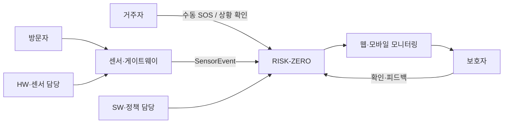
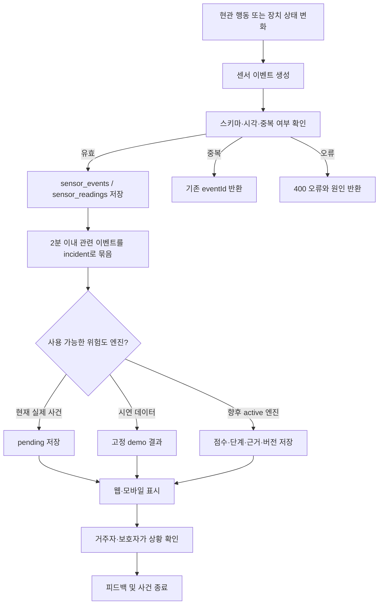

> **CAPSTONE DESIGN · USE CASE DRAFT**

# RISK-ZERO 시나리오 및 Use Case

- **문서 소유:** Pixel-Zero 팀
- **적용 범위:** 센서 이벤트 · 위험도 평가 · 웹/모바일 모니터링 · 사용자 피드백
- **버전 / 기준일:** v0.1 / 2026-07-24
- **상태:** 팀 검토용

> [!IMPORTANT]
> 현재 위험도 계산식과 임계값은 확정되지 않았다. 이 문서의 `normal`, `watch`, `warning`, `critical`은 검증할 흐름과 화면 상태를 설명하기 위한 기대값이며, 실제 위험을 확정하는 기준이 아니다.

## 1. 문서 목적

RISK-ZERO는 현관 주변의 센서 신호를 받아 거주자와 보호자가 상황을 확인하도록 돕는 보조 시스템이다. 이 문서는 “어떤 상황에서 누가 시스템을 사용하고, 시스템은 무엇을 기록하고 보여줘야 하는가”를 Use Case 단위로 정리한다.

Use Case와 테스트 시나리오는 다음처럼 구분한다.

- **Use Case:** 사용자의 목적과 시스템의 정상·예외 흐름을 설명한다.
- **테스트 시나리오:** Use Case가 실제로 동작하는지 반복 실험할 수 있도록 입력값과 기대 결과를 구체화한다.
- **위험 단계:** 사람이 얼마나 빨리 상황을 확인해야 하는지 보여주는 상태다. 사람의 신원이나 범죄 여부를 판정하는 등급이 아니다.

현재 웹·모바일 MVP에는 `normal`, `watch`, `warning`, `critical` 네 가지 고정 시연 화면이 있다. 위험도 검증 문서의 S01~S09는 앞으로 API와 DB에 연결할 상세 테스트 시나리오이며, 아직 모두 실행 가능한 상태는 아니다.

## 2. 시스템 범위와 행위자

### 2.1 행위자

| 행위자 | 역할 |
| --- | --- |
| 거주자 | 보호 대상 주거에 거주하며 상황을 확인하고 수동 SOS 또는 사후 피드백을 제공한다. |
| 보호자 | 웹·모바일에서 알림과 사건을 확인하고 거주자에게 연락한 뒤 대응 여부를 판단한다. |
| 방문자 | 택배, 지인, 관리인 또는 신원을 알 수 없는 사람으로 현관 센서 이벤트를 발생시킨다. |
| 센서·게이트웨이 | 센서 원본을 공통 `SensorEvent` 형식으로 변환해 데이터 API로 전달한다. |
| 위험도 엔진 | 사건과 센서 이벤트를 입력받아 위험 단계, 근거, 데이터 신뢰도를 생성한다. 현재는 더미 엔진 또는 `pending` 상태다. |
| 모니터링 시스템 | 웹·모바일에 사건, 장치 상태, 위험 단계, 근거와 대응 미리보기를 표시한다. |
| SW·정책 담당 | API·DB·접근권한·보존기간·피드백 라벨·엔진 버전을 관리한다. |
| HW·센서 담당 | 장치 ID, 시각, 단위, 품질, 센서 고장과 오프라인 상태를 전달한다. |

### 2.2 관계도

### 2.3 현재 MVP의 경계

| 구분 | 현재 상태 |
| --- | --- |
| 센서 데이터 | 공통 이벤트 API와 DB 저장 구조가 구현되어 있다. 실제 센서는 외부 계층에서 연결해야 한다. |
| 위험도 계산 | 실제 산식은 비어 있다. 시연 데이터는 14, 46, 68, 88의 고정 점수를 사용한다. |
| 신규 센서 사건 | DB에는 저장되지만 실제 위험도 계산이 없어 `pending`으로 남는다. |
| 웹·모바일 | 시나리오 선택, 최신 사건, 장치 상태, 위험 단계와 대응 미리보기를 표시한다. |
| 보호자 피드백 | 사건별 피드백 저장 API가 구현되어 있다. |
| 카메라·외부 알림 | 화면 미리보기만 있다. 실제 촬영, 푸시, 문자, 전화는 실행하지 않는다. |
| 신고·도어락 제어 | 자동 실행하지 않는다. 실제 112 연동과 도어락 제어는 현재 범위 밖이다. |
| 인증·보안 | 실제 사용자·장치 인증과 요청 서명은 아직 구현되지 않았다. |

## 3. 공통 처리 흐름

공통 원칙은 다음과 같다.

1. 센서값과 위험도 결과를 분리한다.
2. 같은 이벤트를 재전송해도 중복 저장하지 않는다.
3. 센서가 부족하거나 고장 난 상황을 `normal`로 단정하지 않는다.
4. 위험 단계와 함께 대표 근거, 데이터 품질, 엔진 상태를 표시한다.
5. 위험도만으로 사람을 범죄자나 스토커로 단정하지 않는다.
6. 신고와 출입 제어는 사람이 상황을 확인한 뒤 결정한다.

## 4. Use Case 목록

| ID | Use Case | 주 행위자 | 관련 검증 시나리오 | 현재 지원 |
| --- | --- | --- | --- | --- |
| UC-01 | 예정된 짧은 방문 확인 | 방문자, 거주자 | S01 | 시연 가능 |
| UC-02 | 예상하지 못한 장시간 체류 확인 | 보호자 | S02 | 일부 시연 가능 |
| UC-03 | 일정 시간 안의 반복 접근 확인 | 보호자 | S03 | 설계 단계 |
| UC-04 | 반복 충격·강한 두드림 확인 | 보호자 | S04 | 일부 시연 가능 |
| UC-05 | 손잡이 조작·인증 실패 반복 확인 | 거주자, 보호자 | S05 | 설계 단계 |
| UC-06 | 충격 후 비정상 문 열림 확인 | 거주자, 보호자 | S06 | 화면 시연만 가능 |
| UC-07 | 거주자의 수동 SOS 요청 | 거주자 | S07 | 데이터 모델 단계 |
| UC-08 | 웹·모바일에서 현재 상황 모니터링 | 보호자 | 공통 | 구현됨 |
| UC-09 | 사건 확인 후 피드백 기록 | 거주자, 보호자 | 공통 | API 구현됨 |
| UC-10 | 센서 결측·장치 오프라인 확인 | HW 담당, 보호자 | S08 | 부분 구현 |
| UC-11 | 중복·잘못된·지연 이벤트 처리 | 센서·게이트웨이 | 공통 | 부분 구현 |
| UC-12 | 네트워크 또는 API 연결 실패 처리 | 보호자 | 공통 | MVP 대체 화면 구현 |
| UC-13 | 테스트·시연 이벤트 분리 | 개발팀 | S09 | 부분 구현 |
| UC-14 | 새로운 센서 종류 추가 | HW 담당, SW 담당 | 공통 | 확장 구조 구현 |

## 5. 상세 Use Case

### UC-01. 예정된 짧은 방문 확인

| 항목 | 내용 |
| --- | --- |
| 목적 | 택배나 지인처럼 예정된 방문을 불필요한 위험 알림 없이 기록한다. |
| 주 행위자 | 방문자, 거주자 |
| 사전 조건 | 센서 장치가 온라인이며, 예정 방문 정보가 있으면 `visit_expectations`에 등록되어 있다. |
| 시작 조건 | 현관에서 사람이 감지된다. |
| 주요 데이터 | `presence`, `dwell_seconds`, `door_state`, `visit_expectation` |
| 기대 상태 | `normal` 또는 정상 방문 피드백 |

**기본 흐름**

1. 센서가 사람의 존재와 체류시간을 측정한다.
2. 게이트웨이가 공통 `SensorEvent`를 생성해 API로 전송한다.
3. 시스템은 짧은 체류와 충격 없음, 문 닫힘 상태를 기록한다.
4. 예정 방문이 등록되어 있으면 결과의 보조 맥락으로 연결한다.
5. 웹·모바일은 사건을 정상 방문으로 표시하고 외부 알림을 보내지 않는다.
6. 필요하면 거주자가 `normal_visit` 피드백을 남긴다.

**대안·예외 흐름**

- 예정 방문 정보가 없더라도 짧은 체류 하나만으로 위험으로 확정하지 않는다.
- 택배 기사가 물건을 정리하느라 오래 머물면 UC-02 흐름으로 이어질 수 있다.
- 방문 예정 정보만으로 위험을 무조건 0으로 만들거나 문을 자동으로 열지 않는다.

**완료 조건**

- 센서 이벤트와 사건이 저장된다.
- 불필요한 실제 보호자 알림이나 신고는 실행되지 않는다.
- 검증 시나리오 S01의 기대 결과와 비교할 수 있다.

### UC-02. 예상하지 못한 장시간 체류 확인

| 항목 | 내용 |
| --- | --- |
| 목적 | 현관 앞 체류가 길어지는 상황을 보호자가 확인할 수 있게 한다. |
| 주 행위자 | 보호자 |
| 사전 조건 | 사람 감지와 체류시간을 측정할 수 있다. |
| 시작 조건 | 체류시간이 팀에서 정한 관찰 기준을 넘는다. |
| 주요 데이터 | `presence`, `dwell_seconds`, `min_door_distance_cm`, `quality` |
| 기대 상태 | `watch` 또는 정보 부족 |

**기본 흐름**

1. 같은 사람인지 식별하지 않고 현관 앞 존재와 체류시간만 기록한다.
2. 관련 이벤트를 하나의 진행 중 사건으로 묶는다.
3. 체류가 이어지는 동안 최신 측정값과 데이터 품질을 갱신한다.
4. 시스템은 보호자에게 확인이 필요한 상황임을 화면에 표시한다.
5. 보호자는 예정된 방문인지, 거주자가 알고 있는 사람인지 안전한 방법으로 확인한다.
6. 확인 결과를 정상 방문, 실제 위험, 오경보 또는 판단 보류로 기록한다.

**대안·예외 흐름**

- 센서 품질이 낮거나 일부 값이 없으면 `normal`이 아니라 정보 부족으로 표시한다.
- 사람이 떠나고 추가 신호가 없으면 사건을 종료 후보로 둔다.
- 장시간 체류만으로 사람의 의도나 관계를 추정하지 않는다.

**현재 구현 메모**

현재 `watch` 시연은 28초 체류와 진동 1회를 고정 값으로 보여준다. S02의 2분 이상 체류 조건을 실제 API·DB에서 생성하는 기능은 아직 없다.

### UC-03. 일정 시간 안의 반복 접근 확인

| 항목 | 내용 |
| --- | --- |
| 목적 | 한 번의 정상 통행과 짧은 시간 안에 반복되는 접근을 구분한다. |
| 주 행위자 | 보호자 |
| 사전 조건 | 이벤트 발생시각과 주거 ID가 정확하게 저장된다. |
| 시작 조건 | 설정된 시간 창 안에서 접근 이벤트가 여러 번 발생한다. |
| 주요 데이터 | `approach_count_10m`, `recent_incident_count`, `events_per_minute` |
| 기대 상태 | `watch`~`warning` 후보 |

**기본 흐름**

1. 시스템은 각 접근 이벤트를 시각과 함께 저장한다.
2. 같은 주거의 최근 사건을 조회해 반복 횟수를 계산한다.
3. 짧은 시간에 접근이 집중되었는지 확인한다.
4. 반복 횟수, 시간 간격, 다른 센서 신호를 위험도 엔진 입력으로 전달한다.
5. 웹·모바일은 “반복 접근”을 대표 근거로 표시한다.
6. 보호자는 정상적인 공동현관 통행인지 추가 확인한다.

**대안·예외 흐름**

- 얼굴인식 없이 이벤트 반복만 집계하므로 동일 인물의 접근이라고 단정하지 않는다.
- 공동주택 통행량이 많은 환경에서는 현관과의 거리, 체류, 문 조작 신호를 함께 본다.
- 이벤트 시각이 지연되거나 순서가 바뀌면 수신시각과 발생시각을 비교한다.

### UC-04. 반복 충격·강한 두드림 확인

| 항목 | 내용 |
| --- | --- |
| 목적 | 일상적인 문 닫힘과 반복적이거나 강한 충격을 구분해 확인을 요청한다. |
| 주 행위자 | 보호자 |
| 사전 조건 | 진동 또는 충격 센서가 단위와 품질을 포함해 값을 전송한다. |
| 시작 조건 | 짧은 시간에 충격 횟수나 최대 충격값이 증가한다. |
| 주요 데이터 | `impact_peak`, `impact_count_10s`, `vibration_count`, `sensor_agreement_count` |
| 기대 상태 | `warning` 후보 |

**기본 흐름**

1. 센서가 충격 강도와 횟수를 기록한다.
2. 시스템은 같은 사건 안의 충격 이벤트를 합쳐서 보여준다.
3. 체류시간, 문 상태, 다른 센서의 일치 여부를 함께 확인한다.
4. 화면에 반복 충격과 데이터 품질을 대표 근거로 표시한다.
5. 보호자는 안전한 방법으로 거주자에게 상황을 확인한다.

**대안·예외 흐름**

- 바람, 문 닫힘, 공사 진동 등 환경 요인이 확인되면 `false_alarm`으로 기록한다.
- 충격 뒤 문 상태가 비정상적으로 바뀌면 UC-06으로 이어진다.
- 센서 하나의 순간값만으로 긴급 상황을 확정하지 않는다.

**현재 구현 메모**

현재 `warning` 시연은 49초 체류와 진동 3회를 고정 값으로 표시한다. 실제 충격 단위와 임계값은 정해지지 않았다.

### UC-05. 손잡이 조작·인증 실패 반복 확인

| 항목 | 내용 |
| --- | --- |
| 목적 | 반복적인 손잡이 조작이나 도어락 인증 실패를 확인할 수 있게 한다. |
| 주 행위자 | 거주자, 보호자 |
| 사전 조건 | 도어락 또는 별도 센서 계층이 조작·실패 횟수를 이벤트로 전달한다. |
| 시작 조건 | 설정된 시간 안에 조작이나 인증 실패가 반복된다. |
| 주요 데이터 | `handle_attempts`, `auth_fail_count`, `door_state`, `captured_at` |
| 기대 상태 | `warning` 후보 |

**기본 흐름**

1. 외부 센서 계층이 조작 횟수와 인증 실패를 공통 metric으로 변환한다.
2. 시스템은 같은 사건의 반복 횟수와 시간 간격을 계산한다.
3. 정상적인 거주자 실수인지 판단할 수 있도록 문 상태와 등록 장치 상태를 함께 표시한다.
4. 보호자는 거주자에게 상황을 확인한다.
5. 확인 결과를 피드백으로 남긴다.

**대안·예외 흐름**

- 거주자가 비밀번호를 잘못 입력한 경우 정상 또는 오경보로 종료한다.
- 장치 오류로 인증 실패가 반복되면 위험 사건과 장치 고장을 분리한다.
- RISK-ZERO가 도어락을 자동 잠금·해제하지 않는다.

**현재 구현 메모**

DB는 자유로운 metric 추가를 지원하지만, 손잡이·인증 실패 센서와 실제 도어락 연동은 구현되지 않았다.

### UC-06. 충격 후 비정상 문 열림 확인

| 항목 | 내용 |
| --- | --- |
| 목적 | 강한 충격과 비정상 문 열림이 함께 발생한 상황을 빠르게 확인한다. |
| 주 행위자 | 거주자, 보호자 |
| 사전 조건 | 충격 센서와 문 상태 센서의 발생시각을 비교할 수 있다. |
| 시작 조건 | 충격 직후 문이 `forced` 또는 비정상 열림 상태로 바뀐다. |
| 주요 데이터 | `impact_peak`, `impact_count_10s`, `door_state`, `door_open_seconds`, `sensor_agreement_count` |
| 기대 상태 | `critical` 후보 |

**기본 흐름**

1. 충격과 문 상태 변화 이벤트를 같은 사건으로 묶는다.
2. 시스템은 복수 센서의 발생 순서와 데이터 품질을 확인한다.
3. 화면에 강한 경고, 대표 근거, 사건 시각을 표시한다.
4. 보호자는 먼저 거주자에게 안전하게 연락한다.
5. 사람이 상황을 확인한 뒤 필요하면 112 신고를 결정한다.
6. 사건 종료 후 `confirmed_risk`, `false_alarm` 또는 `unsure` 피드백을 남긴다.

**대안·예외 흐름**

- 문 센서가 고장 났거나 시각이 맞지 않으면 긴급 확정 대신 데이터 이상을 함께 표시한다.
- 거주자의 정상 출입과 문 세게 닫힘이 확인되면 오경보로 기록한다.
- 연락이 되지 않아도 보호자에게 현장 대면 확인을 강요하지 않는다.

**정책 제한**

- 112 자동 신고를 실행하지 않는다.
- 문을 자동으로 잠그거나 해제하지 않는다.
- 현재 카메라 기능은 화면 미리보기이며 실제 촬영이 아니다.

### UC-07. 거주자의 수동 SOS 요청

| 항목 | 내용 |
| --- | --- |
| 목적 | 거주자가 직접 도움을 요청한 상황을 다른 센서 점수보다 우선 확인한다. |
| 주 행위자 | 거주자 |
| 사전 조건 | SOS 입력 장치 또는 앱 버튼이 사용자에게 제공된다. |
| 시작 조건 | `manual_sos = true` 이벤트가 수신된다. |
| 주요 데이터 | `manual_sos`, `deviceId`, `capturedAt`, `isTest` |
| 기대 상태 | `critical` 우선 확인 후보 |

**기본 흐름**

1. 거주자가 SOS 버튼을 누른다.
2. 시스템은 SOS 발생시각과 장치 ID를 저장한다.
3. 위험도 산식과 별도로 우선 확인 규칙을 적용할 후보로 표시한다.
4. 웹·모바일에 강한 경고와 거주자 연락 안내를 표시한다.
5. 보호자는 상황을 확인하고 필요한 도움을 요청한다.

**대안·예외 흐름**

- 오입력 시 사용자가 취소할 수 있어야 하며 취소 기록을 남긴다.
- 테스트 모드에서 발생한 SOS는 실제 외부 채널로 전송하지 않는다.
- 장치가 같은 SOS를 재전송하면 중복 이벤트로 처리한다.

**현재 구현 메모**

`manual_sos` metric은 데이터 모델에 정의되어 있지만 실제 버튼, 푸시 알림, 취소 UI는 구현되지 않았다.

### UC-08. 웹·모바일에서 현재 상황 모니터링

| 항목 | 내용 |
| --- | --- |
| 목적 | 보호자가 같은 사건 정보를 웹과 모바일에서 확인한다. |
| 주 행위자 | 보호자 |
| 사전 조건 | 모니터링 화면이 API 또는 내장 시연 데이터에 연결된다. |
| 시작 조건 | 사용자가 화면을 열거나 시나리오를 선택한다. |
| 사용 API | `GET /api/snapshot`, `GET /api/incidents`, `GET /api/incidents/{id}`, `GET /api/devices` |
| 현재 상태 | 구현됨 |

**기본 흐름**

1. 앱이 최신 스냅샷 또는 사건 목록을 요청한다.
2. 시스템은 시나리오, 센서값, 위험 단계, 대표 근거, 대응 미리보기를 반환한다.
3. 사용자는 장치 연결 상태와 최근 사건을 함께 확인한다.
4. DEMO, TEST, `pending` 등 결과 상태를 구분한다.
5. 사건 상세에서 이벤트·측정값·평가·대응 이력을 확인한다.

**대안·예외 흐름**

- API 연결에 실패하면 모바일은 내장 시연 데이터로 전환한다.
- 로컬 D1을 사용할 수 없으면 웹 스냅샷은 메모리 시연 데이터로 전환할 수 있다.
- 대체 데이터는 실제 사건처럼 보이지 않도록 DEMO 또는 fallback 상태를 표시해야 한다.

### UC-09. 사건 확인 후 피드백 기록

| 항목 | 내용 |
| --- | --- |
| 목적 | 실제 위험, 정상 방문, 오경보, 테스트, 판단 보류 결과를 저장한다. |
| 주 행위자 | 거주자, 보호자 |
| 사전 조건 | 확인할 사건이 DB에 존재한다. |
| 시작 조건 | 사용자가 사건의 실제 상황을 확인한다. |
| 사용 API | `POST /api/incidents/{id}/feedback` |
| 현재 상태 | 피드백 저장 API 구현됨 |

**기본 흐름**

1. 사용자가 사건 상세를 확인한다.
2. 피드백 라벨과 필요한 경우 짧은 메모를 입력한다.
3. API는 사건 ID, 사용자 ID, 라벨을 검증한다.
4. `incident_feedback`에 결과를 저장한다.
5. 이후 오경보율, 미탐률, 정상 방문 패턴 분석에 사용한다.

**현재 코드와 정책 문서의 라벨 매핑**

| 의미 | 정책 문서 표현 | 현재 API 값 |
| --- | --- | --- |
| 예정되거나 확인된 정상 방문 | `expected_visit` | `normal_visit` |
| 실제 위험 | `actual_risk` | `confirmed_risk` |
| 오경보 | `false_alarm` | `false_alarm` |
| 테스트 | `test` | `test` |
| 판단할 정보 부족 | `uncertain` | `unsure` |

> [!WARNING]
> 정책 문서와 API의 영문 라벨이 일부 다르다. 실제 데이터 수집을 시작하기 전에 한쪽 명칭으로 통일하거나 명시적인 변환 계층을 두어야 한다.

**대안·예외 흐름**

- 사용자가 확신할 수 없으면 억지로 정상이나 위험을 선택하지 않고 `unsure`로 저장한다.
- 테스트 데이터는 성능 통계에서 제외한다.
- 다른 사용자의 사건에 피드백을 남기지 못하도록 실제 운영 전 권한 검사가 필요하다.

### UC-10. 센서 결측·장치 오프라인 확인

| 항목 | 내용 |
| --- | --- |
| 목적 | 센서가 없거나 고장 난 상황을 위험 없음으로 잘못 표시하지 않는다. |
| 주 행위자 | HW 담당, 보호자 |
| 사전 조건 | 장치의 `last_seen_at`, 연결 상태, 측정값 `quality`를 저장한다. |
| 시작 조건 | 필요한 센서값이 누락되거나 장치가 일정 시간 응답하지 않는다. |
| 주요 데이터 | `quality`, `confidence`, `last_seen_at`, 누락 metric 목록 |
| 기대 상태 | 정보 부족 또는 장치 이상 |

**기본 흐름**

1. 시스템은 기대한 metric과 실제 수신한 metric을 비교한다.
2. 누락, 잘못된 값, 낮은 품질을 위험 점수와 별도로 기록한다.
3. 웹·모바일에 장치 오프라인 또는 데이터 부족 상태를 표시한다.
4. 위험도 엔진은 결측값을 임의로 0점 처리하지 않는다.
5. HW 담당은 장치·전원·네트워크 상태를 점검한다.

**대안·예외 흐름**

- 일부 센서만 고장 난 경우 계산 가능한 결과와 데이터 신뢰도를 함께 표시한다.
- 모든 핵심 센서가 없으면 위험 단계 대신 평가 불가 상태를 사용한다.
- 네트워크 지연으로 늦게 도착한 이벤트는 발생시각 기준으로 다시 연결할지 정책을 정해야 한다.

**현재 구현 차이**

정책 문서에는 `insufficient` 또는 “정보 부족” 개념이 있지만 현재 `RiskLevel` 타입에는 별도 값이 없다. 지금은 `pending`과 장치 상태로 일부 표현할 수 있으나, 실제 엔진 전에 `insufficient`를 추가할지 결정해야 한다.

### UC-11. 중복·잘못된·지연 이벤트 처리

| 항목 | 내용 |
| --- | --- |
| 목적 | 센서 재전송이나 잘못된 데이터가 사건과 통계를 오염시키지 않게 한다. |
| 주 행위자 | 센서·게이트웨이 |
| 사전 조건 | 이벤트마다 고유한 `eventId` 또는 `dedupeKey`가 있다. |
| 시작 조건 | 센서 이벤트 API가 요청을 수신한다. |
| 사용 API | `POST /api/sensor-events` |
| 현재 상태 | 중복 방지와 기본 입력 검증 구현, 단위·지연 검증은 보강 필요 |

**기본 흐름**

1. API는 주거, 장치, 이벤트 ID, 발생시각, readings 형식을 검증한다.
2. 처음 받은 이벤트이면 `sensor_events`와 `sensor_readings`에 저장한다.
3. 진행 중인 사건이 있고 마지막 이벤트와 2분 이내면 같은 사건으로 묶는다.
4. 같은 `eventId` 또는 `dedupeKey`가 있으면 새 행을 만들지 않는다.
5. 응답에 기존 사건 ID와 `duplicate` 여부를 반환한다.

**예외 흐름**

- 필수 필드가 없거나 형식이 잘못되면 `400 INVALID_PAYLOAD`를 반환한다.
- 등록되지 않은 장치나 사건이면 `404`를 반환한다.
- DB를 사용할 수 없으면 `503`을 반환한다.
- 허용하지 않은 단위, 지나치게 먼 과거·미래 시각, 너무 큰 payload의 검증 규칙은 추가해야 한다.

### UC-12. 네트워크 또는 API 연결 실패 처리

| 항목 | 내용 |
| --- | --- |
| 목적 | 네트워크 장애 시 앱이 멈추거나 대체 데이터를 실제 사건으로 오해하지 않게 한다. |
| 주 행위자 | 보호자 |
| 사전 조건 | 웹·모바일에 연결 상태와 데이터 출처를 표시할 수 있다. |
| 시작 조건 | API 요청이 시간 초과되거나 실패한다. |
| 현재 상태 | 모바일 fallback과 웹 메모리 시연 데이터가 구현되어 있다. |

**기본 흐름**

1. 앱이 API에 스냅샷을 요청한다.
2. 정해진 시간 안에 응답하지 않으면 요청을 종료한다.
3. 시연 환경에서는 내장 fixture를 불러온다.
4. 화면에 API 데이터가 아닌 DEMO 또는 fallback 데이터임을 표시한다.
5. 사용자가 다시 시도하면 최신 API 데이터를 요청한다.

**정책 제한**

- fallback 화면을 실제 안전 상태로 해석하지 않는다.
- 실제 운영에서는 마지막 성공 시각과 연결 끊김을 눈에 띄게 표시해야 한다.
- 센서 게이트웨이의 로컬 저장·재전송 방식은 HW 계층과 별도로 정해야 한다.

### UC-13. 테스트·시연 이벤트 분리

| 항목 | 내용 |
| --- | --- |
| 목적 | 개발·발표용 이벤트가 실제 보호자 알림이나 성능 통계에 섞이지 않게 한다. |
| 주 행위자 | 개발팀 |
| 사전 조건 | 이벤트와 사건에 테스트 여부 또는 시나리오 식별자가 있다. |
| 시작 조건 | 개발자나 발표자가 테스트 시나리오를 실행한다. |
| 주요 데이터 | `isTest`, `scenario_key`, `mode`, 피드백 `test` |
| 기대 상태 | TEST/DEMO 표시, 외부 전송 차단 |

**기본 흐름**

1. 테스트 이벤트에 `isTest = true` 또는 시연용 `scenario_key`를 지정한다.
2. 시스템은 시연용 주거와 실제 주거 데이터를 분리한다.
3. 위험 결과와 대응 화면에 DEMO 또는 TEST 표시를 유지한다.
4. 실제 푸시, 문자, 전화, 112 등 외부 채널을 실행하지 않는다.
5. 사건 종료 후 피드백을 `test`로 저장한다.
6. 평가 보고서에서 테스트 데이터를 실제 성능 통계와 분리한다.

**현재 구현 메모**

현재 모든 위험 점수는 데모 값이고 실제 외부 알림 채널도 없어서 직접 전송되지는 않는다. 실제 알림 기능을 추가하기 전에 테스트 차단 규칙을 자동화해야 한다.

### UC-14. 새로운 센서 종류 추가

| 항목 | 내용 |
| --- | --- |
| 목적 | 기존 DB와 모니터링 구조를 크게 바꾸지 않고 새로운 센서를 연결한다. |
| 주 행위자 | HW 담당, SW 담당 |
| 사전 조건 | 센서의 값, 단위, 시각, 품질을 정의한 데이터 사전이 있다. |
| 시작 조건 | 새 센서 또는 새 통신 방식이 프로젝트에 추가된다. |
| 관련 구조 | `SensorGateway`, `SensorEvent`, `sensor_readings.metric` |
| 현재 상태 | 확장 가능한 저장 구조와 인터페이스 구현됨 |

**기본 흐름**

1. HW 계층이 제조사별 원본 데이터를 읽는다.
2. 원본 값을 RISK-ZERO의 `metric`, `value`, `unit`, `confidence`, `quality`, `capturedAt` 형식으로 변환한다.
3. HTTP 센서 API를 사용하거나 `SensorGateway` 구현체를 추가한다.
4. 새 metric은 `sensor_readings`의 새 행으로 저장한다.
5. 위험도 엔진이 해당 metric을 사용하지 않더라도 원본 사건은 정상적으로 저장한다.
6. 위험요소로 사용할 때 엔진 버전과 데이터 사전에 방향성·정규화·결측 처리를 기록한다.

**대안·예외 흐름**

- 알 수 없는 metric은 저장 허용 여부를 설정으로 관리하고 로그에 남긴다.
- 단위가 다르면 센서 계층에서 공통 단위로 변환하거나 명시적인 변환 규칙을 둔다.
- 새 센서 하나를 추가했다는 이유로 기존 평가 결과를 다시 쓰지 않는다.

## 6. 시나리오와 필요한 테스트 데이터

| 시나리오 | 최소 입력 예시 | 기대 확인 사항 |
| --- | --- | --- |
| S01 짧은 정상 방문 | `presence=true`, `dwell_seconds=20`, 충격 없음 | 정상 방문, 외부 알림 없음 |
| S02 장시간 체류 | `dwell_seconds>=120`, 문 닫힘 | 관찰 표시, 의도 추정 금지 |
| S03 반복 접근 | 10분 이내 접근 3회 | 시간 창 집계, 동일 인물 단정 금지 |
| S04 반복 충격 | 높은 `impact_peak`, `impact_count_10s` 증가 | 환경 진동 구분, 경고 후보 |
| S05 손잡이·인증 실패 | `handle_attempts`, `auth_fail_count` 반복 | 거주자 실수·장치 오류 분기 |
| S06 충격 후 문 열림 | 충격 직후 `door_state=forced` | 복수 센서 일치, 긴급 확인 |
| S07 수동 SOS | `manual_sos=true` | 우선 확인, 취소·중복 처리 |
| S08 센서 결측 | 핵심 metric 누락, `quality=missing` | 정상 오판 금지, 장치 이상 표시 |
| S09 테스트 이벤트 | `isTest=true` | 실제 알림 차단, 통계 제외 |

테스트 데이터는 센서 원본, 위험도 결과, 사람의 정답 라벨을 분리해 저장한다. 같은 입력을 여러 번 반복하되 거리, 속도, 낮·밤, 문 상태, 네트워크 지연을 바꿔 특정 환경에만 맞는 규칙이 되지 않게 한다.

## 7. API·DB 연결 지점

| Use Case 기능 | API | 주요 저장소 |
| --- | --- | --- |
| 센서 이벤트 수신 | `POST /api/sensor-events` | `sensor_events`, `sensor_readings`, `incidents` |
| 사건 목록·상세 확인 | `GET /api/incidents`, `GET /api/incidents/{id}` | `incidents`, `risk_assessments`, `response_actions` |
| 최신 모니터링 화면 | `GET /api/snapshot?scenario=...` | D1 시연 데이터 또는 메모리 fixture |
| 장치 상태 확인 | `GET /api/devices` | `devices` |
| 보호자 피드백 | `POST /api/incidents/{id}/feedback` | `incident_feedback` |
| 예정 방문 맥락 | API 미구현 | `visit_expectations` 설계됨 |
| 위험도 요소 설명 | API 응답 확장 필요 | `risk_factor_observations` |
| 테스트 데이터 생성 | API 미구현 | S01~S09 fixture 필요 |

## 8. 구현 우선순위

### 1순위: 발표와 통합 테스트에 필요한 기능

- [ ] S01~S09 시나리오 데이터를 같은 센서 API 경로로 생성한다.
- [ ] 웹·모바일에서 DEMO, TEST, API, fallback 데이터 출처를 명확히 표시한다.
- [ ] `pending`과 데이터 부족, 장치 고장을 구분해 표시한다.
- [ ] 사건 상세에 대표 위험요소와 센서 품질을 표시한다.
- [ ] 피드백 라벨의 정책 문서·API 명칭을 통일한다.

### 2순위: 실제 센서 연결 전 필요한 기능

- [ ] `SensorEvent` JSON Schema와 metric·단위 데이터 사전을 확정한다.
- [ ] 잘못된 단위, 오래된 시각, 미래 시각, 너무 큰 payload를 검증한다.
- [ ] 장치별 인증, 요청 서명, 재전송 방지, 역할별 접근권한을 구현한다.
- [ ] 장치 오프라인과 핵심 센서 결측 기준을 정한다.
- [ ] 위험도 엔진 입출력과 버전 저장 방식을 고정한다.

### 3순위: 외부 실증 전 필요한 기능

- [ ] 실제 알림 수신자, 조용한 시간, 재시도와 중복 알림 정책을 구현한다.
- [ ] 테스트 이벤트의 외부 채널 전송을 서버에서 차단한다.
- [ ] 보존기간 만료 데이터의 자동 삭제와 감사 로그를 구현한다.
- [ ] 카메라가 필요하면 설치 권한, 촬영범위, 안내, 보존기간을 별도 검토한다.
- [ ] 112 연결이나 도어락 제어는 사람 확인 절차와 안전 검토 후 별도 승인한다.

## 9. 발표용 권장 시연 순서

1. **UC-01 정상 방문:** 짧은 체류와 충격 없음, 별도 대응 없음.
2. **UC-02 장시간 체류:** 관찰 단계와 대표 근거 표시.
3. **UC-04 반복 충격:** 위험 징후와 보호자 확인 미리보기.
4. **UC-06 비정상 문 열림:** 긴급 화면을 보여주되 자동 신고하지 않음을 설명.
5. **UC-10 센서 결측:** 센서가 없을 때 정상으로 판단하지 않는 흐름.
6. **UC-09 피드백:** 오경보·실제 위험·테스트 라벨 저장.
7. **UC-14 확장 구조:** 실제 센서는 `SensorEvent` 형식만 맞추면 추가할 수 있음을 설명.

발표 중에는 점수보다 데이터 흐름과 사람의 확인 절차를 중심으로 설명한다. 현재 고정 점수가 실제 위험도 성능을 의미하지 않는다는 문구를 화면과 발표 자료에 함께 표시한다.

## 10. 미결정 사항

| 항목 | 결정이 필요한 내용 |
| --- | --- |
| 위험도 산식 | 요소별 가중치, 정규화, 상호작용, 우선 확인 규칙 |
| 단계 임계값 | `normal`, `watch`, `warning`, `critical` 경계 |
| 정보 부족 상태 | `insufficient`를 RiskLevel에 추가할지, 별도 품질 상태로만 둘지 |
| 사건 묶음 | 현재 2분 기본 창을 상황·metric별로 다르게 할지 |
| 피드백 라벨 | 정책 표현과 API 값을 어떤 명칭으로 통일할지 |
| 예정 방문 | 등록·수정·취소 API와 화면, 위험도 반영 범위 |
| 실제 알림 | 푸시·문자·전화의 수신자, 재시도, 중복 방지, 조용한 시간 |
| 사용자·장치 인증 | 계정 역할, 장치 키, 요청 서명, 키 폐기 |
| 카메라 | 사용 여부, 설치 공간, 촬영범위, 접근권한, 보존기간 |
| 신고·도어락 | 사람 확인 방식, 오작동 대응, 별도 승인 범위 |

## 11. 관련 문서

- [RISK-ZERO 위험도 산정 및 검증 방안](RISK-ZERO_위험도_산정_및_검증_방안_초안_v0.1.md)
- [RISK-ZERO 운영·데이터·위험 대응 정책](RISK-ZERO_Policy_Document_초안_v0.2.md)
- [데이터베이스 설계](database-design.md)
- [데이터 API 명세](../web/docs/api.md)
