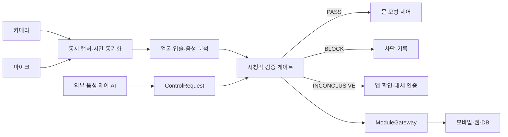

# RISK-ZERO 시청각 발화 검증 시스템 주제 정의서

- 버전: v0.1
- 작성일: 2026-08-11
- 상태: 주제 변경 기준 문서
- 적용 범위: 캡스톤 MVP와 문 모형 시연

## 1. 변경된 주제

RISK-ZERO는 음성인식 AI가 도어락 제어 명령을 내리는 환경을 가정한다. 이때 카메라와 마이크로 수집한 짧은 사건 구간을 분석해, 제어에 사용된 음성이 문 앞 사람의 현재 발화와 시청각적으로 일치하는지 확인한다.

시스템의 목적은 사람의 신원을 단독으로 인증하거나 범죄 가능성을 판단하는 것이 아니다. 기존 음성 제어 AI의 요청을 한 번 더 검사하고, 검증 결과가 불충분하거나 공격이 의심되면 문 제어를 차단하고 근거를 기록하는 것이 목적이다.

> **한 문장 정의:** RISK-ZERO는 음성 도어락 제어 요청과 문 앞 사람의 입술 움직임·음성을 비교해 현장 발화 여부를 검증하는 독립형 안전 게이트다.

## 2. 검증 대상과 시스템 경계

### 2.1 검증 대상

외부 음성 제어 AI는 이미 존재한다고 가정한다. 외부 시스템은 음성을 인식하고 `문 열기`와 같은 제어 요청을 생성하지만, RISK-ZERO의 검증 전에는 실제 문 제어 권한을 갖지 않는다.

RISK-ZERO는 다음 입력을 같은 사건으로 묶는다.

- 제어 요청 ID와 요청 시각
- 음성인식 결과와 인식 신뢰도
- 카메라로 촬영한 얼굴·입술 구간
- 마이크로 수집한 같은 시각의 음성 구간
- 모델이 계산한 시청각 싱크와 데이터 품질

### 2.2 처리 위치

카메라와 마이크의 원본 처리, 얼굴·입술 추적, 음성 구간 검출과 모델 추론은 현장 엣지 장치에서 수행한다. 초기 개발에서는 GPU 사용이 가능한 노트북을 엣지 장치로 사용한다.

모바일 앱과 웹에는 다음 데이터만 전달한다.

- 사건 구간의 후처리 영상 파일
- 시청각 싱크·활성 화자·음성 위조 의심 점수
- 최종 판정과 판정 근거
- 모델 버전, 처리시간과 데이터 품질

이 구조는 기존 `ModuleGateway`가 후처리 영상과 수치형 지표를 받는 방식과 맞는다.

## 3. 검증하는 것과 검증하지 않는 것

### 3.1 검증하는 것

- 카메라 화면에 사람이 존재하는지
- 얼굴과 입술 영역을 판독할 수 있는지
- 화면 속 사람이 실제로 말하고 있는지
- 음성과 입술 움직임의 시간축이 일치하는지
- 제어 요청과 촬영 구간이 같은 세션인지
- 녹음 재생이나 합성 음성의 징후가 있는지
- 조명·소음·가림 등으로 판단이 어려운지

### 3.2 검증하지 않는 것

- 입술과 음성이 맞는 사람의 실제 신원
- 접근자의 의도·감정·범죄 가능성
- 입모양만으로 정확한 문장을 복원하는 기능
- 모든 종류의 실시간 시청각 딥페이크 차단
- 실제 주거지 도어락의 안전성 보증

입술과 음성의 싱크가 맞는다는 결과는 `등록 사용자 인증 성공`이 아니라 `화면 속 사람이 해당 시각에 말했을 가능성이 높음`을 뜻한다. 동기화된 휴대전화 영상 재생이나 정교한 시청각 딥페이크는 기본 싱크 검사만으로 통과할 수 있으므로 랜덤 문구 응답과 별도 위조 탐지를 추가한다.

## 4. 판정 상태

기존의 정상·주의·경고·고위험 단계는 새 시스템의 핵심 판정으로 사용하지 않는다. 제어 검증은 다음 세 상태로 통일한다.

| 상태 | 의미 | 문 모형 동작 |
| --- | --- | --- |
| `PASS` | 현장 발화 조건과 요청 유효성 조건을 모두 충족 | 제한 시간 내 제어 허용 |
| `BLOCK` | 싱크 불일치, 재생 공격, 문구 불일치 또는 만료 요청 확인 | 제어 차단 및 사건 기록 |
| `INCONCLUSIVE` | 조명·소음·가림·다중 얼굴·모델 오류로 판단 불가 | 제어 차단 후 앱 확인 또는 대체 인증 요구 |

`INCONCLUSIVE`를 정상으로 간주하지 않는다. 통신 단절, 모델 오류, 시간 동기화 실패와 데이터 누락도 기본적으로 제어를 차단한다.

## 5. 목표 구조

엣지 검증 게이트와 문 모형 제어 계층은 분리한다. FPGA 또는 MCU를 사용할 경우 `검증 통과`, `요청 유효시간`, `요청 ID`, `heartbeat`가 모두 정상일 때만 짧은 제어 신호를 출력한다.

## 6. MVP 범위

### 6.1 P0: 반드시 구현

- 카메라와 마이크의 동시 캡처 및 타임스탬프 기록
- 한 명의 얼굴과 입술 영역 추적
- 발화 구간 검출
- 음성·입술 싱크 오프셋과 신뢰도 계산
- `PASS/BLOCK/INCONCLUSIVE` 판정
- 제어 요청과 사건 영상의 세션 연결
- 후처리 영상, 수치, 판정 근거와 모델 버전 저장
- 실제 도어락이 아닌 LED 또는 서보 문 모형 제어
- 정상 발화, 음성 재생, 싱크 불일치, 판단 불가 시나리오 시험

### 6.2 P1: 기본 공격 대응

- 시스템이 제시한 일회용 랜덤 문구를 따라 말하는 challenge-response
- 랜덤 문구 인식 결과와 요청 `nonce`·만료시간 확인
- 녹음 재생·합성 음성 탐지 점수
- 휴대전화 화면 재생을 포함한 영상 presentation attack 시험
- 여러 사람이 화면에 있을 때 활성 화자 확인

### 6.3 현재 제외

- 등록 사용자 얼굴·성문을 이용한 단독 신원 인증
- 실제 거주지 도어락 연결
- 중앙 서버에 얼굴·음성 원본 또는 생체 템플릿 장기 저장
- 감정·성별·나이·관계 추정
- 완전한 딥페이크 방어 또는 상용 보안 성능 주장
- 음성 AI가 검증 게이트를 거치지 않고 직접 문을 여는 경로

## 7. 촬영과 저장 원칙

사람 존재 감지 중에는 짧은 순환 버퍼를 메모리에 유지할 수 있지만, 원본을 계속 저장하지 않는다. 기본 저장 시점은 도어락 제어 요청 발생 또는 검증 실패 사건 발생으로 제한한다.

- 사건 전후의 짧은 구간만 저장
- 테스트 참여자에게 목적·항목·보존기간을 안내하고 동의를 받음
- 공개 복도보다 통제된 실험실과 문 모형에서 촬영
- 원본 영상·음성과 파생 점수의 보존기간을 분리
- 만료 파일 자동 삭제
- 테스트 데이터와 발표 시연 데이터를 분리
- 얼굴·음성 원본에 대한 접근과 내보내기 기록 유지

얼굴과 음성을 식별·인증에 사용하면 생체정보 보호 검토가 필요하다. 실제 공간에 고정 카메라를 설치할 때는 개인영상정보 처리와 안내 기준도 별도로 확인한다.

## 8. 기존 프로젝트 처리 기준

### 8.1 유지

- 모바일 이벤트 목록·캘린더·검색·분류
- 영상 저장·재생 및 용량 기준 자동 정리
- SQLite와 이벤트 동기화 구조
- `ModuleGateway` 추상화와 sequence·ACK 흐름
- 웹 모니터링과 장치 상태 표시
- 알림, 모델·정책 버전과 감사 기록 구조

### 8.2 변경

- 위험도 점수 → 시청각 검증 결과와 신뢰도
- 일반 센서 metric → AV 싱크·활성 화자·위조 의심·품질 metric
- 사건 상세 화면 → 제어 요청, 영상, 판정 근거와 처리시간 표시
- 위험 행동 시나리오 → 음성 재생·영상 재생·합성 음성·싱크 불일치 시나리오
- 정책 문서 → 사건 구간 음성·영상과 생체정보 보호 중심

### 8.3 핵심 범위에서 제외

- PIR·진동·리드 스위치 중심 위험도 산정
- 체류시간·충격 횟수 기반 행동 위험 점수
- 접근자의 위험 인물 여부 추정

기존 문서와 코드는 바로 삭제하지 않는다. 새 데이터 계약과 UI가 준비될 때까지 이전 주제 자료임을 표시하고 마이그레이션 근거로 보존한다.

## 9. 성공 기준

1단계 주제 정의가 실제 구현으로 이어졌다고 판단하려면 다음 조건을 만족해야 한다.

- 외부 음성 AI와 RISK-ZERO 검증기의 책임이 분리되어 있다.
- `PASS`, `BLOCK`, `INCONCLUSIVE`의 의미와 기본 동작이 동일하게 사용된다.
- 검증 결과를 사용자 신원이나 범죄 가능성으로 과장하지 않는다.
- 원본 처리는 엣지에서 하고 앱은 후처리 영상과 수치만 받는다.
- 오류·결측·통신 단절 시 문 모형 제어가 기본 차단된다.
- 기존 앱·DB에서 재사용할 기능과 교체할 기능이 구분되어 있다.
- 실제 도어락이 아닌 문 모형에서만 제어를 시연한다.

## 10. 다음 단계

다음 문서에서는 공격 방법을 먼저 나열하고 각 시나리오의 입력, 예상 판정, 저장할 근거와 테스트 방법을 확정한다. 이 시나리오가 정해진 뒤 `ControlRequest`와 `VerificationAttempt` 데이터 계약을 설계한다.

## 참고 기준

- [Oxford VGG SyncNet](https://robots.ox.ac.uk/~vgg/software/lipsync/)
- [TalkNet: Audio-visual Active Speaker Detection](https://arxiv.org/abs/2107.06592)
- [ASVspoof 2021](https://www.asvspoof.org/index2021.html)
- [ISO/IEC 30107-3:2023](https://www.iso.org/standard/79520.html)
- [NIST SP 800-63B-4](https://pages.nist.gov/800-63-4/sp800-63b.html)
- [개인정보보호위원회 생체정보 보호 가이드라인](https://www.privacy.go.kr/front/bbs/bbsView.do?bbsNo=BBSMSTR_000000000049&bbscttNo=12743)
- [개인정보보호위원회 고정형 영상정보처리기기 설치·운영 안내서](https://m.pipc.go.kr/np/cop/bbs/selectBoardArticle.do?bbsId=BS217&mCode=G010030020&nttId=10901)
