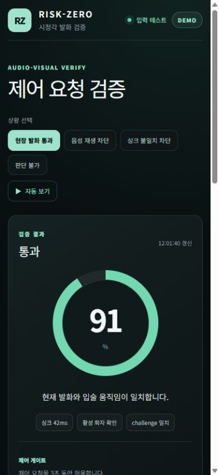
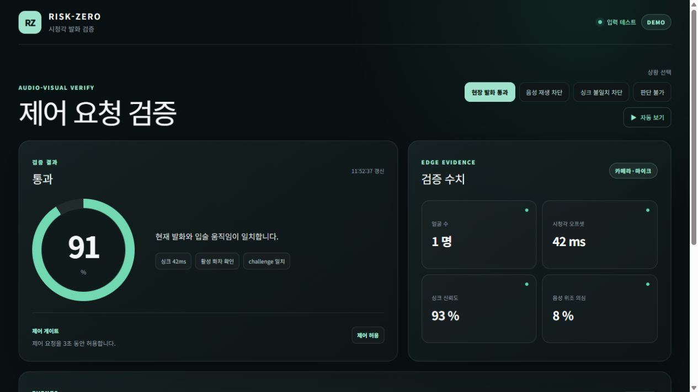
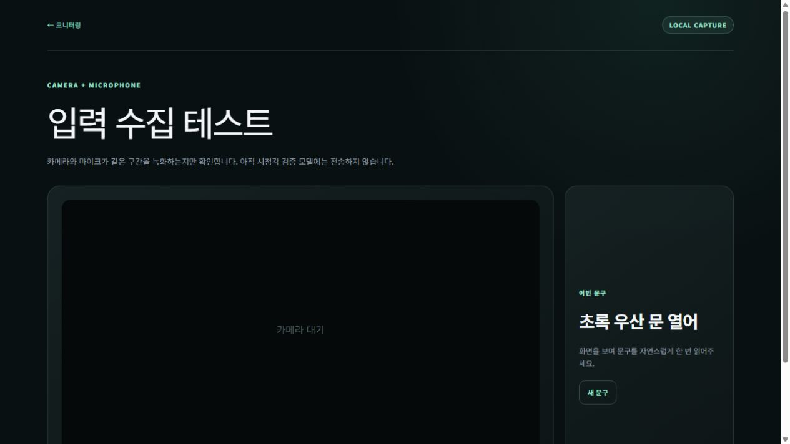
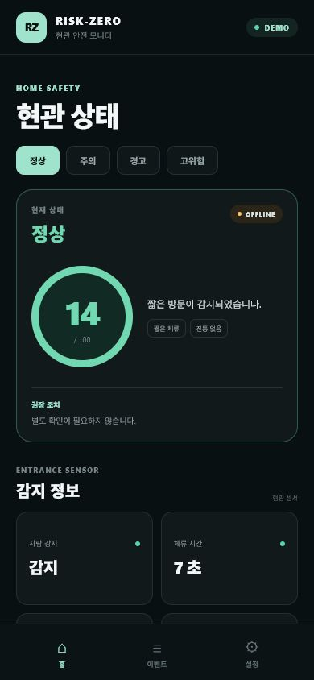
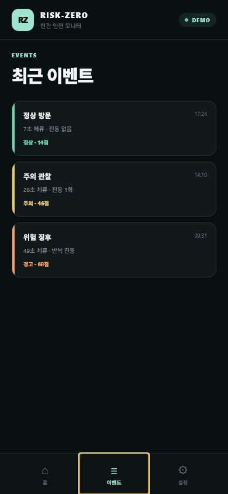
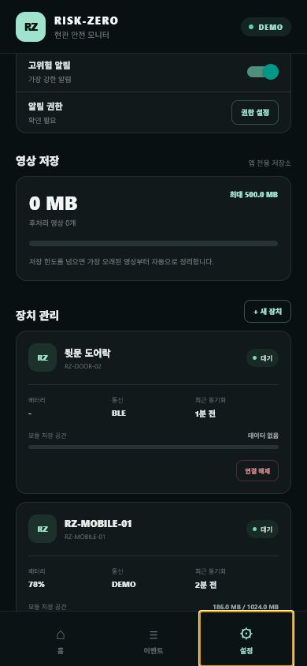
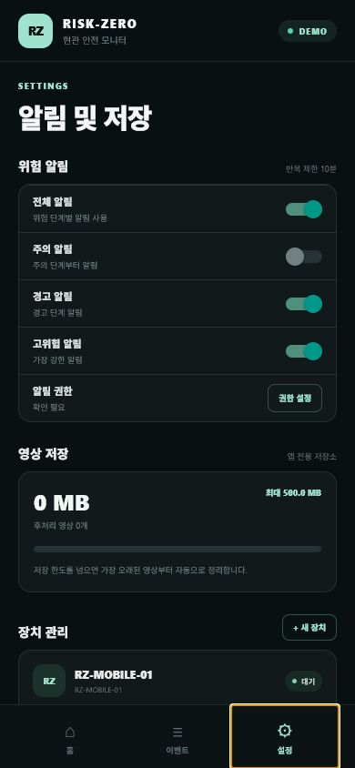
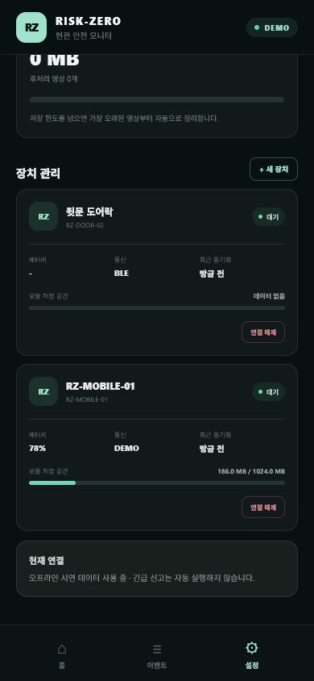
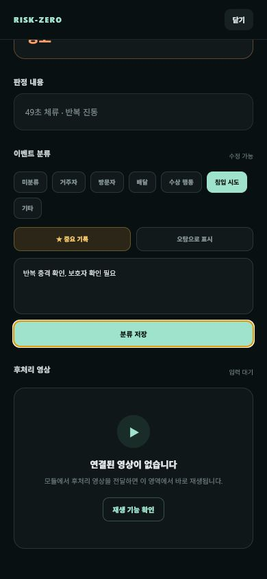
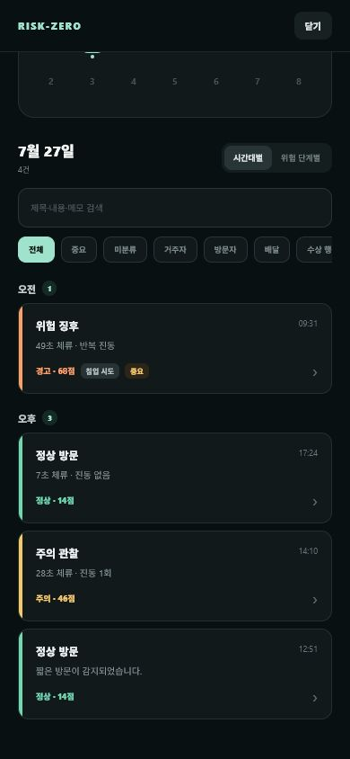

# RISK-ZERO 화면

- 기준일: 2026-08-11

## 시청각 검증 모바일 홈 · 390×844

## 웹 검증 모니터

## 웹 카메라·마이크 입력 테스트

## 이전 주제 화면

아래 이미지는 Mobile v0.2.0의 현관 위험 대응 주제 기록이다.

### 홈

### 최근 이벤트

### 영상 저장

### 알림 설정

### 장치 관리

### 이벤트 분류

### 검색·필터

스크린샷의 결과는 DEMO 데이터다. 모바일·웹 모니터의 PASS는 실제 신원 인증이나 상용 도어락 제어를 뜻하지 않는다. 입력 테스트는 브라우저 메모리에서만 녹화하며 현재 모델로 전송하지 않는다.
