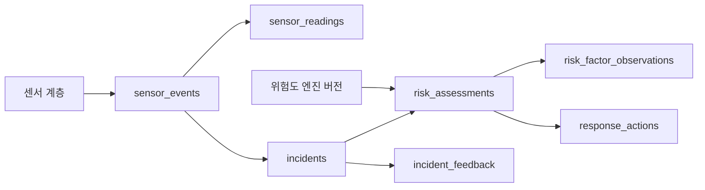
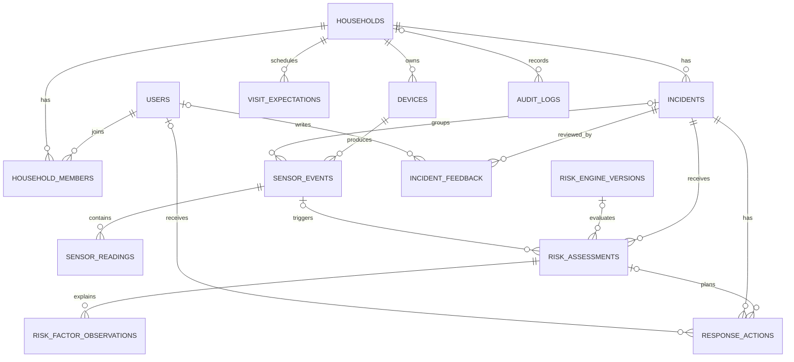

# RISK-ZERO 데이터베이스 설계

## 설계 목표

- 센서 제조사와 전송 방식이 바뀌어도 공통 이벤트 형식을 유지한다.
- 위험도 계산식이 미정인 현재는 더미 결과를 저장할 수 있고, 추후 알고리즘 버전별 결과를 비교할 수 있다.
- 웹과 모바일이 동일한 사고·위험도·대응 이력을 조회한다.
- 보호자 확인 결과를 남겨 향후 오탐 분석과 규칙 개선에 활용한다.
- 영상 원본은 관계형 DB에 넣지 않고, 필요할 때만 별도 객체 저장소에 보관한다.

## 데이터 흐름

## ERD

## 핵심 테이블

| 테이블 | 역할 | 주요 특징 |
|---|---|---|
| `households` | 보호 대상 주거 단위 | 한 사용자가 여러 주거를 관리할 가능성 지원 |
| `users` | 거주자·보호자 | 인증 연동 전에도 더미 사용자를 저장 가능 |
| `household_members` | 사용자와 주거 연결 | `resident`, `guardian`, `admin` 역할과 알림 수신 여부 |
| `devices` | 센서·허브·도어락 등록 | 장치 종류, 전송 방식, 상태, 기능 목록 저장 |
| `visit_expectations` | 예정된 배달·방문 | 정상 방문 맥락으로 사용해 오탐을 줄임 |
| `incidents` | 하나의 위험 상황 묶음 | 여러 센서 이벤트와 여러 차례의 위험도 재평가를 하나로 묶음 |
| `sensor_events` | 센서 계층의 정규화 이벤트 | 중복 방지 키, 수집·수신 시각, 원본 JSON 저장 |
| `sensor_readings` | 이벤트의 개별 측정값 | 자유로운 `metric`과 숫자·문자·불리언·JSON 값을 지원 |
| `risk_engine_versions` | 위험도 로직 버전 | 현재는 비워두고 계산식 확정 후 `draft → active`로 관리 |
| `risk_assessments` | 위험도 평가 결과 | 점수, 단계, 요약, 알고리즘 버전, 입력 시간 구간 저장 |
| `risk_factor_observations` | 평가 근거 | 요소별 관측값과 신뢰도 저장, 계산식 미정이므로 `contribution`은 NULL 가능 |
| `response_actions` | 대응 실행·미리보기 | 보호자 알림, 카메라 확인, 신고 확인 등의 상태 추적 |
| `incident_feedback` | 보호자의 사후 판정 | 정상 방문·실제 위험·오탐·테스트 라벨 저장 |
| `audit_logs` | 중요 변경 감사 기록 | 누가 어떤 설정·사건 상태를 변경했는지 기록 |

## 확장 가능한 센서 값 모델

새 센서가 추가될 때마다 열을 추가하지 않는다. `sensor_readings.metric`에 다음과 같은 코드를 넣는다.

| `metric` 예시 | 값 형식 | 설명 |
|---|---|---|
| `presence` | boolean | 사람 감지 여부 |
| `dwell_seconds` | number | 현관 앞 체류시간 |
| `min_door_distance_cm` | number | 문과의 최소 거리 |
| `approach_count` | number | 문 접근 횟수 |
| `impact_peak` | number | 최대 충격값 |
| `impact_count_10s` | number | 10초 내 충격 횟수 |
| `door_state` | text | `open`, `closed`, `forced` 등 |
| `door_open_seconds` | number | 문이 열린 시간 |
| `manual_sos` | boolean | 사용자 긴급 요청 |
| `sensor_agreement_count` | number | 같은 상황을 지지한 센서 수 |

각 측정값은 값과 함께 `unit`, `confidence`, `quality`, `captured_at`을 저장한다. 따라서 다른 계층은 센서 원본을 RISK-ZERO 형식으로 변환하기만 하면 된다.

## 위험도 로직이 비어 있는 상태의 저장 방식

현재 더미 평가에서는 다음과 같이 저장한다.

- `risk_assessments.status = 'demo'`
- `engine_name = 'DemoPassThroughRiskEngine'`
- `algorithm_version = NULL`
- 시연용 고정 `score`, `level`, `summary` 저장
- `risk_factor_observations.contribution = NULL`

계산식이 확정되면 `risk_engine_versions`에 버전을 등록하고 새 평가부터 `engine_version_id`와 `algorithm_version`을 채운다. 이전 평가 결과는 수정하지 않아야 발표와 테스트 결과를 재현할 수 있다.

## 사고 묶음 기준

센서 이벤트마다 별도의 알림을 만들면 진동 7회가 알림 7개로 쪼개질 수 있다. 다음 조건에서는 기존 `incident`에 이벤트를 추가한다.

- 같은 주거에서 진행 중인 사고가 존재한다.
- 마지막 이벤트 후 설정된 휴지시간 이내다.
- 현관 앞 사람 감지, 충격, 문 상태 변화가 연속된 흐름으로 판단된다.

일정 시간 동안 추가 이벤트가 없거나 사용자가 종료하면 `incidents.status = 'closed'`와 `ended_at`을 기록한다. 구체적인 휴지시간은 위험도 공식과 별도로 설정값으로 둔다.

## 권장 보존 정책

캡스톤 시연을 위한 초기 제안이며 실제 운영 전 개인정보 검토가 필요하다.

| 데이터 | 권장 기간 | 이유 |
|---|---:|---|
| 센서 원본 이벤트·측정값 | 30일 | 디버깅과 사고 재구성 후 삭제 |
| 사고·위험 평가·대응 기록 | 180일 | 추세 분석과 발표용 통계 |
| 영상·이미지 | 기본 저장 안 함, 필요 시 7일 | 개인정보 노출 최소화 |
| 보호자 피드백 | 프로젝트 기간 | 오탐 분석과 알고리즘 개선 |
| 감사 로그 | 180일 | 설정 변경과 대응 이력 확인 |

전화번호와 푸시 토큰은 필요할 때만 저장하고, 화면과 로그에는 마스킹한다. 공개된 복도를 촬영하는 경우 안내판·촬영 목적·접근권한·보존기간을 별도로 관리한다.

## 대표 조회 흐름

1. 웹 대시보드: 주거별 최신 열린 사고와 최신 위험 평가 조회
2. 모바일 홈: 보호자가 관리하는 주거의 미확인 `response_actions` 조회
3. 사건 상세: 사고에 속한 센서 이벤트, 측정값, 평가 근거, 대응 기록 조회
4. 오탐 분석: `incident_feedback.label = 'false_alarm'`인 사고의 위험 요소 집계
5. 장치 점검: `devices.status != 'online'` 또는 오래된 `last_seen_at` 조회

## 구현 위치

- 스키마 정의: `web/db/schema.ts`
- DB 접근 함수: `web/db/index.ts`
- 저장·조회 계층: `web/db/data-repository.ts`
- 센서 수신 API: `web/app/api/sensor-events/route.ts`
- 사건·장치 조회 API: `web/app/api/incidents/`, `web/app/api/devices/`
- 생성된 마이그레이션: `web/drizzle/`
- 논리적 D1 바인딩: `web/.openai/hosting.json`의 `DB`

현재 센서 API는 수신한 `SensorGateway` 형식의 데이터를 `sensor_events`와 `sensor_readings`에 저장한다. 웹·모바일 스냅샷은 D1에 저장된 시연 데이터를 우선 사용하며, 로컬 D1이 준비되지 않았을 때만 기존 메모리 더미로 전환한다. 실제 센서 사건의 위험도는 계산식이 확정될 때까지 `pending` 상태로 유지한다.
