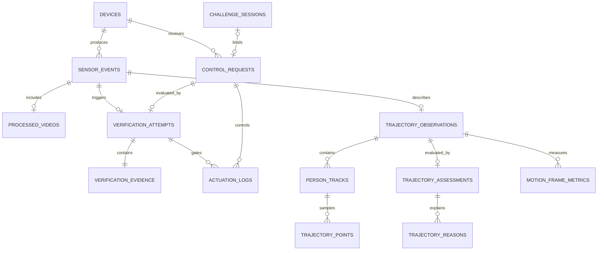

# RISK-ZERO 데이터베이스 설계

- 기준일: 2026-08-18
- 모바일: SQLite v4, 18개 테이블
- 웹: Cloudflare D1, 19개 테이블

## 저장 위치

모바일 SQLite와 앱 전용 영상 폴더를 주 저장소로 사용한다. 현관 모듈은 전송 전 이벤트와 영상만 임시로 보관하고, 모바일이 저장한 뒤 ACK를 보내면 정리한다. 웹 D1은 API·대시보드 통합 시험용이며 필수 운영 서버가 아니다.

영상 바이너리는 DB에 넣지 않는다. DB에는 앱 전용 `localUri`, 형식, 크기, 길이, 체크섬과 촬영시각만 저장한다.

현관 동선 기능도 같은 원칙을 사용한다. ESP32-CAM 원본 스트림은 DB에 넣지 않고, 로컬 처리기가 만든 후처리 영상과 좌표·구역·판정 수치만 저장한다. 현재 동선 화면은 DEMO이며 아래 테이블은 다음 마이그레이션에서 추가할 설계다.

## 현관 동선 추가 테이블 · 예정

| 테이블 | 내용 |
| --- | --- |
| `trajectory_observations` | 장치·촬영시각·프레임 크기·진입/이탈/화면 인원·후처리 영상 ID·처리 소스 |
| `person_tracks` | 관찰별 임시 사람 ID·진입/마지막 시각·입구/출구 구역·체류·평균 신뢰도 |
| `trajectory_points` | 트랙별 순서·상대시간·정규화 x/y·구역 |
| `trajectory_assessments` | NORMAL/WATCH/ALERT/INCONCLUSIVE·이상 점수·정책 버전 |
| `trajectory_reasons` | 판정의 reason code 목록 |
| `motion_frame_metrics` | FPGA frame ID·움직임 픽셀 수·중심점·bbox·배경 준비·손상 패킷 수 |

좌표는 0부터 1 사이 실수로 저장해 ESP32-CAM 해상도가 바뀌어도 화면과 정책이 같은 계약을 사용한다. `trajectory_points`는 `(track_id, sequence)`를 고유 키로 두고, 관찰·트랙 삭제 시 하위 좌표와 판정을 함께 삭제한다.

`motion_frame_metrics`는 Arty A7 시험용 진단값이다. 모든 5FPS 프레임을 영구 저장하지 않고 사건 전후의 표본이나 집계만 저장한다. 원본 GRAY8 UDP 프레임은 DB와 파일에 저장하지 않는다.

## 시청각 검증 핵심 테이블

| 테이블 | 내용 |
| --- | --- |
| `challenge_sessions` | 랜덤 문구, nonce, 발급·만료·사용 시각 |
| `control_requests` | 제어 의도, transcript, ASR 신뢰도, 요청 만료 |
| `sensor_events` | 하드웨어 후처리 사건과 sequence·dedupe key |
| `sensor_readings` | AV offset, 싱크·화자·위조 점수 등 확장 metric |
| `processed_videos` | 후처리 영상 파일 메타데이터와 로컬 경로 |
| `verification_attempts` | PASS/BLOCK/INCONCLUSIVE, reason code, 정책 버전 |
| `verification_evidence` | 사람·입술·음성·품질·모델 버전 |
| `actuation_logs` | 제어 허용 여부, 출력, 유효시간, 실제 실행시각 |

기존 `incidents`, `risk_assessments`, `response_actions`는 이전 앱·API 호환을 위해 남긴다. 새 기능은 `verification_attempts`를 기준으로 조회하며 위험도 점수를 새 판정의 정답으로 사용하지 않는다.

## 관계



## 중복·재전송

- 이벤트: `(device_id, dedupe_key)`와 `(device_id, sequence)` 고유
- 요청: `nonce` 고유
- 검증: 이벤트당 하나의 `verification_attempt`
- 영상: 이벤트당 하나의 최종 파일
- API가 같은 verification ID 또는 event ID를 다시 받으면 기존 결과를 반환
- 다른 요청 ID로 같은 nonce를 보내면 DB 고유 제약과 게이트에서 거부

모바일은 이벤트·수치·영상·검증 결과를 한 transaction에서 저장한 뒤에만 ACK한다.

## 시간과 만료

모든 시각은 ISO-8601 UTC 문자열로 저장한다. `captured_at`, `received_at`, `requested_at`, `evaluated_at`, `valid_until`, `executed_at`을 구분한다. 제어 실행 여부는 `allowed`와 `executed_at`을 구분하며, DEMO에서 허용됐다고 실제 실행시각을 기록하지 않는다.

## 확장 metric

새 모델 수치는 컬럼을 계속 추가하지 않고 `sensor_readings.metric`으로 먼저 수용한다.

```json
{
  "metric": "av_offset_ms",
  "label": "시청각 오프셋",
  "value": 42,
  "unit": "ms",
  "quality": "good",
  "capturedAt": "2026-08-11T02:14:10Z"
}
```

정책 판정에 고정적으로 필요한 값은 `verification_evidence`에도 정규화한다. 이중 저장은 원본 후처리 metric 보존과 빠른 결과 조회를 위한 것으로, attempt ID와 event ID로 추적 가능해야 한다.

## 보존

- 영상: 7일 또는 500MB 중 먼저 도달하는 기준 제안
- 검증·challenge·제어 로그: 학기 종료 후 30일
- 브라우저 수집: 업로드하지 않고 페이지 메모리에서만 유지
- 사용자가 저장한 시험 파일은 사용자가 직접 삭제

현재 구현은 모바일 영상 500MB 정리까지다. 기간 기반 삭제와 DB 레코드·파일 복구 점검은 남은 작업이다.

## 마이그레이션

- 모바일 `MOBILE_SCHEMA_VERSION = 4`: 앱 시작 시 `CREATE TABLE IF NOT EXISTS`로 검증 테이블 추가
- 웹 `drizzle/0003_amused_jubilee.sql`: D1 검증 테이블 추가
- 이전 데이터는 legacy 위험 단계에서 PASS/BLOCK/INCONCLUSIVE 표시로만 변환
- 이전 값을 실제 AV 모델 결과로 다시 쓰지 않으며 `is_demo`, model version으로 구분
