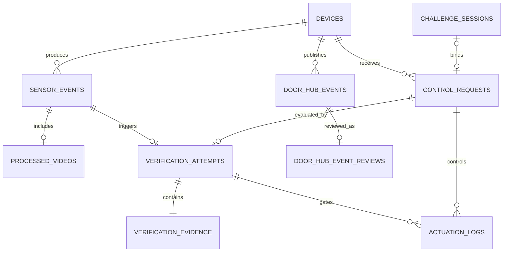

# RISK-ZERO 데이터베이스 설계

- 기준일: 2026-08-28
- 모바일: SQLite v5, 20개 테이블
- 웹: Cloudflare D1, 20개 테이블

## 저장 위치

모바일 SQLite와 앱 전용 영상 폴더를 주 저장소로 사용한다. 현관 모듈은 전송 전 이벤트와 영상만 임시로 보관하고, 모바일이 저장한 뒤 ACK를 보내면 정리한다. 웹 D1은 API·대시보드 통합 시험용이며 필수 운영 서버가 아니다.

영상 바이너리는 DB에 넣지 않는다. DB에는 앱 전용 `localUri`, 형식, 크기, 길이, 체크섬과 촬영시각만 저장한다.

현재 Door Hub 기능도 같은 원칙을 사용한다. Camera 원본 스트림은 DB에 넣지 않고, FPGA가 만든 구역·체류·배경 변경·Safety 수치와 Snapshot 참조만 저장한다. 위험도 점수는 현재 Door Hub 이벤트의 필수 값이 아니다.

## Door Hub 추가 테이블 · 구현됨

| 테이블 | 내용 |
| --- | --- |
| `door_hub_events` | D1의 전체 `door-hub-event/1` 세션·Vision·Safety 결과와 Snapshot 참조 |
| `door_hub_events` (mobile) | 모바일에 필요한 인덱스 필드와 전체 payload JSON |
| `door_hub_event_reviews` | Door Hub 이벤트의 사용자 분류·오탐·중요·메모 |

D1은 `(device_id, external_event_id)`를 고유 키로 사용한다. 같은 event의 `capture` 상태와 `result-ready` 상태가 순서대로 들어오면 새 행을 만들지 않고 최신 상태로 갱신한다. 조회는 `(household_id, generated_at)` 인덱스를 사용한다.

## 시청각 검증 핵심 테이블

| 테이블 | 내용 |
| --- | --- |
| `challenge_sessions` | 랜덤 문구, nonce, 발급·만료·사용 시각 |
| `control_requests` | 제어 의도, transcript, ASR 신뢰도, 요청 만료 |
| `sensor_events` | 하드웨어 후처리 사건과 sequence·dedupe key |
| `sensor_readings` | AV offset, 싱크·화자·위조 점수 등 확장 metric |
| `processed_videos` | 후처리 영상 파일 메타데이터와 로컬 경로 |
| `verification_attempts` | PASS/BLOCK/INCONCLUSIVE, reason code, 정책 버전 |
| `verification_evidence` | 사람·입술·음성·품질·모델 버전 |
| `actuation_logs` | 제어 허용 여부, 출력, 유효시간, 실제 실행시각 |

기존 `incidents`, `risk_assessments`, `response_actions`는 이전 앱·API 호환을 위해 남긴다. 새 기능은 `verification_attempts`를 기준으로 조회하며 위험도 점수를 새 판정의 정답으로 사용하지 않는다.

## 관계



## 중복·재전송

- 이벤트: `(device_id, dedupe_key)`와 `(device_id, sequence)` 고유
- Door Hub 이벤트: `(device_id, external_event_id)` 고유, 같은 event 상태는 upsert
- 요청: `nonce` 고유
- 검증: 이벤트당 하나의 `verification_attempt`
- 영상: 이벤트당 하나의 최종 파일
- API가 같은 verification ID 또는 event ID를 다시 받으면 기존 결과를 반환
- 다른 요청 ID로 같은 nonce를 보내면 DB 고유 제약과 게이트에서 거부

모바일은 이벤트·수치·영상·검증 결과를 한 transaction에서 저장한 뒤에만 ACK한다.

## 시간과 만료

모든 시각은 ISO-8601 UTC 문자열로 저장한다. `captured_at`, `received_at`, `requested_at`, `evaluated_at`, `valid_until`, `executed_at`을 구분한다. 제어 실행 여부는 `allowed`와 `executed_at`을 구분하며, DEMO에서 허용됐다고 실제 실행시각을 기록하지 않는다.

## 확장 metric

새 모델 수치는 컬럼을 계속 추가하지 않고 `sensor_readings.metric`으로 먼저 수용한다.

```json
{
  "metric": "av_offset_ms",
  "label": "시청각 오프셋",
  "value": 42,
  "unit": "ms",
  "quality": "good",
  "capturedAt": "2026-08-11T02:14:10Z"
}
```

정책 판정에 고정적으로 필요한 값은 `verification_evidence`에도 정규화한다. 이중 저장은 원본 후처리 metric 보존과 빠른 결과 조회를 위한 것으로, attempt ID와 event ID로 추적 가능해야 한다.

## 보존

- 영상: 7일 또는 500MB 중 먼저 도달하는 기준 제안
- 검증·challenge·제어 로그: 학기 종료 후 30일
- 브라우저 수집: 업로드하지 않고 페이지 메모리에서만 유지
- 사용자가 저장한 시험 파일은 사용자가 직접 삭제

현재 구현은 모바일 영상 500MB 정리까지다. 기간 기반 삭제와 DB 레코드·파일 복구 점검은 남은 작업이다.

## 마이그레이션

- 모바일 `MOBILE_SCHEMA_VERSION = 5`: Door Hub 이벤트와 사용자 검토 테이블 추가
- 웹 `drizzle/0004_burly_mystique.sql`: D1 Door Hub 테이블·인덱스·DEMO 3건 추가
- 이전 데이터는 legacy 위험 단계에서 PASS/BLOCK/INCONCLUSIVE 표시로만 변환
- 이전 값을 실제 AV 모델 결과로 다시 쓰지 않으며 `is_demo`, model version으로 구분
