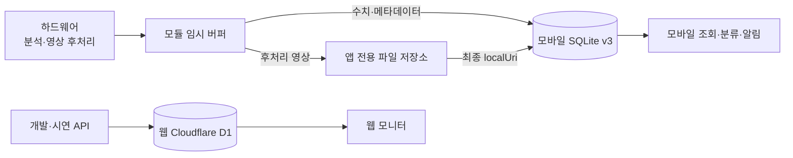
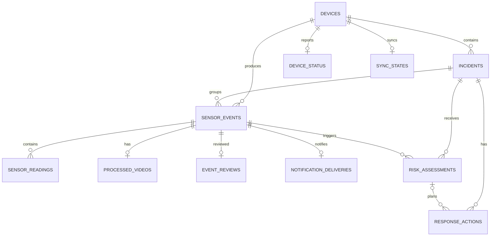

# RISK-ZERO 데이터베이스 설계

- 기준 구현: Mobile v0.2.0 / SQLite schema v3
- 기준일: 2026-07-27

## 설계 목표

- 센서 제조사와 전송 방식이 바뀌어도 공통 이벤트 형식을 유지한다.
- 하드웨어에서 분석이 끝난 수치형 지표와 후처리 영상만 수신한다.
- 위험도 계산식이 미정인 현재는 DEMO 결과 또는 `pending`을 저장한다.
- 고객 모바일의 SQLite를 MVP 주 저장소로 사용해 서버 비용을 줄인다.
- 도어락 모듈은 아직 앱에 전달하지 못한 이벤트만 임시 보관한다.
- 영상 바이트는 DB에 넣지 않고 앱 전용 파일 저장소에 둔다.
- 장치 상태, 알림 이력, 사용자 분류를 사건 데이터와 분리한다.

## 저장 위치와 데이터 흐름

모바일 SQLite가 사건·평가·설정의 주 저장소다. 모듈은 현재 상태와 미전송 이벤트만 제한적으로 보관하며 모바일이 영상과 DB를 모두 저장한 뒤 보낸 ACK를 기준으로 버퍼를 정리한다. 웹 D1은 센서 API와 모니터링 화면을 시험하기 위한 별도 개발 저장소다.

## 모바일 SQLite ERD

## 모바일 SQLite v3 테이블

모바일에는 총 13개 테이블이 생성된다. `schema_migrations`는 스키마 버전 관리용이며 나머지 12개가 앱 데이터다.

| 테이블 | 역할 | 현재 구현 |
| --- | --- | --- |
| `schema_migrations` | 스키마 버전 | 버전 `3` 기록 |
| `devices` | 장치 프로필 | 여러 장치와 통신 방식 등록 |
| `incidents` | 관련 이벤트 묶음 | 최대 위험 단계·점수와 시작 시각 |
| `sensor_events` | 후처리 이벤트 | `device_id + dedupe_key`, 장치별 `sequence` 중복 방지 |
| `sensor_readings` | 수치형 지표 | metric, 단위, 품질, 발생 시각 |
| `processed_videos` | 영상 메타데이터 | 앱 파일 경로, 크기, 길이, 체크섬 |
| `event_reviews` | 사용자 분류 | 카테고리, 오탐, 중요 표시, 메모 |
| `risk_assessments` | 위험도 결과 | DEMO 또는 pending, 엔진·정책 버전 자리 |
| `response_actions` | 대응 기록 | 현재는 화면 미리보기 중심 |
| `app_settings` | 앱 설정 | 알림 설정 등 JSON 값 |
| `sync_states` | 모듈 동기화 | 마지막 수신·ACK 순번, 연결·오류 상태 |
| `device_status` | 장치 상태 | 배터리, 모듈 저장 공간, 최근 확인 시각 |
| `notification_deliveries` | 알림 이력 | 예약·전달·확인 완료, 이벤트별 중복 방지 |

모바일은 서버 스키마 전체를 복제하지 않는다. 웹 D1에는 사용자, 가구, 예정 방문, 위험도 엔진 버전, 평가 근거, 보호자 피드백, 감사 기록 등을 포함한 14개 테이블이 별도로 있다. 계정·가구 권한은 실제 다중 사용자 기능을 만들 때 모바일 로컬 데이터와 서버 계정을 연결한다.

## 지표 확장 방식

새 지표가 추가될 때마다 DB 열을 만들지 않고 `sensor_readings.metric` 행을 추가한다.

| metric 예시 | 값 | 설명 |
| --- | ---: | --- |
| `person_confidence` | 0~1 | 사람 감지 신뢰도 |
| `dwell_seconds` | 초 | 현관 앞 체류시간 |
| `min_door_distance_cm` | cm | 문과의 최소 거리 |
| `approach_count` | 회 | 문 접근 횟수 |
| `impact_peak` | 장치 단위 | 최대 충격값 |
| `impact_count_10s` | 회 | 10초 내 충격 횟수 |
| `door_open_seconds` | 초 | 문이 열린 시간 |
| `repeated_motion_score` | 0~1 | 반복 행동 분석 점수 |
| `video_quality_score` | 0~1 | 후처리 영상 품질 |

실제 `ModuleGateway` 계약은 숫자형 metric을 사용한다. 각 값에는 `unit`, `quality`, `capturedAt`을 함께 둔다. 위험도 엔진은 metric 코드를 모르는 경우 무시하고, 핵심 metric이 없을 때는 정상으로 간주하지 않아야 한다.

## 영상 저장과 정리

1. 하드웨어 어댑터가 모바일이 읽을 수 있는 임시 `localUri`를 전달한다.
2. 앱이 파일을 전용 문서 저장소로 복사한다.
3. 전달받은 크기와 실제 파일 크기를 비교한다.
4. 검증된 최종 경로만 `processed_videos.local_uri`에 저장한다.
5. 영상과 DB 저장이 모두 성공한 이벤트까지만 모듈에 ACK한다.
6. 앱 영상 총량이 기본 `500MB`를 넘으면 가장 오래된 파일부터 삭제한다.

현재 500MB 정리는 ‘용량 기준’ 구현이다. 정책 문서의 기본 7일은 ‘기간 기준’ 제안이며 아직 자동화하지 않았다. 삭제 실패로 DB와 파일이 어긋날 경우를 위한 복구 점검은 실제 배포 전에 추가한다.

## 위험도 로직이 비어 있는 상태

현재 DEMO 평가는 다음처럼 저장한다.

- `engine_name = 'DemoPassThroughRiskEngine'`
- `engine_version = NULL`
- `is_dummy = 1`
- 고정 `score`, `risk_level`, `summary`, `reasons_json`

실제 모듈 이벤트는 계산식이 없으므로 `risk_level = 'pending'`으로 둘 수 있다. 계산식이 확정되면 웹 `risk_engine_versions`에 draft 버전을 등록하고, 모바일 `risk_assessments.engine_version`과 `policy_version`에도 사용 버전을 남긴다. 이전 결과는 덮어쓰지 않는 것이 재현에 유리하다.

## 알림과 사용자 분류

- `notification_deliveries.event_id`는 UNIQUE라 같은 이벤트가 다시 들어와도 알림을 한 번만 예약한다.
- 주의·경고·고위험의 최근 전달 시각을 확인해 같은 단계 알림을 기본 10분 제한한다.
- 사용자가 알림의 ‘확인 완료’를 누르면 상태를 `acknowledged`로 바꾼다.
- `event_reviews`는 거주자·방문객·배달·의심·침입·기타 분류, 오탐, 중요 표시와 메모를 저장한다.
- 위험도 엔진 검증에는 사용자의 사후 분류를 정답 후보로 쓸 수 있지만, 한 명의 판단을 곧바로 확정 라벨로 사용하지 않는다.

## 삭제 단위

장치 프로필을 해제하면 해당 `devices` 행을 삭제한다. 외래키 `ON DELETE CASCADE`에 따라 사건·이벤트·수치·영상 메타데이터·분류·알림·동기화 상태가 함께 정리된다. DB 삭제 전 해당 장치의 실제 영상 파일도 앱 저장소에서 제거한다.

외부 실증에서는 사용자에게 삭제 범위와 복구 불가 여부를 확인시키고, 백업 또는 서버 사본이 있다면 별도로 삭제해야 한다.

## 권장 보존 정책

| 데이터 | 초기 제안 | 현재 자동화 |
| --- | ---: | --- |
| 일반 이벤트·수치 | 7일 | 미구현 |
| 사고 이벤트·수치 | 30일 | 미구현 |
| 사고 요약·평가·대응 | 90일 | 미구현 |
| 후처리 영상 | 기본 7일 | 기간 기준 미구현, 500MB 용량 정리 구현 |
| 사용자 분류·피드백 | 프로젝트 기간 | 미구현 |
| 감사 로그 | 180일 | 웹 설계만 존재 |

이 기간은 캡스톤 내부 제안이다. 실제 설치 전에 촬영 공간, 참여자 동의, 학교 지침과 개인정보 처리 범위를 다시 검토한다.

## 구현 위치

- 모바일 스키마: `mobile/src/storage/schema.ts`
- 모바일 SQLite: `mobile/src/storage/local-database.native.ts`
- 웹 대체 저장 계층: `mobile/src/storage/local-database.ts`
- 모듈 계약·동기화: `mobile/src/module/`
- 영상 파일 저장: `mobile/src/media/processed-video-storage.native.ts`
- 영상 용량 정리: `mobile/src/media/video-retention.ts`
- 장치 삭제: `mobile/src/devices/device-management.ts`
- 알림 전달: `mobile/src/notifications/risk-notifications.native.ts`
- 웹 D1 스키마: `web/db/schema.ts`
- 웹 저장소: `web/db/data-repository.ts`
- D1 마이그레이션: `web/drizzle/`

웹 미리보기에서는 네이티브 SQLite를 열지 않는다. Android·iOS 네이티브 앱에서만 SQLite와 앱 파일 저장소를 사용한다.
