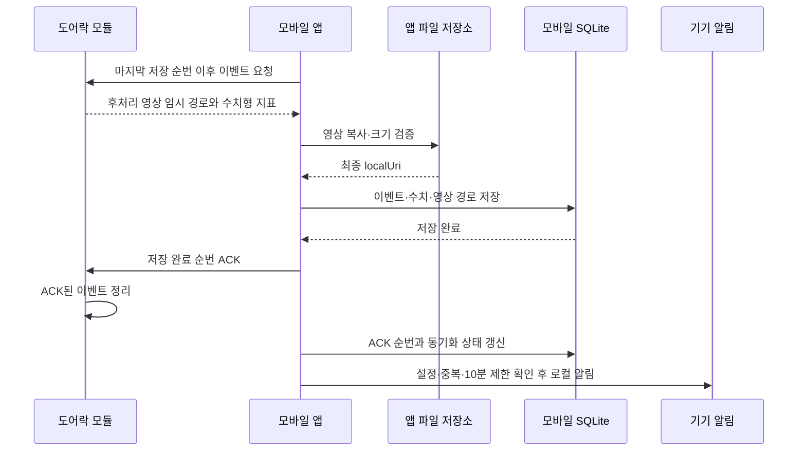

# 모듈 이벤트 버퍼·모바일 동기화

- 기준 구현: Mobile v0.2.0
- 기준일: 2026-07-27

## 저장 원칙

- 센서 분석과 영상 후처리는 하드웨어에서 완료한다.
- SW는 원시 센서값을 받지 않고 수치형 지표와 후처리 영상만 받는다.
- 모듈은 최근 이벤트와 아직 모바일이 확인하지 않은 이벤트만 보관한다.
- 이벤트에는 장치별로 증가하는 `sequence`를 붙인다.
- 모바일은 영상 파일과 수치 저장이 모두 끝난 이벤트까지만 ACK한다.
- 모듈은 ACK된 이벤트를 버퍼에서 제거할 수 있다.
- 같은 이벤트를 다시 받아도 `device_id + dedupe_key`로 중복 저장하지 않는다.
- 실제 통신은 아직 연결하지 않았으며 현재 `ModuleGateway`와 메모리 모듈로 흐름을 검증한다.

## 모듈이 전달하는 데이터

| 구분 | 내용 | 모바일 저장 위치 |
|---|---|---|
| 수치형 지표 | 체류시간, 거리, 충격량, 반복 동작 점수 등 | SQLite `sensor_readings` |
| 후처리 영상 | 하드웨어가 필요한 구간만 추출한 임시 영상 파일 | 앱 전용 파일 저장소 |
| 영상 메타데이터 | 파일명, 경로, 형식, 크기, 길이, 체크섬 | SQLite `processed_videos` |

영상 바이트를 SQLite에 BLOB으로 넣지 않는다. 하드웨어 통신 어댑터는 모바일이 읽을 수 있는 임시 `localUri`를 전달한다. 동기화 서비스가 이를 앱 전용 문서 저장소로 복사하고 파일 크기를 확인한 뒤 최종 경로를 DB에 기록한다. 파일 저장과 DB 기록이 모두 끝난 이벤트까지만 모듈에 ACK한다.

## 동기화 순서

ACK 전 연결이 끊기면 모바일의 `last_received_sequence`가 `last_acknowledged_sequence`보다 커진다. 다음 연결에서는 데이터를 다시 저장하지 않고 해당 순번의 ACK부터 재시도한다.

영상 복사 또는 DB 기록 중 하나라도 실패하면 ACK하지 않는다. 이미 저장된 이벤트를 다시 받아도 UNIQUE 제약으로 중복 사건을 만들지 않으며 저장 순번을 기준으로 재개한다.

## 모바일 수신 후 처리

1. `ModuleGateway.getDevice()`로 장치 프로필과 배터리·모듈 저장 공간을 확인한다.
2. `pullEvents(afterSequence, limit)`로 마지막 저장 순번 이후 배치를 받는다.
3. event ID, sequence, dedupe key, 시간, 숫자형 metric을 확인한다.
4. 영상이 있으면 앱 전용 저장소로 복사하고 파일 크기를 검증한다.
5. 트랜잭션에서 incident, event, readings, video metadata를 저장한다.
6. 저장된 가장 큰 연속 sequence까지 모듈에 ACK한다.
7. `sync_states`와 `device_status`를 갱신한다.
8. 위험 단계가 알림 대상이면 기기 알림을 예약한다.
9. 영상 총량이 500MB를 넘으면 가장 오래된 파일부터 정리한다.

현재 위험도 계산은 이 과정에 들어가지 않는다. 실제 모듈에서 들어온 이벤트의 평가는 엔진 연결 전까지 `pending`이고, DEMO fixture만 고정 점수를 사용한다.

## 버퍼 규칙

- MVP 기본 용량은 300건이다.
- 300건은 이벤트와 수치 메타데이터 기준이며 영상 파일 용량은 하드웨어 저장 한도로 별도 관리한다.
- 용량을 넘으면 가장 오래된 이벤트부터 덮어쓴다.
- 덮어쓴 마지막 순번을 `droppedThroughSequence`로 제공한다.
- 모바일이 필요한 순번보다 `droppedThroughSequence`가 크면 데이터 유실로 처리한다.
- 모듈 순번이 모바일 저장 순번보다 작아지면 모듈 초기화로 처리한다.
- `hasMore = true`이면 같은 연결에서 다음 배치를 이어서 요청한다.
- 장치별 버퍼와 ACK 순번을 분리해 여러 장치를 독립적으로 동기화한다.

## 알림 규칙

- 기본값은 주의(`watch`) 꺼짐, 경고(`warning`)·고위험(`critical`) 켜짐이다.
- 사용자가 전체 또는 단계별 알림을 끌 수 있다.
- 이벤트 ID가 같은 알림은 한 번만 전달한다.
- 같은 단계의 반복 알림은 기본 10분 동안 제한한다.
- Android 채널은 주의·경고·고위험을 분리한다.
- ‘확인 완료’ 동작은 `notification_deliveries` 상태만 갱신하며 사건을 자동 종료하지 않는다.

앱이 완전히 종료된 상태에서 하드웨어 이벤트를 받아 깨우는 백그라운드 BLE/Wi-Fi 서비스와 원격 보호자 푸시는 아직 구현하지 않았다.

## 구현 위치

- 이벤트·게이트웨이 계약: `mobile/src/module/contracts.ts`
- 모듈 순환 버퍼 모델: `mobile/src/module/event-buffer.ts`
- 동기화 서비스: `mobile/src/module/sync-service.ts`
- 모바일 SQLite 연결: `mobile/src/module/mobile-sync.ts`
- 이벤트·영상 조회 쿼리: `mobile/src/storage/local-database.native.ts`
- 영상 파일 보관·검증: `mobile/src/media/processed-video-storage.native.ts`
- 영상 보존 한도: `mobile/src/media/video-retention.ts`
- 위험 알림: `mobile/src/notifications/risk-notifications.native.ts`
- 알림 정책: `mobile/src/notifications/notification-policy.ts`
- 이벤트 분류 저장: `mobile/src/storage/local-database.native.ts`
- 장치 관리: `mobile/src/devices/device-management.ts`
- 캘린더 분류: `mobile/src/events/calendar.ts`
- 이벤트 검색·필터: `mobile/src/events/event-filter.ts`
- 이벤트 상세·영상 재생 화면: `mobile/src/events/EventsScreen.tsx`
- 동기화 테스트: `mobile/src/module/module-sync.test.mjs`

실제 하드웨어 통신 계층은 모바일이 읽을 수 있는 임시 영상 경로와 수치형 `metrics`를 반환하는 `ModuleGateway`를 구현하면 된다. 최종 `localUri`가 이벤트 상세 화면에 전달되면 영상 플레이어가 활성화되며 파일이 없으면 입력 대기 화면을 보여준다. 장치 관리 화면의 수동 등록은 현재 로컬 프로필 생성이며 실제 BLE 페어링을 의미하지 않는다.
