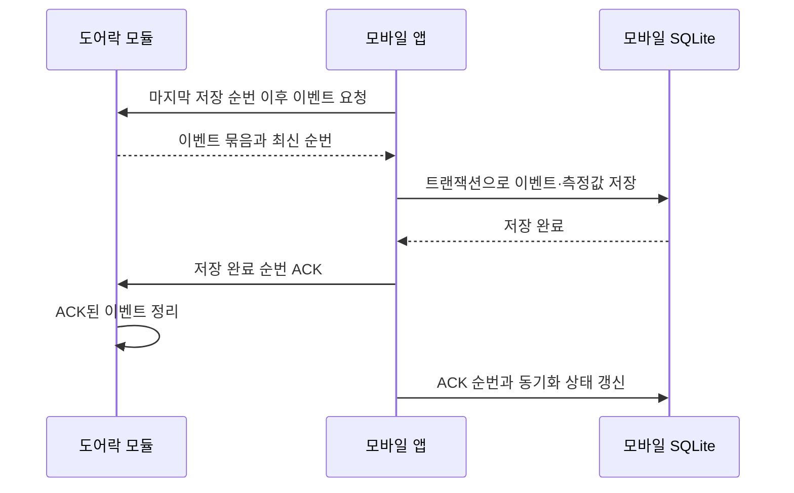

# 모듈 이벤트 버퍼·모바일 동기화

## 저장 원칙

- 모듈은 최근 이벤트와 아직 모바일이 확인하지 않은 이벤트만 보관한다.
- 이벤트에는 장치별로 증가하는 `sequence`를 붙인다.
- 모바일은 SQLite 저장이 끝난 이벤트까지만 ACK한다.
- 모듈은 ACK된 이벤트를 버퍼에서 제거할 수 있다.
- 같은 이벤트를 다시 받아도 `device_id + dedupe_key`로 중복 저장하지 않는다.

## 동기화 순서

ACK 전 연결이 끊기면 모바일의 `last_received_sequence`가 `last_acknowledged_sequence`보다 커진다. 다음 연결에서는 데이터를 다시 저장하지 않고 해당 순번의 ACK부터 재시도한다.

## 버퍼 규칙

- MVP 기본 용량은 300건이다.
- 용량을 넘으면 가장 오래된 이벤트부터 덮어쓴다.
- 덮어쓴 마지막 순번을 `droppedThroughSequence`로 제공한다.
- 모바일이 필요한 순번보다 `droppedThroughSequence`가 크면 데이터 유실로 처리한다.
- 모듈 순번이 모바일 저장 순번보다 작아지면 모듈 초기화로 처리한다.

## 구현 위치

- 이벤트·게이트웨이 계약: `mobile/src/module/contracts.ts`
- 모듈 순환 버퍼 모델: `mobile/src/module/event-buffer.ts`
- 동기화 서비스: `mobile/src/module/sync-service.ts`
- 모바일 SQLite 연결: `mobile/src/module/mobile-sync.ts`
- 동기화 테스트: `mobile/src/module/module-sync.test.mjs`

현재 구현은 실제 BLE 통신 대신 메모리 모듈을 사용한다. 센서·BLE 계층은 추후 `ModuleGateway`만 구현하면 동일한 동기화 서비스를 사용할 수 있다.
