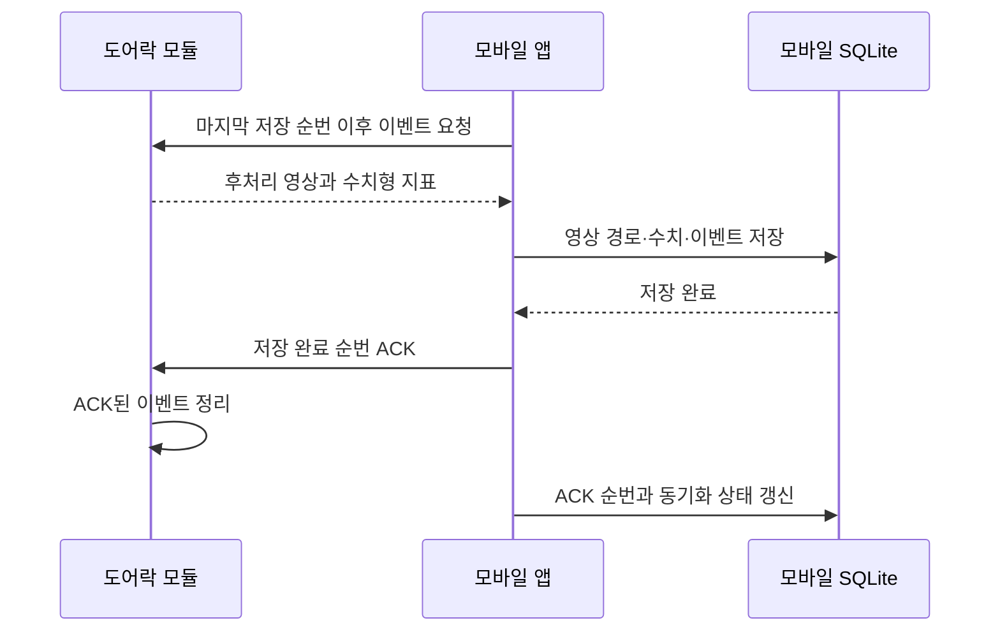

# 모듈 이벤트 버퍼·모바일 동기화

## 저장 원칙

- 센서 분석과 영상 후처리는 하드웨어에서 완료한다.
- SW는 원시 센서값을 받지 않고 수치형 지표와 후처리 영상만 받는다.
- 모듈은 최근 이벤트와 아직 모바일이 확인하지 않은 이벤트만 보관한다.
- 이벤트에는 장치별로 증가하는 `sequence`를 붙인다.
- 모바일은 영상 파일과 수치 저장이 모두 끝난 이벤트까지만 ACK한다.
- 모듈은 ACK된 이벤트를 버퍼에서 제거할 수 있다.
- 같은 이벤트를 다시 받아도 `device_id + dedupe_key`로 중복 저장하지 않는다.

## 모듈이 전달하는 데이터

| 구분 | 내용 | 모바일 저장 위치 |
|---|---|---|
| 수치형 지표 | 체류시간, 거리, 충격량, 반복 동작 점수 등 | SQLite `sensor_readings` |
| 후처리 영상 | 하드웨어가 필요한 구간만 추출한 영상 파일 | 앱 전용 파일 저장소 |
| 영상 메타데이터 | 파일명, 경로, 형식, 크기, 길이, 체크섬 | SQLite `processed_videos` |

영상 바이트를 SQLite에 BLOB으로 넣지 않는다. 하드웨어 통신 어댑터가 앱 파일 저장소로 전송을 완료한 뒤 `localUri`를 포함한 이벤트를 동기화 서비스에 전달한다.

## 동기화 순서

ACK 전 연결이 끊기면 모바일의 `last_received_sequence`가 `last_acknowledged_sequence`보다 커진다. 다음 연결에서는 데이터를 다시 저장하지 않고 해당 순번의 ACK부터 재시도한다.

## 버퍼 규칙

- MVP 기본 용량은 300건이다.
- 300건은 이벤트와 수치 메타데이터 기준이며 영상 파일 용량은 하드웨어 저장 한도로 별도 관리한다.
- 용량을 넘으면 가장 오래된 이벤트부터 덮어쓴다.
- 덮어쓴 마지막 순번을 `droppedThroughSequence`로 제공한다.
- 모바일이 필요한 순번보다 `droppedThroughSequence`가 크면 데이터 유실로 처리한다.
- 모듈 순번이 모바일 저장 순번보다 작아지면 모듈 초기화로 처리한다.

## 구현 위치

- 이벤트·게이트웨이 계약: `mobile/src/module/contracts.ts`
- 모듈 순환 버퍼 모델: `mobile/src/module/event-buffer.ts`
- 동기화 서비스: `mobile/src/module/sync-service.ts`
- 모바일 SQLite 연결: `mobile/src/module/mobile-sync.ts`
- 동기화 테스트: `mobile/src/module/module-sync.test.mjs`

현재 구현은 실제 BLE 통신 대신 메모리 모듈을 사용한다. 하드웨어 통신 계층은 영상 전송과 파일 저장까지 끝낸 뒤 수치형 `metrics`와 영상 `localUri`를 반환하는 `ModuleGateway`를 구현하면 된다.
