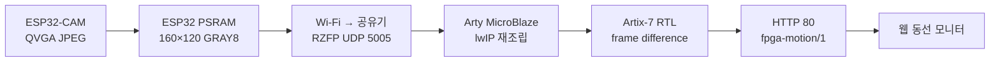

# RISK-ZERO · Arty A7-100T 동선 처리기

ESP32-CAM의 저해상도 흑백 프레임을 받아 고정 배경과 현재 프레임의 차이를 계산하고, 움직임 픽셀의 중심점과 경계 상자를 만드는 FPGA MVP다.

## 구현된 범위

| 영역 | 구현 |
| --- | --- |
| 입력 | RZFP/1 UDP, 160×120 GRAY8, out-of-order 재조립 |
| RTL | 배경 프레임 BRAM 저장, 선택적 배경 갱신, 절대 차이, 임계값, 픽셀 수·좌표 합·bbox |
| 인터페이스 | AXI4-Lite 레지스터 |
| MicroBlaze | lwIP UDP 수신, 완전한 프레임만 FPGA 전달 |
| 동선 | 중심점, 32개 좌표, 구역, 체류시간, 누락 프레임 처리 |
| 출력 | HTTP JSON, CORS 허용, `fpga-motion/1` |
| 웹 | Arty IP 입력, 1초 간격 상태 조회와 동선 표시 |

이 구현은 움직이는 물체를 `사람 후보`로 다룬다. YOLO 사람 분류, 얼굴 식별, 여러 사람의 독립적인 ID 유지 기능은 아니다.

## 데이터 흐름



ESP32-CAM과 Arty는 같은 공유기에 연결한다. ESP32-CAM은 Wi-Fi, Arty A7은 10/100 Ethernet을 사용한다.

## A7-100T 보드 고정값

- FPGA part: `xc7a100tcsg324-1`
- 시스템 입력 클럭: 100MHz
- Ethernet PHY: DP83848J, MII, 10/100Mbps, PHY 주소 1
- PHY 기준 클럭: 25MHz
- 외부 메모리: 256MB DDR3L, MicroBlaze 코드·heap·stack·프레임 버퍼 배치

35T용 프로젝트를 그대로 열지 말고 위 part로 새 프로젝트를 만든다. Ethernet은 RMII나 Gigabit 설정이 아니라 MII 설정을 사용한다. Vivado block design에서는 AXI Ethernet Lite 또는 Digilent의 Arty MicroBlaze Ethernet 예제를 기준으로 연결하고, Master XDC에서 100MHz 입력과 MII·PHY reset·25MHz 기준 클럭 핀을 활성화한다.

- [Digilent Arty A7-100T 제품 사양](https://digilent.com/shop/arty-a7-100t-artix-7-fpga-development-board/)
- [Digilent Arty 보드 매뉴얼](https://digilent.com/reference/_media/reference/programmable-logic/arty/arty_rm.pdf)

## RTL 검증

`sim/tb_risk_zero_motion_core.sv`는 다음 벡터를 검사한다.

1. 값 10인 8×6 첫 프레임을 배경으로 저장
2. `(2,1)`, `(3,1)`, `(2,2)`, `(3,2)`를 100으로 변경
3. 움직임 픽셀 4개, `sum_x=10`, `sum_y=6`, bbox `(2,1)-(3,2)` 확인
4. 같은 전경 프레임을 다시 보내 정지한 전경 후보 4픽셀이 유지되는지 확인

Vivado가 설치된 PC에서는 다음 Tcl로 프로젝트를 만든다.

```powershell
vivado -mode batch -source vivado/create_rtl_project.tcl
vivado -mode batch -source vivado/package_motion_ip.tcl
```

전체 block design 프로젝트를 연 뒤 A7-100T part와 필요한 IP가 맞는지 확인한다.

```tcl
source vivado/check_arty_target.tcl
```

현재 작업 PC에는 Vivado와 RTL 시뮬레이터가 없으므로 실제 합성, timing, LUT·BRAM 사용량은 아직 확인하지 않았다. 같은 알고리즘과 UDP 규격을 검사하는 Python 테스트는 외부 패키지 없이 실행할 수 있다.

```powershell
python -m unittest discover -s fpga/arty-a7-100t/tests -v
```

Arty 보드 없이 웹 연결 화면을 확인하려면 상태 emulator를 실행하고 웹의 보드 IP에 `127.0.0.1:8081`을 입력한다.

```powershell
python fpga/arty-a7-100t/tools/fpga_status_emulator.py
```

## Vivado 블록 구성

Digilent Arty A7-100T board files를 설치한 뒤 다음 블록을 구성한다.

1. MicroBlaze + 64KB local memory
2. MIG 7 Series DDR3와 instruction/data cache
3. AXI Ethernet Lite + interrupt controller + AXI timer
4. AXI UART Lite
5. Processor System Reset와 100MHz clock
6. `vivado/package_motion_ip.tcl`로 만든 `risk_zero_motion` IP
7. MicroBlaze AXI data bus에서 motion IP의 S_AXI 연결

lwIP heap과 19,200-byte 프레임 버퍼를 위해 애플리케이션의 `.text`, `.data`, `.bss`, heap, stack은 DDR3로 배치한다. 연결 후 Vitis의 lwIP echo server 템플릿을 생성하고 `software/src` 파일을 추가한다.

## AXI4-Lite 레지스터

| Offset | R/W | 내용 |
| ---: | --- | --- |
| `0x00` | W | bit0 frame start, bit1 background reset, bit2 result clear |
| `0x04` | W | GRAY8 pixel 한 개 |
| `0x08` | R/W | 차이 임계값, 기본 24 |
| `0x0C` | R | bit0 result pending, bit1 background ready |
| `0x10` | R | 움직임 픽셀 수 |
| `0x14` | R | 움직임 x 좌표 합 |
| `0x18` | R | 움직임 y 좌표 합 |
| `0x1C` | R | `{maxY,minY,maxX,minX}` |
| `0x20` | R | IP version `0x00010001` |

MicroBlaze가 `sum_x / motion_count`, `sum_y / motion_count`를 계산한다. 19,200번의 AXI pixel write가 필요하며 5FPS에서는 초당 96,000번이다. 실제 보드에서 여유가 부족하면 다음 단계에서 AXI DMA/Stream 구조로 교체한다.

## 실제 시험 순서

1. motion IP만 RTL simulation
2. MicroBlaze에서 version register `0x00010001` 확인
3. Ethernet echo와 고정 IP 확인
4. ESP32 `config.h`에서 FPGA UDP를 활성화
5. 첫 프레임의 `backgroundReady=true`, `motionPixelCount=0` 확인
6. 카메라 앞에서 이동하고 `http://Arty-IP/trajectory` JSON 확인
7. 웹에서 Arty IP 입력 후 경로 표시 확인

## 현재 제한

- 카메라가 흔들리거나 조명이 급변하면 화면 전체를 움직임으로 볼 수 있다.
- 가장 큰 물체를 분리하지 않고 모든 움직임의 공통 중심점을 계산한다.
- 두 사람이 동시에 움직이면 두 사람 사이가 중심점이 될 수 있다.
- 전경 픽셀은 배경에 섞지 않아 멈춘 후보도 유지하지만, 새로 놓인 택배도 전경으로 남을 수 있다.
- 범죄 의도나 신원, 실제 사람 여부를 판정하지 않는다.

다음 개선은 3×3 노이즈 제거, connected-component 두 개 분리, AXI DMA 순서다. YOLO보다 이 세 가지가 Arty A7-100T에서 우선이다.
