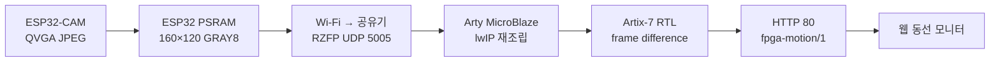

# RISK-ZERO · Arty A7-100T 동선 처리기

현재 구조는 외부 Parallel DVP Camera를 FPGA에 직접 연결하고, 항상 동작하는 Safety Domain과 이벤트 기반 Vision Domain을 분리한다. 기준 문서는 [2026-08-28 하드웨어 아키텍처](../../docs/RISK-ZERO_하드웨어_아키텍처_2026-08-28.md)와 [직접 Camera 구동 순서](DIRECT_CAMERA_BRINGUP.md)다.

현재 `risk_zero_camera_dvp_rx.sv`는 PCLK domain의 GRAY8 byte·frame geometry 수신 골격이며, `risk_zero_safety_gate_fsm.sv`는 Door Hub toggle과 Reed·Tamper·E-stop을 직접 검사한다. SCCB register read/write, OV7670 PID/VER probe, YUV422 Y 추출과 async FIFO는 독립 RTL simulation과 Artix-7 OOC synthesis를 통과했지만 Camera top·핀·전체 timing·DVP-to-motion 연결과 실물 시험은 아직 미완료다.

## 이전 UDP 참고 구현

아래 UDP·MicroBlaze·Ethernet 내용은 PC toolchain 검증을 마친 이전 구조다. motion pixel 연산은 재사용 가능하지만 UDP frame 입력과 HTTP 출력이 새 직접 Camera 구조의 현재 수직 통합 경로는 아니다.

## 구현된 범위

| 영역 | 구현 |
| --- | --- |
| 입력 | RZFP/1 UDP, 160×120 GRAY8, out-of-order 재조립 |
| RTL | 배경 프레임 BRAM 저장, 선택적 배경 갱신, 절대 차이, 임계값, 픽셀 수·좌표 합·bbox |
| 인터페이스 | AXI4-Lite 레지스터 |
| MicroBlaze | lwIP UDP 수신, 완전한 프레임만 FPGA 전달 |
| 동선 | 중심점, 32개 좌표, 구역, 체류시간, 누락 프레임 처리 |
| 출력 | HTTP JSON, CORS 허용, `fpga-motion/1` |
| 웹 | Arty IP 입력, 1초 간격 상태 조회와 동선 표시 |

이 구현은 움직이는 물체를 `사람 후보`로 다룬다. YOLO 사람 분류, 얼굴 식별, 여러 사람의 독립적인 ID 유지 기능은 아니다.

## 데이터 흐름



ESP32-CAM과 Arty는 같은 공유기에 연결한다. ESP32-CAM은 Wi-Fi, Arty A7은 10/100 Ethernet을 사용한다.

## A7-100T 보드 고정값

- FPGA part: `xc7a100tcsg324-1`
- 시스템 입력 클럭: 100MHz
- Ethernet PHY: DP83848J, MII, 10/100Mbps, PHY 주소 1
- PHY 기준 클럭: 25MHz
- 보드 메모리: 256MB DDR3L 제공
- 1차 하드웨어 검증: 256KB local BRAM profile
- 전체 lwIP 애플리케이션: 256MB DDR3L, 32KB instruction/data cache

35T용 프로젝트를 그대로 열지 말고 위 part로 새 프로젝트를 만든다. Ethernet은 RMII나 Gigabit 설정이 아니라 MII 설정을 사용한다. Vivado block design에서는 AXI Ethernet Lite 또는 Digilent의 Arty MicroBlaze Ethernet 예제를 기준으로 연결하고, Master XDC에서 100MHz 입력과 MII·PHY reset·25MHz 기준 클럭 핀을 활성화한다.

- [Digilent Arty A7-100T 제품 사양](https://digilent.com/shop/arty-a7-100t-artix-7-fpga-development-board/)
- [Digilent Arty 보드 매뉴얼](https://digilent.com/reference/_media/reference/programmable-logic/arty/arty_rm.pdf)

## RTL 검증

`sim/tb_risk_zero_motion_core.sv`는 다음 벡터를 검사한다.

1. 값 10인 8×6 첫 프레임을 배경으로 저장
2. `(2,1)`, `(3,1)`, `(2,2)`, `(3,2)`를 100으로 변경
3. 움직임 픽셀 4개, `sum_x=10`, `sum_y=6`, bbox `(2,1)-(3,2)` 확인
4. 같은 전경 프레임을 다시 보내 정지한 전경 후보 4픽셀이 유지되는지 확인

`sim/tb_risk_zero_motion_axi_lite.sv`는 AXI 주소가 먼저 오는 쓰기와 데이터가 먼저 오는 쓰기를 각각 검사한다. Vivado가 설치된 PC에서는 다음 순서로 RTL simulation, BRAM bring-up 검증, DDR 애플리케이션용 bitstream·XSA 생성을 진행한다.

```powershell
vivado -mode batch -source fpga/arty-a7-100t/vivado/run_rtl_tests.tcl
vivado -mode batch -source fpga/arty-a7-100t/vivado/run_camera_primitive_synthesis.tcl
vivado -mode batch -source fpga/arty-a7-100t/vivado/build_ov7670_probe.tcl
vivado -mode batch -source fpga/arty-a7-100t/vivado/create_arty_bram_system.tcl
vivado -mode batch -source fpga/arty-a7-100t/vivado/build_arty_system.tcl
vivado -mode batch -source fpga/arty-a7-100t/vivado/create_arty_ddr_system.tcl
vivado -mode batch -source fpga/arty-a7-100t/vivado/build_arty_ddr_system.tcl
vitis -s fpga/arty-a7-100t/vitis/build_ddr_app.py
```

`create_arty_bram_system.tcl`은 motion IP를 패키징하고 다음 구성을 자동 생성한다. Digilent Arty A7-100 board files가 설치되어 있어야 한다.

- Classic MicroBlaze 100MHz와 256KB local BRAM
- AXI Ethernet Lite MII와 ping-pong buffer
- AXI Timer, interrupt controller, USB UART 115200bps
- `risk_zero_motion` AXI4-Lite IP
- 25MHz Ethernet PHY 기준 클럭

두 build Tcl은 합성·구현 후 WNS가 음수면 실패 처리한다. BRAM profile은 `build/risk_zero_arty_a7_100t.xsa`, DDR profile은 `build/risk_zero_arty_a7_100t_ddr.xsa`를 생성한다.

실제 케이블 연결부터 Vitis·UART·UDP 확인까지는 [보드 구동 순서](BOARD_BRINGUP.md)를 따른다.

Vivado/Vitis 2025.2 PC 검증에서 RTL 테스트 두 개, BRAM·DDR 합성/구현/bitstream/XSA와 DDR ELF build가 통과했다. DDR route WNS는 `+0.998833ns`였으며 실물 Arty 프로그램·UART·Ethernet 시험은 아직 남아 있다. 같은 알고리즘과 UDP 규격을 검사하는 Python 테스트는 외부 패키지 없이 실행할 수 있다.

```powershell
python -m unittest discover -s fpga/arty-a7-100t/tests -v
```

Arty 보드 없이 웹 연결 화면을 확인하려면 상태 emulator를 실행하고 웹의 보드 IP에 `127.0.0.1:8081`을 입력한다.

```powershell
python fpga/arty-a7-100t/tools/fpga_status_emulator.py
```

## Vivado 블록 구성

DDR3 오류를 분리하기 위해 다음 BRAM profile을 먼저 생성한다.

1. MicroBlaze + 256KB local memory
2. AXI Ethernet Lite + interrupt controller + AXI timer
3. AXI UART Lite
4. Processor System Reset와 100MHz clock
5. `risk_zero_motion` IP
6. 25MHz PHY reference clock

BRAM XSA로 크기를 측정한 결과 lwIP 애플리케이션이 256KB를 107,864byte 초과했다. 기능이나 64KB heap을 줄이지 않고 두 번째 profile의 256MB DDR3L과 32KB instruction/data cache를 사용한다. Vitis linker는 예외 vector만 local BRAM에 두고 코드·데이터·BSS·heap·stack을 DDR `0x80000000` 영역에 배치한다.

## AXI4-Lite 레지스터

| Offset | R/W | 내용 |
| ---: | --- | --- |
| `0x00` | W | bit0 frame start, bit1 background reset, bit2 result clear |
| `0x04` | W | GRAY8 pixel 한 개 |
| `0x08` | R/W | 차이 임계값, 기본 24 |
| `0x0C` | R | bit0 result pending, bit1 background ready |
| `0x10` | R | 움직임 픽셀 수 |
| `0x14` | R | 움직임 x 좌표 합 |
| `0x18` | R | 움직임 y 좌표 합 |
| `0x1C` | R | `{maxY,minY,maxX,minX}` |
| `0x20` | R | IP version `0x00010001` |

MicroBlaze가 `sum_x / motion_count`, `sum_y / motion_count`를 계산한다. 19,200번의 AXI pixel write가 필요하며 5FPS에서는 초당 96,000번이다. 실제 보드에서 여유가 부족하면 다음 단계에서 AXI DMA/Stream 구조로 교체한다.

## Default-deny Safety Gate FSM

`rtl/risk_zero_safety_gate_fsm.sv`는 Vision과 독립된 always-on Safety Domain의 핵심이다. Door Hub의 toggle event와 FPGA 직접 Reed·Tamper·E-stop을 2-FF 동기화한 뒤 기본 차단한다.

| 상태 | 의미 | `unlock_allow_pulse` |
| --- | --- | --- |
| `BOOT` | synchronizer와 첫 heartbeat를 기다림 | 0 |
| `LOCKED` | 1회용 auth token과 request toggle 평가 | 0 |
| `UNLOCK` | 직접 입력이 정상일 때 제한 폭 허가 | 1 |
| `FAULT` | Tamper·E-stop·heartbeat 또는 pulse 중 unsafe 입력 래치 | 0 |

`auth_toggle`은 시간 제한 1회용 token을 arm하고 `req_toggle`이 소비한다. `door_closed_direct`, `tamper_detected`, `estop_n`과 heartbeat가 Door Hub보다 우선한다. pulse 중 unsafe 입력은 ABORT와 fault latch를 만든다. 기본 파라미터는 100MHz 기준 1초 pulse, 15초 auth, 3초 heartbeat timeout이다.

## 실제 시험 순서

1. motion IP만 RTL simulation
2. MicroBlaze에서 version register `0x00010001` 확인
3. Ethernet echo와 고정 IP 확인
4. ESP32 `risk_zero_config.h`에서 FPGA UDP를 활성화
5. 첫 프레임의 `backgroundReady=true`, `motionPixelCount=0` 확인
6. 카메라 앞에서 이동하고 `http://Arty-IP/trajectory` JSON 확인
7. 웹에서 Arty IP 입력 후 경로 표시 확인

## 현재 제한

- 카메라가 흔들리거나 조명이 급변하면 화면 전체를 움직임으로 볼 수 있다.
- 가장 큰 물체를 분리하지 않고 모든 움직임의 공통 중심점을 계산한다.
- 두 사람이 동시에 움직이면 두 사람 사이가 중심점이 될 수 있다.
- 전경 픽셀은 배경에 섞지 않아 멈춘 후보도 유지하지만, 새로 놓인 택배도 전경으로 남을 수 있다.
- 범죄 의도나 신원, 실제 사람 여부를 판정하지 않는다.

다음 개선은 3×3 노이즈 제거, connected-component 두 개 분리, AXI DMA 순서다. YOLO보다 이 세 가지가 Arty A7-100T에서 우선이다.
